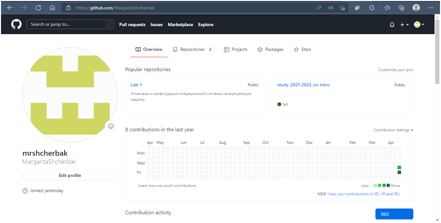
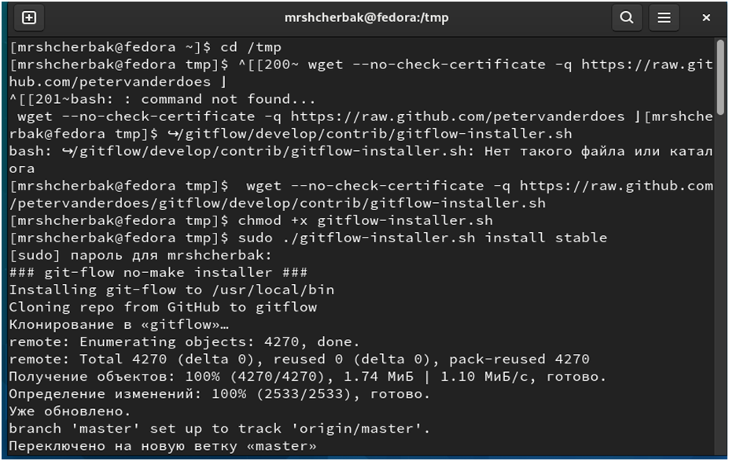
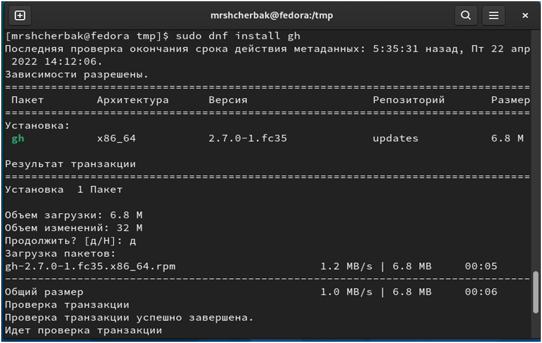
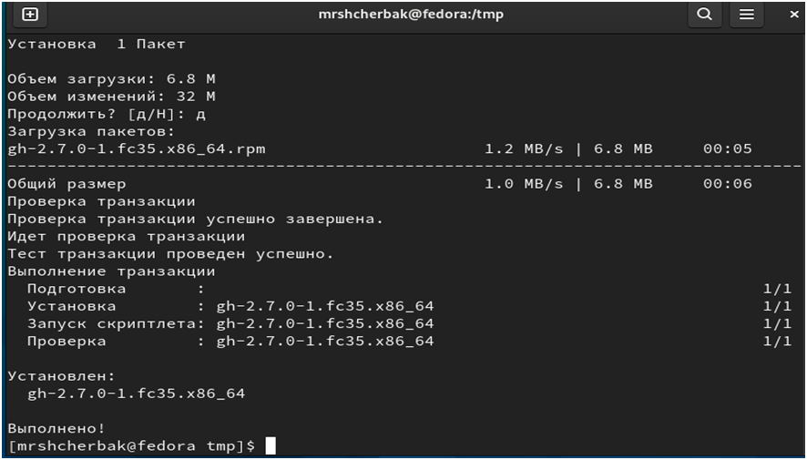
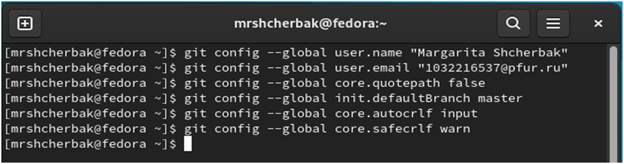
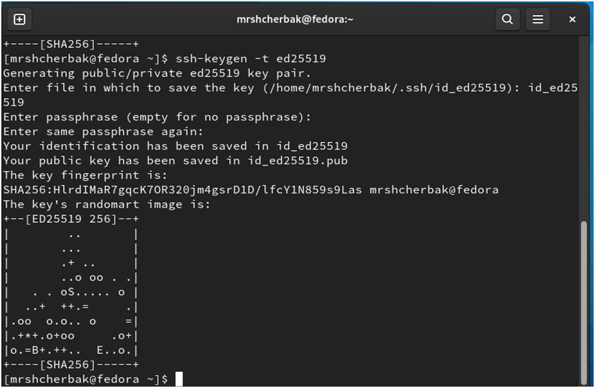
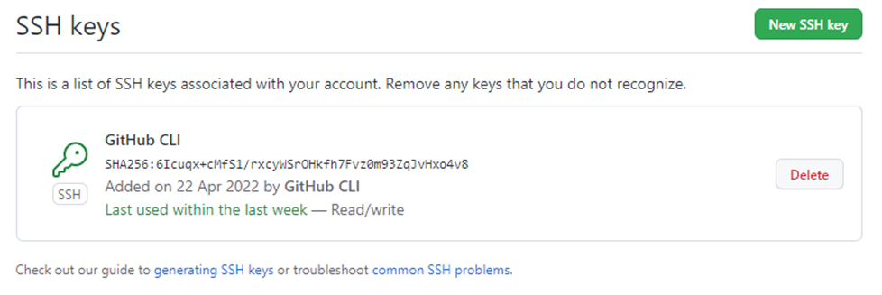
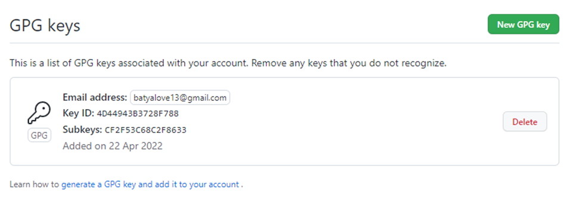
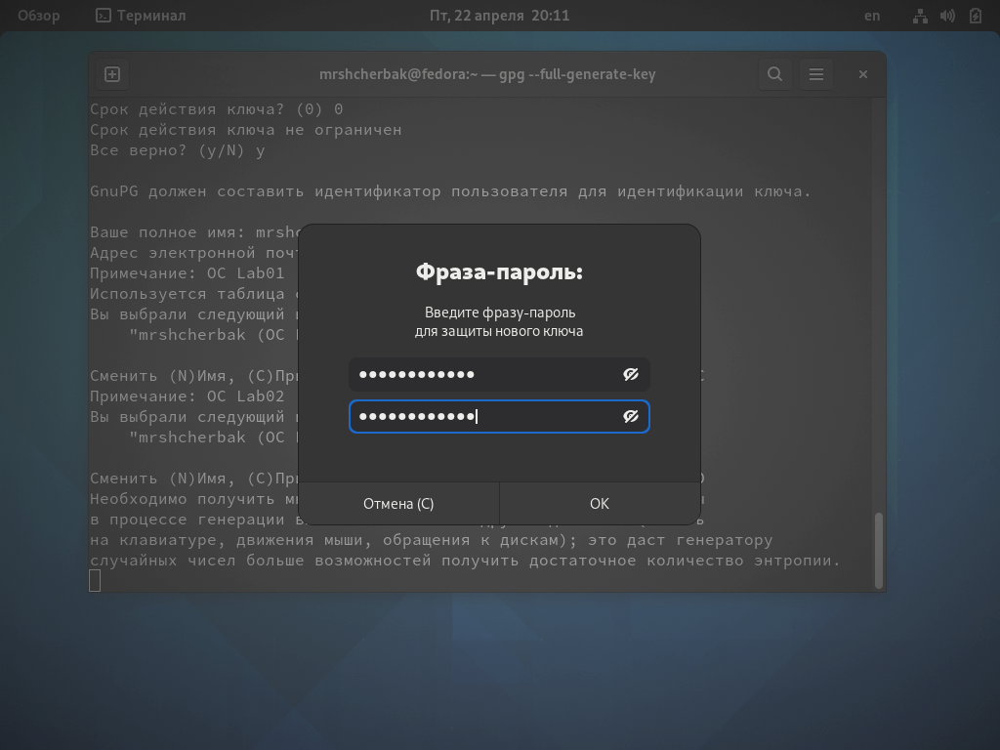
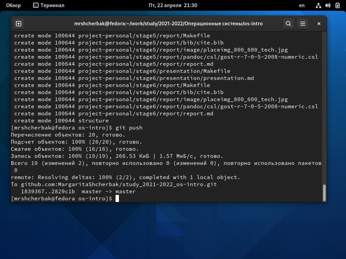

---
## Front matter
title: "Отчёт по лабораторной работе"
subtitle: "Управление версиями"
author: "Щербак Маргарита Романовна"

## Generic otions
lang: ru-RU
toc-title: "Содержание"

## Bibliography
bibliography: bib/cite.bib
csl: pandoc/csl/gost-r-7-0-5-2008-numeric.csl

## Pdf output format
toc: true # Table of contents
toc-depth: 2
fontsize: 12pt
linestretch: 1.5
papersize: a4
documentclass: scrreprt
## I18n polyglossia
polyglossia-lang:
  name: russian
  options:
	- spelling=modern
	- babelshorthands=true
polyglossia-otherlangs:
  name: english
## I18n babel
babel-lang: russian
babel-otherlangs: english
## Fonts
mainfont: PT Serif
romanfont: PT Serif
sansfont: PT Sans
monofont: PT Mono
mainfontoptions: Ligatures=TeX
romanfontoptions: Ligatures=TeX
sansfontoptions: Ligatures=TeX,Scale=MatchLowercase
monofontoptions: Scale=MatchLowercase,Scale=0.9
## Biblatex
biblatex: true
biblio-style: "gost-numeric"
biblatexoptions:
  - parentracker=true
  - backend=biber
  - hyperref=auto
  - language=auto
  - autolang=other*
  - citestyle=gost-numeric
## Pandoc-crossref LaTeX customization
figureTitle: "Рис."
tableTitle: "Таблица"
listingTitle: "Листинг"
lofTitle: "Список иллюстраций"
lotTitle: "Список таблиц"
lolTitle: "Листинги"
## Misc options
indent: true
header-includes:
  - \usepackage{indentfirst}
  - \usepackage{float} # keep figures where there are in the text
  - \floatplacement{figure}{H} # keep figures where there are in the text
---

# Управление версиями
## Цель работы
Изучить идеологию и применение средств контроля версий. 
Освоить умения по работе с git.   

## Ход работы

### Из теории: 
Изучить идеологию и применение средств контроля версий.  –

Освоить умения по работе с git. 

Системы  контроля  версий  (Version  Control  System,  VCS)  применяются  при 
работе  нескольких  человек  над  одним  проектом.  Обычно  основное  дерево 
проекта  хранится  в  локальном  или  удалённом  репозитории,  к  которому 
настроен  доступ  для  участников  проекта.  При  внесении  изменений  в 
содержание  проекта  система  контроля  версий  позволяет  их  фиксировать, 
совмещать  изменения,  произведённые  разными  участниками  проекта, 
производить откат к любой более ранней версии проекта, если это требуется. 
Среди  классических  VCS  наиболее  известны  CVS,  Subversion,  а  среди 
распределённых  — Git,  Bazaar,  Mercurial.  Принципы  их  работы  схожи, 
отличаются они в основном синтаксисом используемых в работе команд. 
Система  контроля версий  Git представляет  собой  набор программ командной 
строки.  Доступ  к  ним  можно  получить  из  терминала  посредством  ввода 
команды git с различными опциями. Управление версиями Благодаря тому, что 
Git  является  распределённой  системой  контроля  версий,  резервную  копию 
локального хранилища можно сделать простым копированием или архивацией. 
 
### Настройка github.   

1.Создали учётную запись на https://github.com.   
2.Заполнили основные данные на https://github.com. (Рис. [-@fig:001]) 

{#fig:001}  

## Установка программного обеспечения. 
Установка git-flow в Fedora Linux – это программное обеспечение удалено из 
репозитория. 
Необходимо устанавливать его вручную.(Рис. [-@fig:002])  

Ввели команды:  
cd /tmp  
wget --no-check-certificate -q https://raw.github.com/petervanderdoes/gitflow/develop/contrib/gitflow-installer.sh  
chmod +x gitflow-installer.sh  
sudo ./gitflow-installer.sh install stable

{#fig:002 width=70%}

## Установка gh в FedoraLinux. (Рис. [-@fig:003])  
Ввели команду  sudodnfinstallgh 

{#fig:003 width=70%}

{#fig:0033 width=70%}

## Базовая настройка git (Рис. [-@fig:004])  
Задали имя и email владельца репозитория:  
git config --global user.name "Name Surname" 
git config --global user.email "work@mail" 

## Настроим utf-8 в выводе сообщений git: 
git config --global core.quotepath false  
Настроили верификацию и подписание 
коммитов git.  
Задали имя начальной ветки (будем называть её master) 
gitconfig --globalinit.defaultBranchmaster  
**Параметр autocrlf:**  git config --global core.autocrlf input 
**Параметр safecrlf:**  git config --global core.safecrlf warn  
Почту изменила на batyalove13@gmail.com как на Github. 

{#fig:004 width=70%}

## Создали ключи ssh (Рис. [-@fig:005]) 
– по алгоритму rsa с ключём размером 4096 бит:  
ssh-keygen -t rsa -b 4096  
– поалгоритму ed25519:  
ssh-keygen -t ed25519 

{#fig:005 width=70%}

{#fig:0055 width=70%}

## Создали ключи pgp (Рис. [-@fig:006])   
– Генерируем ключ  
gpg --full-generate-key 

## Из предложенных опций выбираем:   
– тип RSA and RSA;  
 – размер 4096;  
– выберите срок действия; значение по умолчанию — 0 (срок действия не 
истекает никогда).  
 – GPG запросит личную информацию, которая сохранится в ключе:  
– Имя (не менее 5 символов).  
– Адрес электронной почты.  
– При вводе email убедитесь, что он соответствует адресу, используемому на 
GitHub.  
– Комментарий.  Можно ввести что угодно или нажать клавишу ввода, чтобы 
оставить это поле пустым.  

{#fig:006 width=70%} 

## Добавление PGP ключа в GitHub 

– Вывели список ключей и копировали отпечаток приватного ключа:  
gpg --list-secret-keys --keyid-format LONG   
– Отпечаток  ключа  — это  последовательность  байтов,  используемая  для 
идентификации более длинного, по сравнению с самим отпечатком ключа.  
Формат строки:  
sec Алгоритм/Отпечаток_ключа Дата_создания [Флаги] [Годен_до] ID_ключа  
– Cкопировали наш сгенерированный PGP ключ в буфер обмена:  
gpg --armor --export | xclip -sel clip  
– Перешли  в  настройки  GitHub  (https://github.com/settings/keys),  нажали  на 
кнопку New GPG key и вставили полученный ключ в поле ввода.  

 

## Настройка автоматических подписей коммитов git (Рис. [-@fig:007])

– Используя введёный email, указали Git применять его при подписи коммитов:  
git config --global user.signingkey  
git config --global commit.gpgsign true  
git config --global gpg.program $(which gpg2) 
 
## Настройка gh 

– Для начала необходимо авторизоваться  
gh auth login  
 – Утилита задаст несколько наводящих вопросов.  
– Авторизоваться можно через браузер.  

{#fig:007 width=70%} 

## Создание репозитория курса на основе шаблона 

– Создали  шаблон рабочего пространства.  
– Например, для 2021–2022 учебного года и предмета «Операционные 
системы» (код предмета os-intro) создание репозитория примет следующий вид:  
mkdir -p ~/work/study/2021-2022/"Операционные системы"  
cd ~/work/study/2021-2022/"Операционные системы"  
gh repo create study_2021-2022_os-intro --template=yamadharma/course-directory-
student-template --public  
git clone --recursive git@github.com:/study_2021-2022_os-intro.git os-intro   

## Настройка каталога курса (Рис. [-@fig:009])

– Перешли в каталог курса:  
cd ~/work/study/2021-2022/"Операционные системы"/os-intro  
– Удалили лишние файлы: 
rm package.json  
– Создали необходимые каталоги:  
make COURSE=os-intro  
– Отправили файлы на сервер:  
git add .  
git commit -am 'feat(main): make course   structure'  
git push   

 

{#fig:009 width=70%} 
 
**Контрольные вопросы**  

1.  Что такое системы контроля версий (VCS) и для решения каких задач они 
предназначаются?  
Системы  контроля  версий  -VCS- это  программное  обеспечение,  которое 
используется для облегчения работы с изменяющейся информацией, обычно - в 
проектах.  VCS позволяет  хранить  несколько версий одного  и  того  же 
документа,  при  необходимости  возвращаться к  более  ранним версиям, 
определять, кто и когда сделал то или иное изменение, и многое другое. Чаще 
всего  используется  при  разработке,  когда  над  одним  проектом  работает 
большое количество людей.  
2.  Объясните  следующие  понятия  VCS  и  их  отношения: хранилище,  commit, 
история, рабочая копия.  
•  Хранилище  (репозиторий)  в  системе  контроля  версий  - это  удаленный 
репозиторий, в котором хранятся все файлы проекта  
• commit -  фиксирует изменения перед загрузкой файлов в систему контроля 
версий  
•  история  хранит  все  изменения  в  проекте,  и  при  необходимости  позволяет 
перейти в желаемое место  
• рабочая копия - это копия проекта на компьютере разработчика. Если другой 
член команды изменил проект, вам необходимо скачать новую версию проекта 
на свой компьютер.  
3. Что  представляют  собой  и  чем  отличаются  централизованные  и 
децентрализованные VCS? Приведите примеры VCS каждого вида.  
В  отличие  от  классических,  в  распределённых  системах  контроля  версий 
центральный репозиторий не является обязательным. Среди классических VCS 
наиболее  известны  CVS,  Subversion,  а  среди  распределённых  —  Git,  Bazaar, 
Mercurial.  Принципы  их  работы  схожи,  отличаются  они  в  основном 
синтаксисом используемых в работе команд. В децентрализованных системах у 
каждого  из  участников  проекта  есть  полная  копия  проекта  на  своем 
компьютере, что делает его менее зависимым от сервера (Git).  
4. Опишите действия с VCS при единоличной работе с хранилищем.  
Для начала необходимо создать и подключить удаленный репозиторий. Затем, 
поскольку никто, кроме вас, не изменяет проект, по мере изменения проекта 
отправляйте изменения на сервер, и нет необходимости загружать изменения. 
5. Опишите порядок работы с общим хранилищем VCS. 
 Пользователь  перед  началом  работы  посредством  определённых  команд 
получает нужную ему версию файлов. После внесения изменений, пользователь 
размещает  новую  версию  в  хранилище.  При  этом  предыдущие  версии  не 
удаляются  из  центрального  хранилища  и  к  ним  можно  вернуться  в  любой 
момент. 
6. Каковы основные задачи, решаемые инструментальным средством git?  
Упрощение обмена информацией, ускорение разработки, устранение ошибок и 
недочетов при разработке.  
7. Назовите и дайте краткую характеристику командам git.  
• git init - инициализирует локальный репозиторий  
• git add * или add. - добавляет файлы в репозиторий  
• git commit - версия фиксации  
• git pull - загружает текущую версию проекта  
• git push - отправляет измененный проект на сервер  
• git checkout - позволяет переключаться между ветками  
• git status - текущий статус проекта  
• git branch - просмотреть доступные ветки  
• git remote add - добавить удаленный репозиторий 
8.  Приведите  примеры  использования  при  работе  с  локальным  и  удалённым 
репозиториями.  
git push --all (push origin master/любой branch) 
9. Что такое и зачем могут быть нужны ветви (branches)?  
Ветви  функций,  также  иногда  называемые  ветвями  тем,  используются  для 
разработки  новых  функций,  которые  должны  появиться  в  текущих  или 
будущих выпусках. 
10. Как и зачем можно игнорировать некоторые файлы при commit?  
Существуют временные и системные файлы, которые загромождают проект и 
не нужны. Путь к ним можно добавить в файл .gitignore, тогда они не будут 
добавлены в проект.  

## **Вывод:** 

таким образом,  я изучила идеологию и применение средств контроля 
версий,  освоила  умения  по  работе  с  git,  научилась    использовать  Git,  и 
подключать удаленные репозитории, добавлять и удалять необходимые файлы, 
научилась  использовать  Git  Flow,  который  значительно  упрощает  разработку 
проекта и навигацию между ветвями. 
