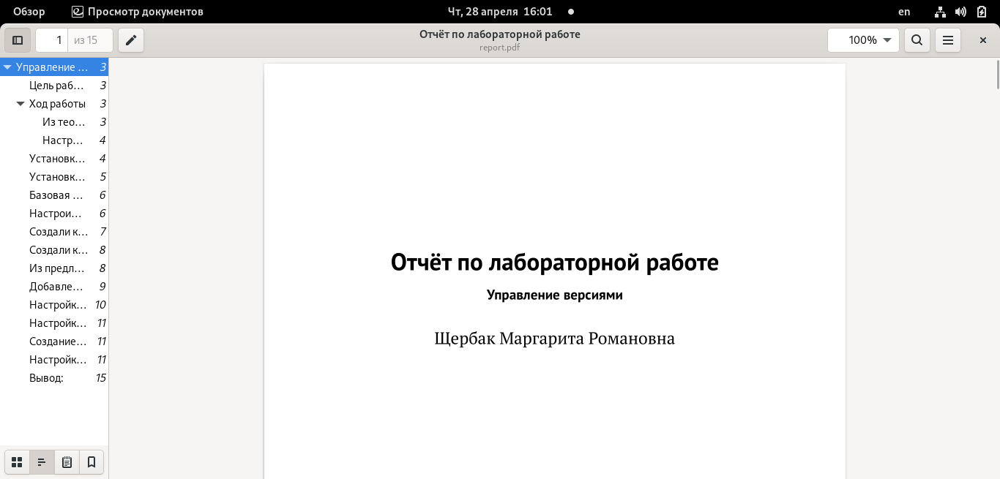

---
## Front matter
title: "Отчёт по лабораторной работе №3"
subtitle: "Markdown"
author: "Щербак Маргарита Романовна"

## Generic otions
lang: ru-RU

## Bibliography
bibliography: bib/cite.bib
csl: pandoc/csl/gost-r-7-0-5-2008-numeric.csl

## Pdf output format
toc: true # Table of contents
toc-depth: 2
fontsize: 12pt
linestretch: 1.5
papersize: a4
documentclass: scrreprt
## I18n polyglossia
polyglossia-lang:
  name: russian
  options:
	- spelling=modern
	- babelshorthands=true
polyglossia-otherlangs:
  name: english
## I18n babel
babel-lang: russian
babel-otherlangs: english
## Fonts
mainfont: PT Serif
romanfont: PT Serif
sansfont: PT Sans
monofont: PT Mono
mainfontoptions: Ligatures=TeX
romanfontoptions: Ligatures=TeX
sansfontoptions: Ligatures=TeX,Scale=MatchLowercase
monofontoptions: Scale=MatchLowercase,Scale=0.9
## Biblatex
biblatex: true
biblio-style: "gost-numeric"
biblatexoptions:
  - parentracker=true
  - backend=biber
  - hyperref=auto
  - language=auto
  - autolang=other*
  - citestyle=gost-numeric
## Pandoc-crossref LaTeX customization
figureTitle: "Рис."
tableTitle: "Таблица"
listingTitle: "Листинг"
lofTitle: "Список иллюстраций"
lotTitle: "Список таблиц"
lolTitle: "Листинги"
## Misc options
indent: true
header-includes:
  - \usepackage{indentfirst}
  - \usepackage{float} # keep figures where there are in the text
  - \floatplacement{figure}{H} # keep figures where there are in the text
---

# **Markdown**
## **Цель работы**
 Научиться оформлять отчёты с помощью легковесного языка разметки Markdown. 

### Из теории (базовые сведения о Markdown):

Чтобы создать заголовок, используйте знак.
Чтобы задать для текста полужирное начертание, заключите его в двойные звездочки.
Чтобы задать для текста курсивное начертание, заключите его в одинарные звездочки.
Чтобы задать для текста полужирное и курсивное начертание, заключите его в тройные
звездочки.
Неупорядоченный (маркированный) список можно отформатировать с помощью звездочек или тире.

## **Ход работы**

1. Создали файл для отчёта с расширением .md в Visual studio Code.
2. Открыли рабочее окно, в котором будем создавать отчёт. Также VSC удобен тем, что можно просматривать предварительный вариант своего отчёта. (Рис. [-@fig:001]) 

{#fig:001}  

3. Пишем отчёт, соблюдая синтаксис. Обращаем внимание на то, как загружаются изображения, как выглядит текст и как делаются ссылки на картинки. В ![] мы пишем подпись к картинке, а в {} мы указываем путь.
(Рис. [-@fig:002])  

{#fig:002 width=70%}

4. После того, как написали отчёт, его нужно по заданию продоставить в форматах .docx и .pdf  
(Рис. [-@fig:003]) 

{#fig:003 width=70%}

5. Смотрим наш отчёт в папке Lab02/report. (Рис. [-@fig:004]) 

{#fig:004 width=70%}

6. Готовый отчёт pdf из markdown. (Рис. [-@fig:005])

{#fig:005 width=70%}

## **Вывод:** 

Таким образом, я научилась оформлять отчёты с помощью легковесного языка разметки Markdown.