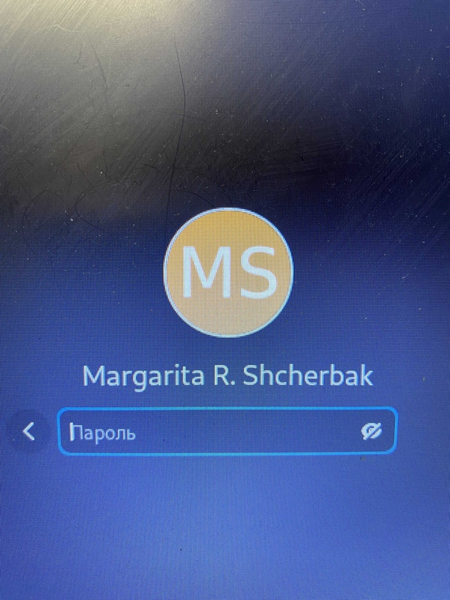

---
## Front matter

title: "Отчёт по лабораторной работе №6"
subtitle: "Поиск файлов. Перенаправление
ввода-вывода. Просмотр запущенных процессов"
author: "Щербак Маргарита Романовна"
date: "2022"
## Generic otions
lang: ru-RU

## Bibliography
bibliography: bib/cite.bib
csl: pandoc/csl/gost-r-7-0-5-2008-numeric.csl

## Pdf output format
toc-depth: 2
fontsize: 12pt
linestretch: 1.5
papersize: a4
documentclass: scrreprt
## I18n polyglossia
polyglossia-lang:
  name: russian
  options:
	- spelling=modern
	- babelshorthands=true
polyglossia-otherlangs:
  name: english
## I18n babel
babel-lang: russian
babel-otherlangs: english
## Fonts
mainfont: PT Serif
romanfont: PT Serif
sansfont: PT Sans
monofont: PT Mono
mainfontoptions: Ligatures=TeX
romanfontoptions: Ligatures=TeX
sansfontoptions: Ligatures=TeX,Scale=MatchLowercase
monofontoptions: Scale=MatchLowercase,Scale=0.9
## Biblatex
biblatex: true
biblio-style: "gost-numeric"
biblatexoptions:
  - parentracker=true
  - backend=biber
  - hyperref=auto
  - language=auto
  - autolang=other*
  - citestyle=gost-numeric
## Pandoc-crossref LaTeX customization
figureTitle: "Рис."

listingTitle: "Листинг"
lofTitle: "Список иллюстраций"

lolTitle: "Листинги"
## Misc options
indent: true
header-includes:
  - \usepackage{indentfirst}
  - \usepackage{float} # keep figures where there are in the text
  - \floatplacement{figure}{H} # keep figures where there are in the text
---

# Цель работы:
Ознакомление с инструментами поиска файлов и фильтрации текстовых данных.
Приобретение практических навыков: по управлению процессами (и заданиями), по
проверке использования диска и обслуживанию файловых систем.

# Теоретическое введение: 
В системе по умолчанию открыто три специальных потока: 
– stdin — стандартный поток ввода (по умолчанию: клавиатура), файловый дескриптор
0;  
– stdout — стандартный поток вывода (по умолчанию: консоль), файловый дескриптор
1;  
– stderr — стандартный поток вывод сообщений об ошибках (по умолчанию: консоль),
файловый дескриптор 2. 
Большинство используемых в консоли команд и программ записывают результаты своей работы в стандартный поток вывода stdout. Например, команда ls выводит в стандартный поток вывода (консоль) список файлов в текущей директории. Потоки вывода и ввода можно перенаправлять на другие файлы или устройства. Проще всего это делается с помощью символов >, >>, <, <<.  
Конвейер (pipe) служит для объединения простых команд или утилит в цепочки, в которых результат работы предыдущей команды передаётся последующей.  
Чаще всего скрипты на Bash используются в качестве автоматизации каких-то рутинных операций в консоли, отсюда иногда возникает необходимость в обработке stdout одной команды и передача на stdin другой команде, при этом результат выполнения команды должен обработан.

# Выполнение лабораторной работы:

1. Осуществили вход в систему, используя соответствующее имя пользователя(Рис. [-@fig:001])

{#fig:001 width=80%}   

2. Записали в файл file.txt названия файлов, содержащихся в каталоге /etc. Дописали в этот же файл названия файлов, содержащихся в моём домашнем каталоге. (Рис. [-@fig:002] - Рис. [-@fig:003]).

{#fig:002 width=80%}

{#fig:003 width=80%}

3. Вывели имена всех файлов из file.txt, имеющих расширение .conf, после чего
записали их в новый текстовой файл conf.txt (Рис. [-@fig:004] - Рис. [-@fig:005]). 

{#fig:004 width=80%}

{#fig:005 width=80%}

4. Определили, какие файлы в моём домашнем каталоге имеют имена, начинавшиеся
с символа c. (Рис. [-@fig:006])

{#fig:006 width=80%}

5. Вывели на экран (по странично) имена файлов из каталога /etc, начинающиеся с символа h. (Рис. [-@fig:007] - Рис. [-@fig:008]). 

{#fig:007 width=80%}

{#fig:008 width=80%}

6. Запустили в фоновом режиме процесс, который будет записывать в файл ~/logfile
файлы, имена которых начинаются с log.
7. Удалили файл ~/logfile. (Рис. [-@fig:009]). 

{#fig:009 width=80%}

8. Запустили из консоли в фоновом режиме редактор gedit.
9. Определили идентификатор процесса gedit, используя команду ps, конвейер и фильтр
grep. (Рис. [-@fig:0010] - Рис. [-@fig:0012]). 

{#fig:0010 width=80%}

{#fig:0011 width=80%}

{#fig:0012 width=80%}

10. Прочитали справку (man) команды kill, после чего использовали её для завершения процесса gedit. (Рис. [-@fig:0013]).

{#fig:0013 width=80%}

11. Выполнили команды df и du, предварительно получив более подробную информацию об этих командах, с помощью команды man. (Рис. [-@fig:0014] - Рис. [-@fig:0017]). 

{#fig:0014 width=80%}

{#fig:0015 width=80%}

{#fig:0016 width=80%}

{#fig:0017 width=80%}

12. Воспользовавшись справкой команды find, вывели имена всех директорий, имеющихся в моём домашнем каталоге. (Рис. [-@fig:0018] - Рис. [-@fig:0019]). 

{#fig:0018 width=80%}

{#fig:0019 width=80%}

# Контрольные вопросы: 

1. Какие потоки ввода вывода вы знаете? 
Stdin и stdout, stderr 
Большинство используемых в консоли команд и программ записывают результаты своей работы в стандартный поток вывода stdout. 
2. Объясните разницу между операцией > и >>.  
‘>’ Перенаправление вывода в файл  
‘»’ Перенаправление вывода в файл и открытие файла в режиме добавления (данные добавляются в конец файла). 
3. Что такое конвейер? 
Конвейер (pipe) служит для объединения простых команд или утилит в цепочки, в которых результат работы предыдущей команды передаётся последующей. 
Синтаксис следующий:  
команда1|команда2 (это означает, что вывод команды 1 передастся на ввод команде 2. 
4. Что такое процесс? Чем это понятие отличается от программы? 
Процесс рассматривается операционной системой как заявка на потребление всех видов ресурсов, кроме одного − процессорного времени. Этот последний
важнейший ресурс распределяется операционной системой между другими единицами работы − потоками, которые и получили свое название благодаря тому, что они представляют собой последовательности (потоки выполнения) команд. 
Процесс − это выполнение программы. Он считается активной сущностью и реализует действия, указанные в программе.
Программа представляет собой статический набор команд, а процесс это набор ресурсов и данных, использующихся при выполнении программы. 
5. Что такое PID и GID? 
pid: идентификатор процесса (PID) процесса (processID), к которому вызывают метод 
gid: идентификатор группы UNIX, в котором работает программа. 
6. Что такое задачи и какая команда позволяет ими управлять? 
Любую выполняющуюся в консоли команду или внешнюю программу можно запустить в фоновом режиме. Для этого следует в конце имени команды указать знак амперсанда &. Например: gedit &. 
7. Найдите информацию об утилитах top и htop. Каковы их функции? 
Top - отобразить запущенные процессы, используемые ими ресурсы и другую полезную информацию (с автоматическим обновлением данных)
htop − это продвинутый консольный мониторинг процессов. Утилита выводит постоянно меняющийся список системных процессов, который сортируется в зависимости от нагрузки на ЦПУ. Если делать сравнение сtop, то htop показывает абсолютно все процессы в системе, время их непрерывного использования, загрузку процессоров и расход оперативной памяти.
8. Назовите и дайте характеристику команде поиска файлов. Приведите примеры использования этой команды. 
find − это команда для поиска файлов и каталогов на основе специальных условий. Ее можно использовать в различных обстоятельствах, например, для поиска файлов по разрешениям, владельцам, группам, типу, размеру и другим подобным критериям.
Команда find имеет такой синтаксис: 
find[папка][параметры] критерий шаблон [действие]
Папка − каталог в котором будем искать 
Параметры − дополнительные параметры, например, глубина поиска, и т д. 
Критерий − по какому критерию будем искать: имя, дата создания, права, владелец и т д. 
Шаблон – непосредственно значение по которому будем отбирать файлы. 
Основные параметры: 
- P никогда не открывать символические ссылки 
- L - получает информацию о файлах по символическим ссылкам. Важно для дальнейшей обработки, чтобы обрабатывалась не ссылка, а сам файл. 
- maxdepth - максимальная глубина поиска по подкаталогам,для поиска только в текущем каталоге установите 1. 
- depth - искать сначала в текущем каталоге, а потом в подкаталогах 
- mount искать файлы только в этой файловой системе. 
- version - показать версию утилиты find 
- print - выводить полные имена файлов 
- typef - искать только файлы 
- typed - поиск папки в Linux 
- name - поиск файлов по имени
- perm - поиск файлов в Linux по режиму доступа
- user - поиск файлов по владельцу
-group - поиск по группе
- mtime - поиск по времени модификации файла
- atime - поиск файлов по дате последнего чтения
- nogroup - поиск файлов, не принадлежащих ни одной группе
- nouser - поиск файлов без владельцев
- newer - найти файлы новее чем указанный
- size - поиск файлов в Linux по их размеру
Примеры:  
find~ -type d поиск директорий в домашнем каталоге  
find~ -type f -name ”.*” поиск скрытых файлов в домашнем каталоге.
9. Можно ли по контексту (содержанию) найти файл? Если да, то как? 
Да, через команду grep. Например: grep Aug -R /var/log/* вывода строки, содержащие "Aug", во всех файлах, находящихся в директории /var/log и ниже.  
«grep -r” слово/выражение, которое нужно найти”». 
10. Как определить объем свободной памяти на жёстком диске? 
Для определения объёма свободного пространства на файловой системе можно воспользоваться командой df, которая выведет на экран список всех файловых систем в соответствии с именами устройств, с указанием размера и точки монтирования. 
11. Как определить объем вашего домашнего каталога? 
Команда du показывает число килобайт, используемое каждым файлом или каталогом. 
12. Как удалить зависший процесс
Можно удалить через kill, написав айди процесса.
Основные сигналы (каждый сигнал имеет свой номер), которые используются для завершения процесса: 
- SIGINT–самый безобидный сигнал завершения, означает Interrupt. Он отправляется процессу, запущенному из терминала с помощью сочетания клавиш Ctrl+C. Процесс правильно завершает все свои действия и возвращает управление; 
- SIGQUIT–это еще один сигнал, который отправляется с помощью сочетания клавиш, программе, запущенной в терминале. Он сообщает ей что нужно завершиться и программа может выполнить корректное завершение или проигнорировать сигнал. Сочетание клавиш Ctrl+/;
- SIGHUP–сообщает процессу, что соединение с управляющим терминалом разорвано, отправляется, в основном, системой при разрыве соединения с интернетом;
- SIGTERM–немедленно завершает процесс, но обрабатывается программой, поэтому позволяет ей завершить дочерние процессы и освободить все ресурсы;
- SIGKILL–тоже немедленно завершает процесс, но, в отличие от предыдущего варианта, он не передается самому процессу, а обрабатывается ядром.
Поэтому ресурсы и дочерние процессы остаются запущенными.

# Выводы:

Таким образом, в ходе ЛР№6 я ознакомилась с инструментами поиска файлов и фильтрации текстовых данных.
Приобрела практически навыки: по управлению процессами (и заданиями), по проверке использования диска и обслуживанию файловых систем.