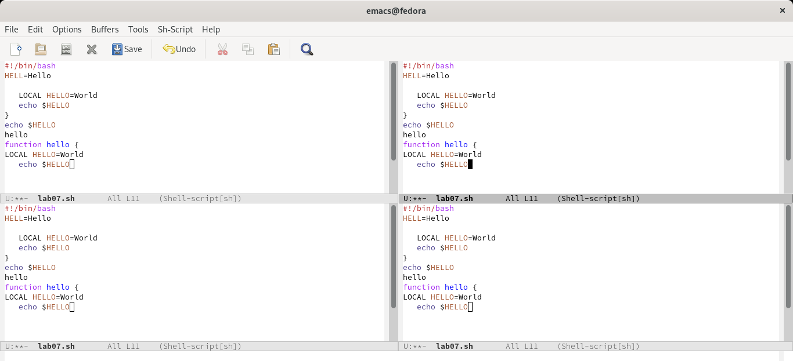

---
## Front matter
lang: ru-RU
title: " Текстовой редактор emacs"
author: |
        Щербак Маргарита Романовна

institute: |
           RUDN
date: 2022

## Formatting
toc: false
slide_level: 2
theme: metropolis
header-includes: 
 - \metroset{progressbar=frametitle,sectionpage=progressbar,numbering=fraction}
 - '\makeatletter'
 - '\beamer@ignorenonframefalse'
 - '\makeatother'
aspectratio: 43
section-titles: true
---

## **Цель работы**
Познакомиться с операционной системой Linux. Получить практические навыки работы с редактором Emacs.

## **Ход работы:** Ознакомились с теоретическим материалом, редактором emacs. Открыли emacs. (Рис. [-@fig:001]). 

{#fig:001 width=80%}   

## Создали файл lab07.sh с помощью комбинации Ctrl-x Ctrl-f (C-x C-f). (Рис. [-@fig:002]).

{#fig:002 width=65%}

## Набрали текст. Проделали с текстом стандартные процедуры редактирования. (Рис. [-@fig:003]). Вырезали одной командой целую строку "function hello {" (С-k).

{#fig:003 width=50%}

{#fig:004 width=50%}

## Вставили эту строку в конец файла (C-y). (Рис. [-@fig:005]).

{#fig:005 width=80%}

## Выделили область текста (C-space). Скопировали область в буфер обмена (M-w). Вставили область в конец файла. (Рис. [-@fig:006]).

{#fig:006 width=80%}

## Выделили эту область и вырезали её (C-w).  (Рис. [-@fig:007]). Отменили последнее действие (C-/). (Рис. [-@fig:008]).

{#fig:007 width=50%}

{#fig:008 width=50%}

## Научились использовать команды по перемещению курсора. (Рис. [-@fig:009]).
- переместили курсор в начало строки (C-a).
- переместили курсор в конец строки (C-e).
- переместили курсор в начало буфера (M-<).
- переместили курсор в конец буфера (M->).

{#fig:009 width=60%}

## Управление буферами.
- вывели список активных буферов на экран (C-x C-b) (Рис. [-@fig:0010]).

{#fig:0010 width=80%}

## Переместились во вновь открытое окно (C-x o) со списком открытых буферов и переключились на другой буфер. (Рис. [-@fig:0011]).

{#fig:0011 width=80%}

## Закрыли это окно (C-x 0). Переключались между буферами, но уже без вывода их списка на экран (C-x b). (Рис. [-@fig:0012]).

{#fig:0012 width=60%}

## Управление окнами. Поделили фрейм на 4 части: разделили фрейм на два окна по вертикали (C-x 3)(Рис. [-@fig:0013] - Рис. [-@fig:0014]).

{#fig:0013 width=80%}

## Каждое из окон разделили на две части по горизонтали (C-x 2)

{#fig:0014 width=80%}

## В каждом из четырёх созданных окон открыли новый буфер (файл) и ввели несколько строк текста. (Рис. [-@fig:0015] - Рис. [-@fig:0016]).

{#fig:0015 width=80%}

## Вводим текст в каждом файле 

{#fig:0016 width=90%}

## Режим поиска
- переключились в режим поиска (C-s) и нашли несколько слов, присутствующих
в тексте. (Рис. [-@fig:0017]).

{#fig:0017 width=80%}

## Переключались между результатами поиска, нажимая C-s. (Рис. [-@fig:0018]).

{#fig:0018 width=80%}

## Вышли из режима поиска, нажав C-g. (Рис. [-@fig:0019]).

{#fig:0019 width=80%}

## Перешли в режим поиска и замены (Esc+Shift+%), ввели текст, который следует найти и заменить, нажали Enter , затем ввели текст для замены. Нажали ! для подтверждения замены. (Рис. [-@fig:0020] - Рис. [-@fig:0021]).

{#fig:0020 width=80%}

## Заменили слово "смотреть" на "ПРИВЕТ" 

{#fig:0021 width=80%}

## Испробовали другой режим поиска, нажав Alt-s o. (Рис. [-@fig:0022]).

{#fig:0022 width=80%} 

## **Вывод:** 

Таким образом, в ходе ЛР№9 я познакомилась с операционной системой Linux. Получила практические навыки работы с редактором Emacs.
