---
## Front matter

title: "Отчёт по лабораторной работе №9"
subtitle: "Текстовой редактор emacs"
author: "Щербак Маргарита Романовна"
date: "2022"
## Generic otions
lang: ru-RU

## Bibliography
bibliography: bib/cite.bib
csl: pandoc/csl/gost-r-7-0-5-2008-numeric.csl

## Pdf output format
toc-depth: 2
fontsize: 12pt
linestretch: 1.5
papersize: a4
documentclass: scrreprt
## I18n polyglossia
polyglossia-lang:
  name: russian
  options:
	- spelling=modern
	- babelshorthands=true
polyglossia-otherlangs:
  name: english
## I18n babel
babel-lang: russian
babel-otherlangs: english
## Fonts
mainfont: PT Serif
romanfont: PT Serif
sansfont: PT Sans
monofont: PT Mono
mainfontoptions: Ligatures=TeX
romanfontoptions: Ligatures=TeX
sansfontoptions: Ligatures=TeX,Scale=MatchLowercase
monofontoptions: Scale=MatchLowercase,Scale=0.9
## Biblatex
biblatex: true
biblio-style: "gost-numeric"
biblatexoptions:
  - parentracker=true
  - backend=biber
  - hyperref=auto
  - language=auto
  - autolang=other*
  - citestyle=gost-numeric
## Pandoc-crossref LaTeX customization
figureTitle: "Рис."

listingTitle: "Листинг"
lofTitle: "Список иллюстраций"

lolTitle: "Листинги"
## Misc options
indent: true
header-includes:
  - \usepackage{indentfirst}
  - \usepackage{float} # keep figures where there are in the text
  - \floatplacement{figure}{H} # keep figures where there are in the text
---

# Цель работы:
Познакомиться с операционной системой Linux. Получить практические навыки работы с редактором Emacs.

# Теоретическое введение: 
Emacs представляет собой мощный экранный редактор текста, написанный на языке
высокого уровня Elisp.  
Буфер — объект, представляющий какой-либо текст.
Буфер может содержать что угодно, например, результаты компиляции программы
или встроенные подсказки. Практически всё взаимодействие с пользователем, в том
числе интерактивное, происходит посредством буферов.  
Фрейм соответствует окну в обычном понимании этого слова. Каждый
фрейм содержит область вывода и одно или несколько окон Emacs.  
Окно — прямоугольная область фрейма, отображающая один из буферов.
Каждое окно имеет свою строку состояния, в которой выводится следующая информация: название буфера, его основной режим, изменялся ли текст буфера и как далеко вниз
по буферу расположен курсор. Каждый буфер находится только в одном из возможных
основных режимов. Существующие основные режимы включают режим Fundamental
(наименее специализированный), режим Text, режим Lisp, режим С, режим Texinfo
и другие. Под второстепенными режимами понимается список режимов, которые включены в данный момент в буфере выбранного окна.  
Область вывода — одна или несколько строк внизу фрейма, в которой
Emacs выводит различные сообщения, а также запрашивает подтверждения и дополнительную информацию от пользователя.  
Минибуфер используется для ввода дополнительной информации и всегда отображается в области вывода.  
Точка вставки — место вставки (удаления) данных в буфере.

# Выполнение лабораторной работы:

1.  Ознакомились с теоретическим материалом, редактором emacs. Открыли emacs. (Рис. [-@fig:001]). 

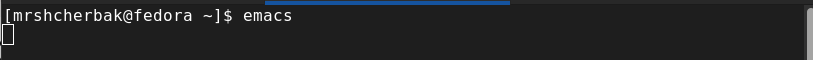{#fig:001 width=80%}

2. Создали файл lab07.sh с помощью комбинации Ctrl-x Ctrl-f (C-x C-f). (Рис. [-@fig:002]).

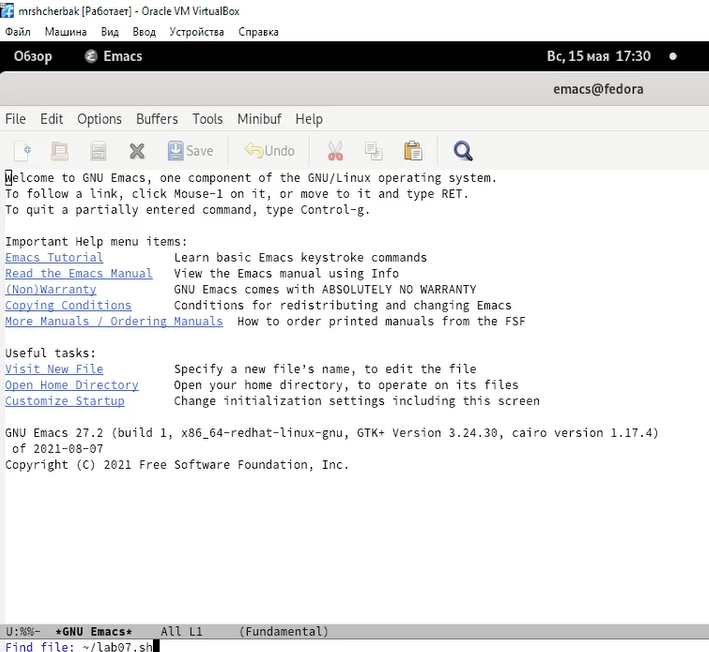{#fig:002 width=80%}

3. Набрали текст (Рис. [-@fig:003]).

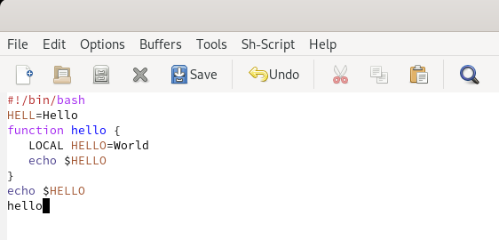{#fig:003 width=80%}

4. Сохранили файл с помощью комбинации Ctrl-x Ctrl-s (C-x C-s). 

5. Проделали с текстом стандартные процедуры редактирования.
- вырезали одной командой целую строку "function hello {" (С-k). (Рис. [-@fig:004]).

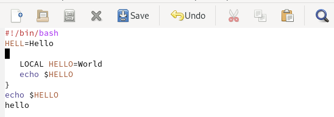{#fig:004 width=80%}

- вставили эту строку в конец файла (C-y). (Рис. [-@fig:005]).

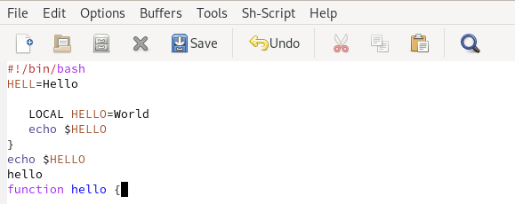{#fig:005 width=80%}

- выделили область текста (C-space).
- скопировали область в буфер обмена (M-w).
- вставили область в конец файла. (Рис. [-@fig:006]).

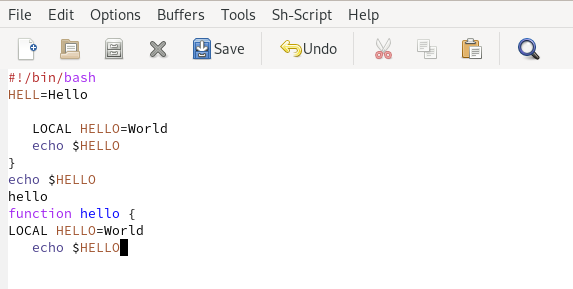{#fig:006 width=80%}

- выделили эту область и вырезали её (C-w).  (Рис. [-@fig:007]).

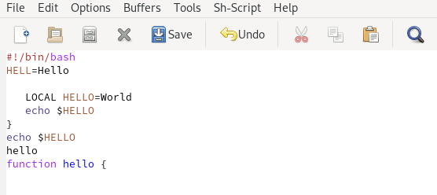{#fig:007 width=80%}

- отменили последнее действие (C-/). (Рис. [-@fig:008]).

{#fig:008 width=80%}

6. Научились использовать команды по перемещению курсора. (Рис. [-@fig:009]).
- переместили курсор в начало строки (C-a).
- переместили курсор в конец строки (C-e).
- переместили курсор в начало буфера (M-<).
- переместили курсор в конец буфера (M->).

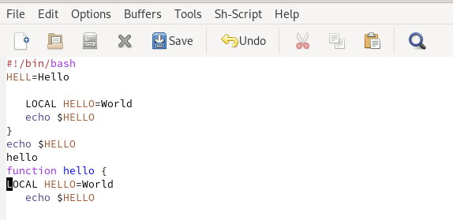{#fig:009 width=80%}

7. Управление буферами.
- вывели список активных буферов на экран (C-x C-b) (Рис. [-@fig:0010]).

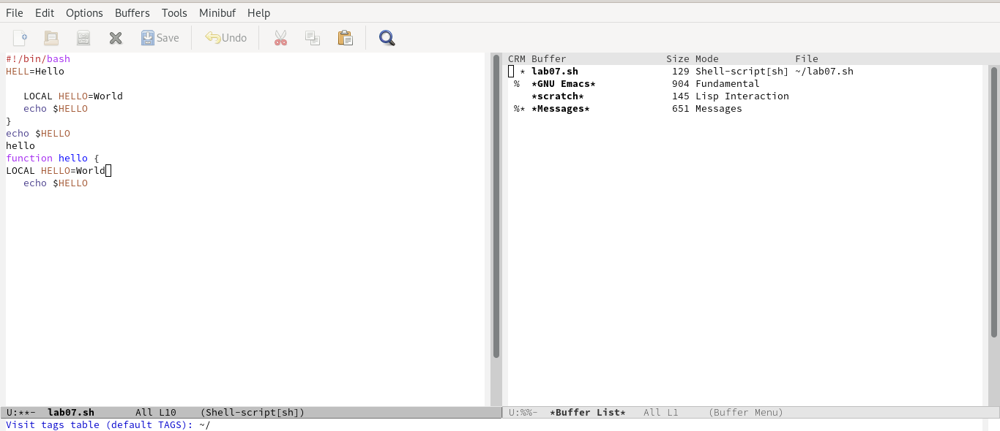{#fig:0010 width=80%}

- переместились во вновь открытое окно (C-x o) со списком открытых буферов
и переключились на другой буфер. (Рис. [-@fig:0011]).

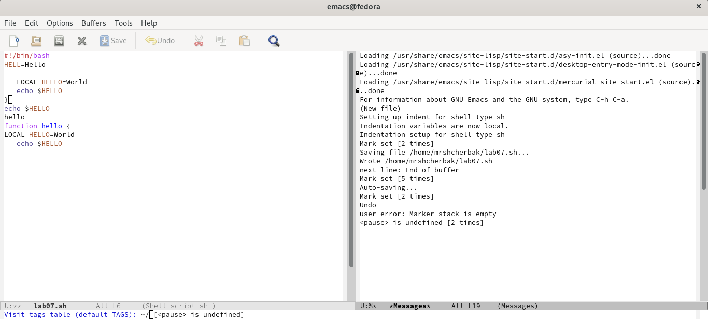{#fig:0011 width=80%}

- закрыли это окно (C-x 0).
- переключались между буферами, но уже без вывода их списка на
экран (C-x b). (Рис. [-@fig:0012]).

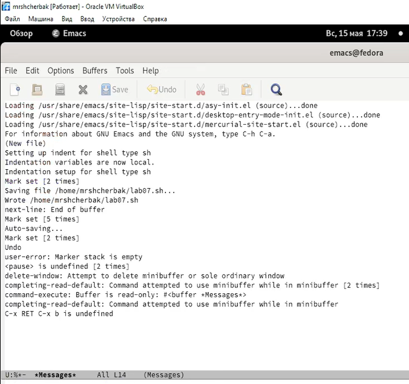{#fig:0012 width=80%}

8. Управление окнами.
- поделили фрейм на 4 части: разделили фрейм на два окна по вертикали (C-x 3),
а затем каждое из этих окон на две части по горизонтали (C-x 2) (Рис. [-@fig:0013] - Рис. [-@fig:0014]).

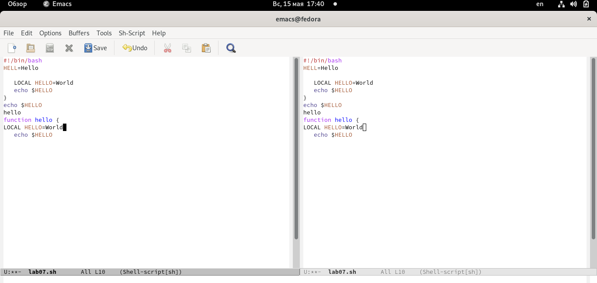{#fig:0013 width=80%}

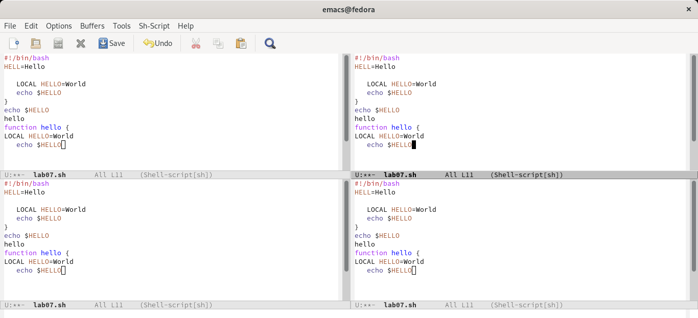{#fig:0014 width=80%} 

- в каждом из четырёх созданных окон открыли новый буфер (файл) и ввели
несколько строк текста. (Рис. [-@fig:0015] - Рис. [-@fig:0016]).

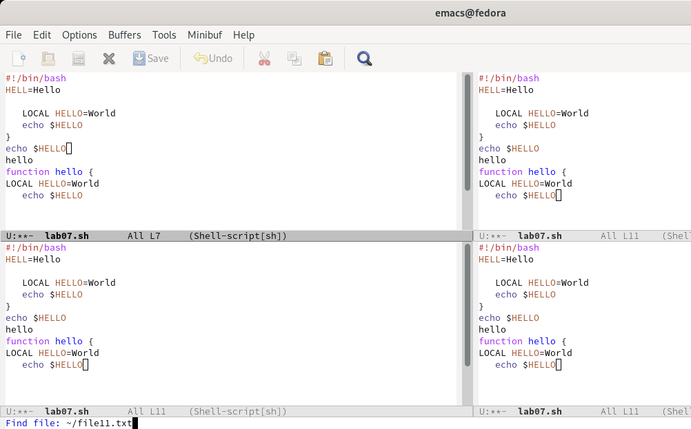{#fig:0015 width=80%}

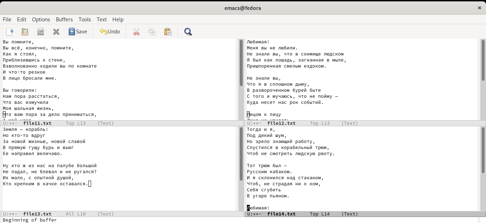{#fig:0016 width=80%}

9. Режим поиска 
- переключились в режим поиска (C-s) и нашли несколько слов, присутствующих
в тексте. (Рис. [-@fig:0017]).

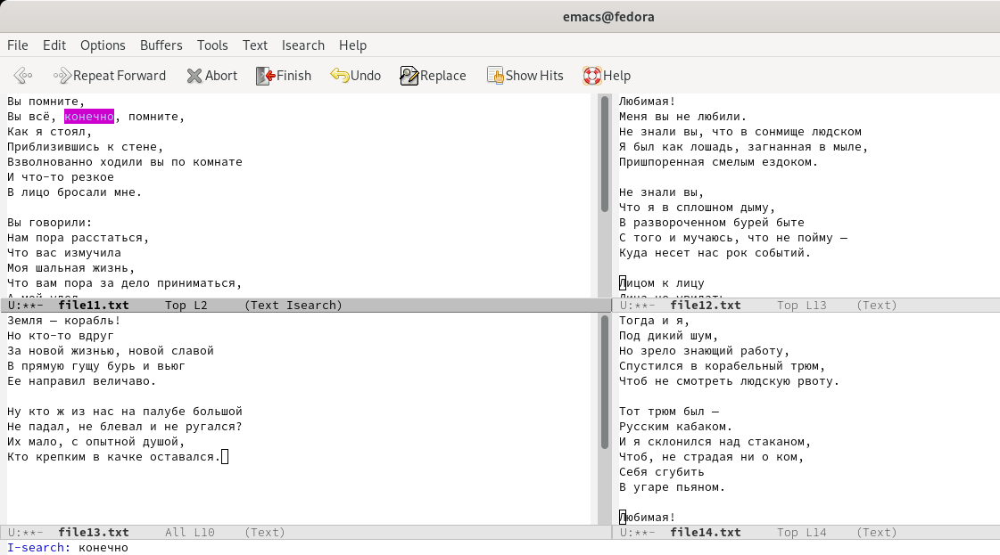{#fig:0017 width=80%}

- переключались между результатами поиска, нажимая C-s. (Рис. [-@fig:0018]).

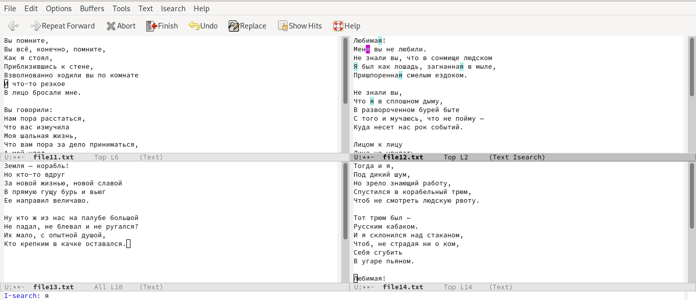{#fig:0018 width=80%}

- вышли из режима поиска, нажав C-g. (Рис. [-@fig:0019]).

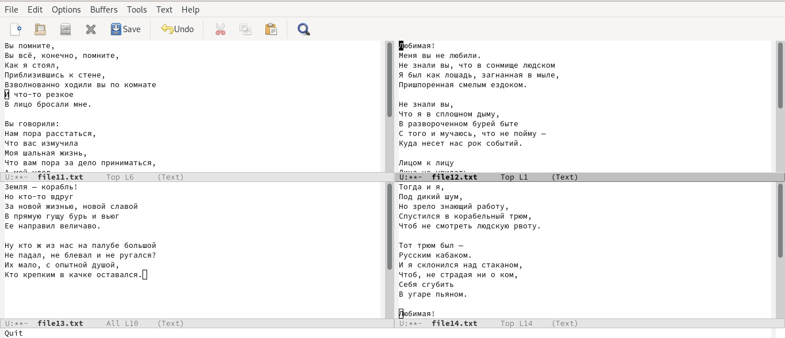{#fig:0019 width=80%}

- перешли в режим поиска и замены (Esc+Shift+%), ввели текст, который следует найти
и заменить, нажали Enter , затем ввели текст для замены. Нажали ! для подтверждения замены. (Рис. [-@fig:0020] - Рис. [-@fig:0021]).

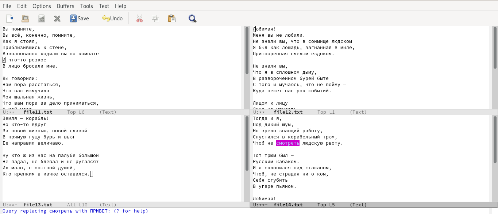{#fig:0020 width=80%}

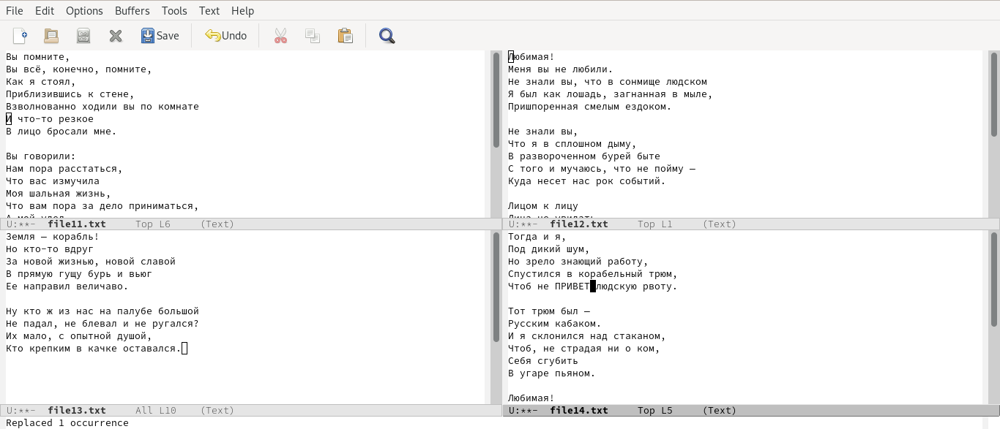{#fig:0021 width=80%}

- испробовали другой режим поиска, нажав Alt-s o. (Рис. [-@fig:0022]).

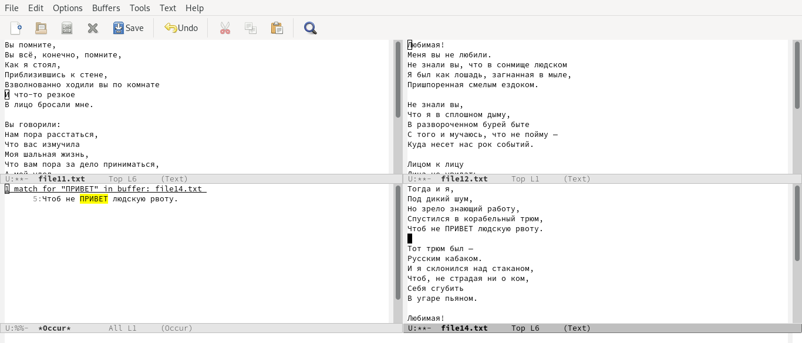{#fig:0022 width=80%} 

Режим поиска и замены ALt-% показывает найденные совпадения искомого слова, а Alt-s o показывает название буфера (файла), номера строк, в которых содержится искомое слово, и совпадения. Оба выделяют цветом.  

*Контрольные вопросы:*  

1. Emacs − один из наиболее мощных и широко распространённых редакторов,
используемых в мире Unix. По популярности он соперничает с редактором vi и
его клонами. В зависимости от ситуации, Emacs может быть текстовым редактором; программой для чтения почты и новостей Usenet; интегрированной средой
разработки (IDE); операционной системой и т.д. Всё это разнообразие достигается
благодаря архитектуре Emacs, которая позволяет расширять возможности редактора при помощи языка Emacs Lisp. На языке C написаны лишь самые базовые и
низкоуровневые части Emacs, включая полнофункциональный. интерпретатор
языка Lisp. Таким образом, Emacs имеет встроенный язык программирования,
который может использоваться для настройки, расширения и изменения поведения редактора. В действительности, большая часть того редактора, с которым
пользователи Emacs работают в наши дни,написана на языке Lisp. 
2. Основную трудность для новичков при освоенииданного редактора могут составлять большое количество команд, комбинаций клавиш, которые не
получится все запомнить с первого раза и поэтому придется часто обращаться к
справочным материалам. 
3. Буфер – это объект, представляющий собой текст. Если имеется несколько
буферов, то редактировать можно только один. Обычно буфер считывает данные
из файла или записывает в файл данные из буфера.Окно – это область экрана,
отображающая буфер. При запуске редактора отображается одно окно, но при
обращении к некоторым функциям могут открыться дополнительные окна. Окна
Emacs и окна графической среды XWindow – разные вещи. Одно окно XWindow может быть разбито на несколько окон в смысле Emacs, в каждом из которых
отображается отдельный буфер. 
4. Не получится, так как окно - прямоугольная область фрейма, отображающая один из буферов, то есть 10 окон - 10 буферов и в одном окне 10 буферов нельзя открыть. 
5. При запуске Emacs по умолчанию создаются следующие буферы: «scratch» (буфер для несохраненного текста) «Messages» (журнал ошибок, включающий также информацию, которая появляется в области EchoArea) «GNUE macs»(справочный
буфер о редакторе). 
6. *C-c |* сначала, удерживая «ctrl»,нажимаю «c»,после отпускаю обе клавишии
нажимаю «|»  
*C-c C-|* сначала, удерживая «ctrl»,нажимаю «с», после отпускаю обе
клавиши и, удерживая «ctrl», нажимаю «|». 
7. Чтобы поделить окно на две части необходимо воспользоваться комбинацией «Ctrl-x 3» (по вертикали) или «Ctrl-x 2» (по горизонтали). 
8. Настройки Emacs хранятся в файле .emacs. 
9.  По умолчанию данная клавиша удаляет символ перед курсором, но в редакторе
её можно переназначить. Для этого необхдимо изменить конфигурацию файла
.emacs. 
10. Более удобным я считаю редактор emacs, потому что в нем проще открывать
другие файлы, можно использовать сразу несколько окон, нет «Командного режима», «Режима ввода», «Режима командной строки», которые являются немного
непривычными и в какой-то степени неудобными. Emacs имеет значительно больше расширений, позволяющих выполнять задачи, которые связаны только с текстовым редактором, например, просмотр файловой системы или управление версиями, а также расширения, которые никоим образом не связаны с текстовым редактором, например, чтение RSS-каналов. Если нужна среда, а не просто текстовый редактор, Emacs будет лучше, чем Vim. Я также думаю, что Emacs гораздо легче освоить.

# Выводы

Таким образом, в ходе ЛР№9 я познакомилась с операционной системой Linux. Получила практические навыки работы с редактором Emacs.
