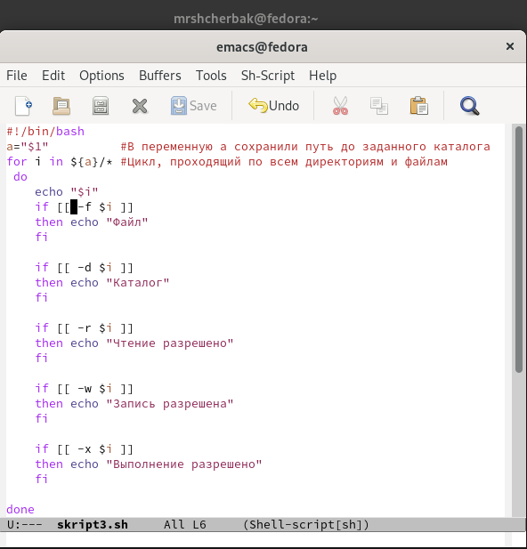
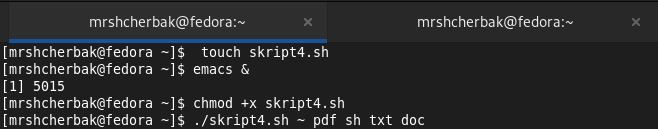

---
## Front matter
lang: ru-RU
title: "Программирование в командном
процессоре ОС UNIX. Командные файлы"
author: |
        Щербак Маргарита Романовна

institute: |
           RUDN
date: 2022

## Formatting
toc: false
slide_level: 2
theme: metropolis
header-includes: 
 - \metroset{progressbar=frametitle,sectionpage=progressbar,numbering=fraction}
 - '\makeatletter'
 - '\beamer@ignorenonframefalse'
 - '\makeatother'
aspectratio: 43
section-titles: true
---

## **Цель работы**
Изучить основы программирования в оболочке ОС UNIX/Linux. Научиться писать
небольшие командные файлы.

## **Ход работы:** Я изучила способ использования команд архивации, используя команды "man zip", "man bzip2", "man tar". (Рис. [-@fig:001]). 

{#fig:001 width=90%}

## Задание: 
1. Написать скрипт, который при запуске будет делать резервную копию самого себя (то
есть файла, в котором содержится его исходный код) в другую директорию backup
в вашем домашнем каталоге. При этом файл должен архивироваться одним из архиваторов на выбор zip, bzip2 или tar. Способ использования команд архивации
необходимо узнать, изучив справку.

## Создала файл backup.sh, в котором писала скрипт по первому заданию. Открыла его в редакторе emacs (C-x C-f). (Рис. [-@fig:005] - Рис. [-@fig:007]).
- Создала каталог backup в домашнем каталоге
- Проверила его наличие с помощью команды ls
- Предоставила право доступа на выполнение файлу backup.sh
- Проверила файл на исполнение  
Использовала архиватор bzip2.

{#fig:005 width=70%}

## Скрипт 1го задания

{#fig:006 width=70%}

{#fig:007 width=70%}

## Задание:
2. Написать пример командного файла, обрабатывающего любое произвольное число
аргументов командной строки, в том числе превышающее десять. Например, скрипт
может последовательно распечатывать значения всех переданных аргументов.

## Создала файл skript2.sh, в котором писала второй скрипт, и открыла его в редакторе emacs. (Рис. [-@fig:008] - Рис. [-@fig:009]).  
- Предоставила право доступа на выполнение файлу skript2.sh
- Проверила файл на исполнение  

{#fig:008 width=50%}

## Скрипт последовательно печатает значения всех переданных аргументов.

{#fig:009 width=80%}

## Задание: 
3. Написать командный файл — аналог команды ls (без использования самой этой команды и команды dir). Требуется, чтобы он выдавал информацию о нужном каталоге
и выводил информацию о возможностях доступа к файлам этого каталога.

## Создала файл skript3.sh, в котором писала третий скрипт, и открыла его в редакторе emacs (C-x C-s). (Рис. [-@fig:0010] - Рис. [-@fig:0011]).  
- Предоставила право доступа на выполнение файлу skript3.sh (chmod +x skript3.sh)
- Проверила файл на исполнение 

{#fig:0010 width=35%}

## Скрипт 3го задания

{#fig:0011 width=60%}

## Файл выдаёт информацию о нужном каталоге и выводит информацию о возможностях доступа к файлам этого каталога (Рис. [-@fig:0012]).

{#fig:0012 width=40%}

## Задание:
4. Написать командный файл, который получает в качестве аргумента командной строки
формат файла (.txt, .doc, .jpg, .pdf и т.д.) и вычисляет количество таких файлов
в указанной директории. Путь к директории также передаётся в виде аргумента командной строки.

## Создала файл skript4.sh, в котором писала четвёртый скрипт, и открыла его в редакторе emacs (C-x C-s). (Рис. [-@fig:0013] - Рис. [-@fig:0016]).  
- Предоставила право доступа на выполнение файлу skript4.sh (chmod +x skript4.sh)
- Проверила файл на исполнение 

{#fig:0013 width=80%}

## Скрипт 4го задания

{#fig:0014 width=80%}

## Файл получает в качестве аргумента командной строки формат файла (.txt, .doc, .jpg, .pdf и т.д.) и вычисляет количество таких файлов в указанной директории.

{#fig:0015 width=90%}

## Добавлены другие форматы файлов

{#fig:0016 width=90%}

## **Вывод:** 

Таким образом, в ходе ЛР№10 я изучила основы программирования в оболочке ОС UNIX/Linux. Научилась писать
небольшие командные файлы.

