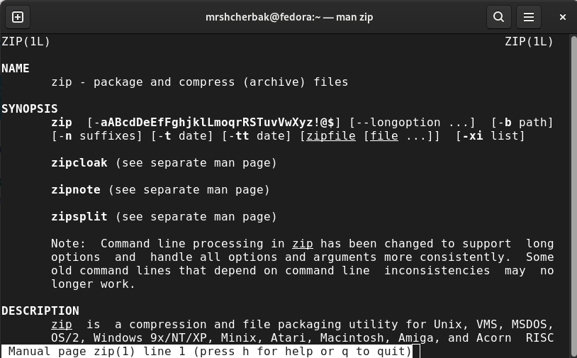
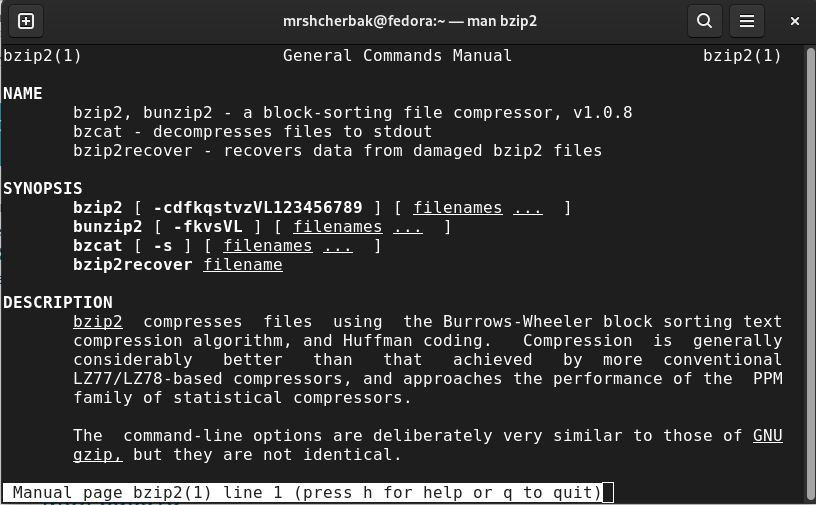
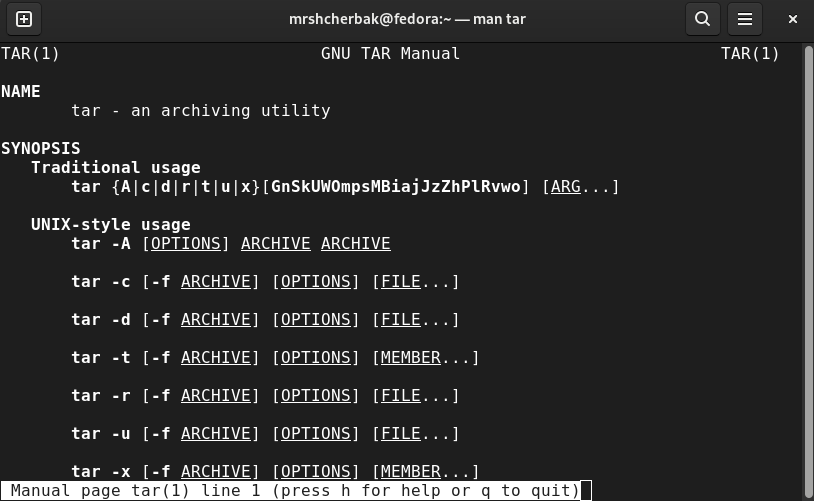
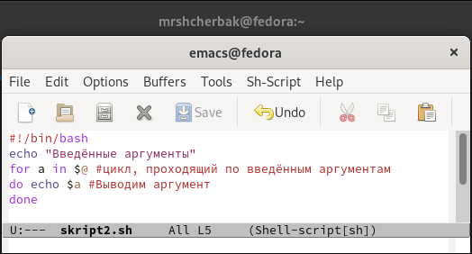
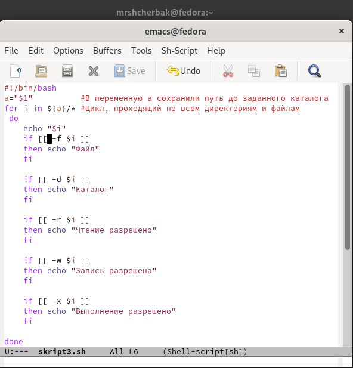

---
## Front matter

title: "Отчёт по лабораторной работе №10"
subtitle: "Программирование в командном
процессоре ОС UNIX. Командные файлы"
author: "Щербак Маргарита Романовна"
date: "2022"
## Generic otions
lang: ru-RU

## Bibliography
bibliography: bib/cite.bib
csl: pandoc/csl/gost-r-7-0-5-2008-numeric.csl

## Pdf output format
toc-depth: 2
fontsize: 12pt
linestretch: 1.5
papersize: a4
documentclass: scrreprt
## I18n polyglossia
polyglossia-lang:
  name: russian
  options:
	- spelling=modern
	- babelshorthands=true
polyglossia-otherlangs:
  name: english
## I18n babel
babel-lang: russian
babel-otherlangs: english
## Fonts
mainfont: PT Serif
romanfont: PT Serif
sansfont: PT Sans
monofont: PT Mono
mainfontoptions: Ligatures=TeX
romanfontoptions: Ligatures=TeX
sansfontoptions: Ligatures=TeX,Scale=MatchLowercase
monofontoptions: Scale=MatchLowercase,Scale=0.9
## Biblatex
biblatex: true
biblio-style: "gost-numeric"
biblatexoptions:
  - parentracker=true
  - backend=biber
  - hyperref=auto
  - language=auto
  - autolang=other*
  - citestyle=gost-numeric
## Pandoc-crossref LaTeX customization
figureTitle: "Рис."

listingTitle: "Листинг"
lofTitle: "Список иллюстраций"

lolTitle: "Листинги"
## Misc options
indent: true
header-includes:
  - \usepackage{indentfirst}
  - \usepackage{float} # keep figures where there are in the text
  - \floatplacement{figure}{H} # keep figures where there are in the text
---

# Цель работы:
Изучить основы программирования в оболочке ОС UNIX/Linux. Научиться писать
небольшие командные файлы.

## Задание: 
1. Написать скрипт, который при запуске будет делать резервную копию самого себя (то
есть файла, в котором содержится его исходный код) в другую директорию backup
в вашем домашнем каталоге. При этом файл должен архивироваться одним из архиваторов на выбор zip, bzip2 или tar. Способ использования команд архивации
необходимо узнать, изучив справку.
2. Написать пример командного файла, обрабатывающего любое произвольное число
аргументов командной строки, в том числе превышающее десять. Например, скрипт
может последовательно распечатывать значения всех переданных аргументов.
3. Написать командный файл — аналог команды ls (без использования самой этой команды и команды dir). Требуется, чтобы он выдавал информацию о нужном каталоге
и выводил информацию о возможностях доступа к файлам этого каталога.
4. Написать командный файл, который получает в качестве аргумента командной строки
формат файла (.txt, .doc, .jpg, .pdf и т.д.) и вычисляет количество таких файлов
в указанной директории. Путь к директории также передаётся в виде аргумента командной строки.

# Теоретическое введение: 
*Командные процессоры (оболочки)*  
Командный процессор (командная оболочка, интерпретатор команд shell) — это программа, позволяющая пользователю взаимодействовать с операционной системой
компьютера.  
В операционных системах типа UNIX/Linux наиболее часто используются
следующие реализации командных оболочек:  
- оболочка Борна (Bourne shell или sh) — стандартная командная оболочка UNIX/Linux,
содержащая базовый, но при этом полный набор функций;  
- С-оболочка (или csh) — надстройка на оболочкой Борна, использующая С-подобный
синтаксис команд с возможностью сохранения истории выполнения команд;  
- оболочка Корна (или ksh) — напоминает оболочку С, но операторы управления программой совместимы с операторами оболочки Борна;  
- BASH — сокращение от Bourne Again Shell (опять оболочка Борна), в основе своей совмещает свойства оболочек С и Корна (разработка компании Free Software Foundation).  
POSIX (Portable Operating System Interface for Computer Environments) — набор стандартов
описания интерфейсов взаимодействия операционной системы и прикладных программ.  
Стандарты POSIX разработаны комитетом IEEE (Institute of Electrical and Electronics
Engineers) для обеспечения совместимости различных UNIX/Linux-подобных операционных систем и переносимости прикладных программ на уровне исходного кода.
POSIX-совместимые оболочки разработаны на базе оболочки Корна.  
Рассмотрим основные элементы программирования в оболочке bash. В других оболочках большинство команд будет совпадать с описанными ниже.  
Оболочка bash поддерживает встроенные арифметические функции. Команда let
является показателем того, что последующие аргументы представляют собой выражение,
подлежащее вычислению. Простейшее выражение — это единичный терм (term), обычно
целочисленный.  
Команда let берет два операнда и присваивает их переменной. Положительным моментом команды let можно считать то, что для идентификации переменной ей не
нужен знак доллара; вы можете писать команды типа let sum=x+7, и let будет искать
переменную x и добавлять к ней 7.  
Команда let также расширяет другие выражения let, если они заключены в двойные
круглые скобки. Таким способом вы можете создавать довольно сложные выражения.  
Команда let не ограничена простыми арифметическими выражениями.

# Выполнение лабораторной работы:
1. Я изучила способ использования команд архивации, используя команды "man zip", "man bzip2", "man tar". (Рис. [-@fig:001] - Рис. [-@fig:004]). 

{#fig:001 width=90%}

{#fig:002 width=90%}

{#fig:003 width=90%}

{#fig:004 width=90%}

2. **Первое задание.** Создала файл backup.sh, в котором писала скрипт по первому заданию. Открыла его в редакторе emacs (C-x C-f). (Рис. [-@fig:005] - Рис. [-@fig:007]).
- Создала каталог backup в домашнем каталоге
- Проверила его наличие с помощью команды ls
- Предоставила право доступа на выполнение файлу backup.sh
- Проверила файл на исполнение  
Использовала архиватор bzip2.

{#fig:005 width=90%}

{#fig:006 width=90%}

{#fig:007 width=90%}

3. **Второе задание.** Создала файл skript2.sh, в котором писала второй скрипт, и открыла его в редакторе emacs. (Рис. [-@fig:008] - Рис. [-@fig:009]).
- Предоставила право доступа на выполнение файлу skript2.sh
- Проверила файл на исполнение  

{#fig:008 width=90%}

Скрипт последовательно печатает значения всех переданных аргументов.

{#fig:009 width=90%}

4. **Третье задание.** Создала файл skript3.sh, в котором писала третий скрипт, и открыла его в редакторе emacs (C-x C-s). (Рис. [-@fig:0010] - Рис. [-@fig:0012]).
- Предоставила право доступа на выполнение файлу skript3.sh (chmod +x skript3.sh)
- Проверила файл на исполнение 

{#fig:0010 width=90%}

{#fig:0011 width=90%}

Файл выдаёт информацию о нужном каталоге
и выводит информацию о возможностях доступа к файлам этого каталога.

{#fig:0012 width=90%}

5. **Четвёртое задание.** Создала файл skript4.sh, в котором писала четвёртый скрипт, и открыла его в редакторе emacs (C-x C-s). (Рис. [-@fig:0013] - Рис. [-@fig:0016]).
- Предоставила право доступа на выполнение файлу skript4.sh (chmod +x skript4.sh)
- Проверила файл на исполнение 

{#fig:0013 width=90%}

{#fig:0014 width=90%}

Файл получает в качестве аргумента командной строки
формат файла (.txt, .doc, .jpg, .pdf и т.д.) и вычисляет количество таких файлов
в указанной директории.

{#fig:0015 width=85%}

{#fig:0016 width=85%}

*Контрольные вопросы:*  
1.  Командный процессор (командная оболочка, интерпретатор команд shell) −
это программа, позволяющая пользователю взаимодействовать с операционной
системой компьютера.  
В операционных системах типа UNIX/Linux наиболее часто используются следующие реализации командных оболочек:  
- оболочка Борна (Bourne shell или sh) — стандартная командная оболочка
UNIX/Linux, содержащая базовый, но при этом полный набор функций;  
- С-оболочка (или csh) — надстройка на оболочкой Борна, использующая Сподобный синтаксис команд с возможностью сохранения истории выполнения
команд;  
- оболочка Корна (или ksh)— напоминает оболочку С, но операторы управления
программой совместимы с операторами оболочки Борна;  
- BASH — сокращение от Bourne Again Shell (опять оболочка Борна), в основе своей совмещает свойства оболочек С и Корна (разработка компании Free
Software Foundation).  
2. POSIX (Portable Operating System Interface for Computer Environments) — набор
стандартов описания интерфейсов взаимодействия операционной системы и
прикладных программ. Стандарты POSIX разработаны комитетом IEEE (Institute
of Electrical and Electronics Engineers) для обеспечения совместимости различных UNIX/Linux-подобных операционных систем и переносимости прикладных
программ на уровне исходного кода. POSIX-совместимые оболочки разработаны
на базе оболочки Корна.  
3. Командный процессор bash обеспечивает возможность использования переменных типа строка символов. Имена переменных могут быть выбраны пользователем. Пользователь имеет возможность присвоить переменной значение
некоторой строки символов. Например, команда «mark=/usr/andy/bin» присваивает значение строки символов /usr/andy/bin переменной mark типа строка символов. Значение, присвоенное некоторой переменной, может быть впоследствии
использовано. Для этого в соответствующем месте командной строки должно
быть употреблено имя этой переменной, которому предшествует метасимвол
.Например,команда«mvafile{mark}» переместит файл afile из текущего каталога в
каталог с абсолютным полным именем /usr/andy/bin. Оболочка bash позволяет
работать с массивами. Для создания массива используется команда setс флагом
-A. За флагом следует имя переменной, а затем список значений, разделённых
пробелами. Например, «set -Astates Delaware Michigan “New Jersey”». Далее можно
сделать добавление в массив, например, states[49]=Alaska. Индексация массивов
начинается с нулевого элемента.  
4. Команда let является показателем того, что последующие аргументы представляют собой выражение, подлежащее вычислению. Простейшее выражение − это
единичный терм (term), обычно целочисленный. Команда let берет два операнда
и присваивает их переменной. Команда read позволяет читать значения переменных со стандартного ввода: «echo “Please enter Month and Day of Birth ?”»
«read mon day trash». В переменные monи day будут считаны соответствующие
значения, введённые с клавиатуры, а переменная trash нужна для того, чтобы
отобрать всю избыточно введённую информацию и игнорировать её.  
5. В языке программирования bash можно применять такие арифметические
операции как сложение (+), вычитание (-), умножение (*), целочисленное деление
(/) и целочисленный остаток от деления (%).  
6. В (( )) записывают условия оболочки bash, а также внутри двойных скобок
можно вычислять арифметические выражения и возвращать результат.  
7.  Стандартные переменные:  
-  PATH: значением данной переменной является список каталогов, в которых командный процессор осуществляет поиск
программы или команды, указанной в командной строке, в том случае, если
указанное имя программы или команды не содержит ни одного символа /. Если
имя команды содержит хотя бы один символ /, то последовательность поиска,
предписываемая значением переменной PATH, нарушается. В этом случае в зависимости от того, является имя команды абсолютным или относительным, поиск
начинается соответственно от корневогоили текущего каталога.  
- PS1 и PS2: эти переменные предназначены для отображения промптера
командного процессора. PS1 − это промптер командного процессора, по
умолчанию его значение равно символу $ или #. Если какая-то интерактивная программа, запущенная командным процессором, требует ввода, то
используется промптер PS2. Он по умолчанию имеет значение символа >.  
- HOME — имя домашнего каталога пользователя. Если команда cd вводится
без аргументов, то происходит переход в каталог, указанный в этой переменной.  
- IFS — последовательность символов, являющихся разделителями в командной
строке, например, пробел, табуляция и перевод строки (new line).  
- MAIL — командный процессор каждый раз перед выводом на экран промптера проверяет
содержимое файла, имя которого указано в этой переменной, и если содержимое
этого файла изменилось с момента последнего ввода из него, то перед тем как
вывести на терминал промптер, командный процессор выводит на терминал
сообщение You have mail (у Вас есть почта).  
- TERM — тип используемого терминала.  
- LOGNAME — содержит регистрационное имя пользователя, которое
устанавливается автоматически при входе в систему.  
8. Такие символы, как ’ < > * ? | ” &, являются метасимволами и имеют для
командного процессора специальный смысл.  
9. Снятие специального смысла с метасимвола называется экранированием мета
символа. Экранирование может быть осуществлено с помощью предшествующего мета символу символа , который, в свою очередь, является мета символом. Для
экранирования группы метасимволов нужно заключить её в одинарные кавычки.
Строка, заключённая в двойные кавычки, экранирует все метасимволы, кроме $,
’ , , “. Например, –echo* выведет на экран символ , –echoab’|’cd выведет на экран
строку ab|*cd.  
10. Последовательность команд может быть помещена в текстовый файл. Такой файл называется командным. Далее этот файл можно выполнить по команде:
«bash командный_файл [аргументы]». Чтобы не вводить каждый раз последовательности символов bash, необходимо изменить код защиты этого командного
файла, обеспечив доступ к этому файлу по выполнению. Это может быть сделано с помощью команды «chmod +x имя_файла». Теперь можно вызывать свой
командный файл на выполнение, просто вводя его имя с терминала так, как
будто он является выполняемой программой. Командный процессор распознает,
что в Вашем файле на самом деле хранится не выполняемая программа, а программа, написанная на языке программирования оболочки, и осуществить её
интерпретацию.  
11. Группу команд можно объединить в функцию. Для этого существует ключевое слово function, после которого следует имя функции и список команд, заключённых в фигурные скобки. Удалить функцию можно с помощью команды
unset c флагом -f.  
12.  Чтобы выяснить, является ли файл каталогом или обычным файлом, необходимо воспользоваться командами «test-f [путь до файла]» (для проверки, является ли обычным файлом) и «test -d[путь до файла]» (для проверки, является ли
каталогом).  
13. «set» можно использовать для вывода списка переменных окружения. В системах Ubuntu и Debia nкоманда «set» также выведет список функций командной
оболочки после списка переменных командной оболочки. Поэтому для ознакомления со всеми элементами списка переменных окружения при работе с
данными системами рекомендуется использовать команду «set| more». Команда
«typeset» предназначена для наложения ограничений на переменные. Команду
«unset» следует использовать для удаления переменной из окружения командной
оболочки.  
14. При вызове командного файла на выполнение параметры ему могут быть
переданы точно таким же образом, как и выполняемой программе. С точки
зрения командного файла эти параметры являются позиционными. Символ $
является метасимволом командного процессора.  
15. Специальные переменные:  
-  $* −отображается вся командная строка или параметры оболочки;  
- $? −код завершения последней выполненной команды;  
- $ (2 Таких знака) −уникальный идентификатор процесса, в рамках которого
выполняется командный процессор;  
- $! −номер процесса, в рамках которого
выполняется последняя вызванная на выполнение в командном режиме команда;  
- $ значение флагов командного процессора;  
- ${#} −возвращает целое число
−количествослов, которые были результатом $;  
-  ${#name} −возвращает целое
значение длины строки в переменной name;  
- ${name[n]} −обращение к n-му
элементу массива;  
- ${name[*]}−перечисляет все элементы массива, разделённые пробелом;  
- ${name[@]}−то же самое, но позволяет учитывать символы
пробелы в самих переменных;  
- ${name:-value} −если значение переменной
name не определено, то оно будет заменено на указанное value;  
- ${name:value}
−проверяется факт существования переменной;  
- ${name=value} −если name не
определено, то ему присваивается значение value;  
- ${name?value} −останавливает выполнение, если имя переменной не определено, и выводит value как
сообщение об ошибке;  
- ${name+value} −это выражение работает противоположно ${name-value}. Если переменная определена, то подставляется value;  
- ${name#pattern} −представляет значение переменной name с удалённым самым
коротким левым образцом (pattern);  
- ${#name[*]} и ${#name[@]} − эти выражения возвращают количество элементов в массиве name.

# Выводы
Таким образом, в ходе ЛР№10 я изучила основы программирования в оболочке ОС UNIX/Linux. Научилась писать
небольшие командные файлы.
