---
## Front matter
lang: ru-RU
title: "Программирование в командном
процессоре ОС UNIX. Ветвления и циклы"
author: |
        Щербак Маргарита Романовна

institute: |
           RUDN
date: 2022

## Formatting
toc: false
slide_level: 2
theme: metropolis
header-includes: 
 - \metroset{progressbar=frametitle,sectionpage=progressbar,numbering=fraction}
 - '\makeatletter'
 - '\beamer@ignorenonframefalse'
 - '\makeatother'
aspectratio: 43
section-titles: true
---

## **Цель работы**
Изучить основы программирования в оболочке ОС UNIX. Научиться писать более
сложные командные файлы с использованием логических управляющих конструкций
и циклов.

## Задание: 
1.  Используя команды getopts grep, написать командный файл, который анализирует
командную строку с ключами:  
– -iinputfile — прочитать данные из указанного файла;  
– -ooutputfile — вывести данные в указанный файл;  
– -p шаблон — указать шаблон для поиска;  
– -C — различать большие и малые буквы;  
– -n — выдавать номера строк.  
а затем ищет в указанном файле нужные строки, определяемые ключом -p.

## **Ход работы:** 
Я создала файл prog1.sh, в котором буду писать скрипт, открыла текстовой редактор emacs. Также дала созданному файлу право доступа на выполнение (+х).  
Считывать данные я буду из файла conf.txt, поэтому просмотрели его содержимое перед выполнением задания.  
Создала файл outputf.txt, в который считывала содержимое файла conf.txt.  
При выполнении задания взяла в качестве шаблона из файла conf.txt строку №23: man_db.conf, "db" будет служить шаблоном для параметра -С.  
(Рис. [-@fig:001] - Рис. [-@fig:005]). 

## Создание файла, в котором написан скрипт первого задания, предоставление права доступа на выполнение этому файлу и просмотр содержимого файла, который будем читать.

{#fig:001 width=40%}

## Создание файла, в который будем выводить данные из указанного файла.

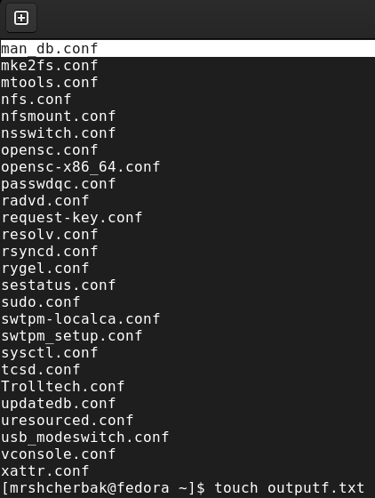{#fig:002 width=45%}

## Скрипт

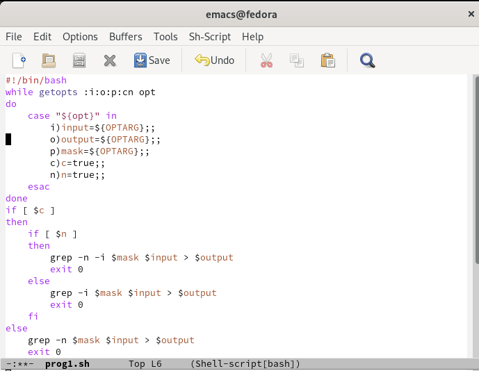{#fig:003 width=80%}

## Делаем вывод, что скрипт работает корректно. Командный файл анализирует командную строку с ключами и ищет в указанном файле нужные строки, определяемые ключом -p.

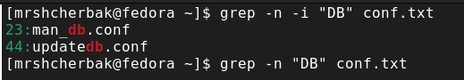{#fig:004 width=80%}

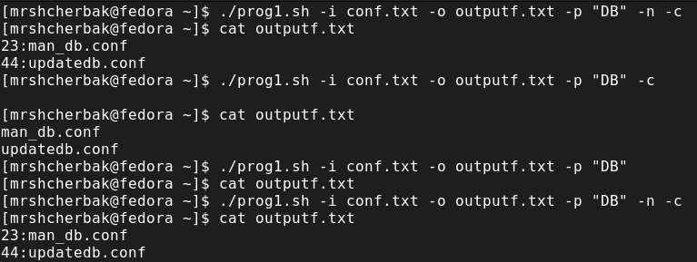{#fig:005 width=70%}

## Задание:
2.  Написать на языке Си программу, которая вводит число и определяет, является ли оно
больше нуля, меньше нуля или равно нулю. Затем программа завершается с помощью
функции exit(n), передавая информацию о коде завершения в оболочку. Командный файл должен вызывать эту программу и выдавать сообщение о том, какое число было введено.

## Создала файл prog2.sh, в котором писала второй скрипт, и открыла его в редакторе emacs. Также создала файл prog2.c, в котором писала на языке Си программу, выводящую  число и определяющую, является ли оно больше нуля, меньше нуля или равно нулю. (Рис. [-@fig:006] - Рис. [-@fig:009]).  
Предоставила право доступа на выполнение файлу prog2.sh.  

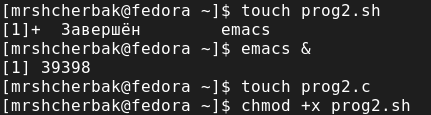{#fig:006 width=70%}

## Выполнение

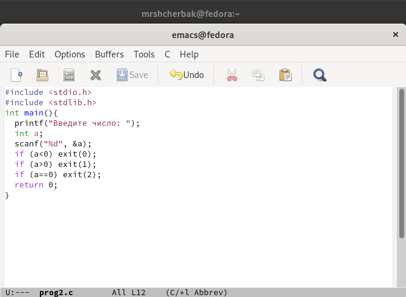{#fig:007 width=70%}

## Скрипт 

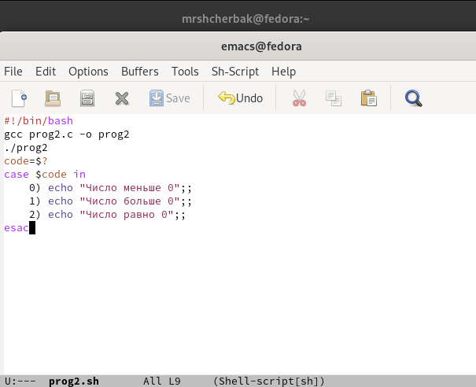{#fig:008 width=70%}

## Проверка работы

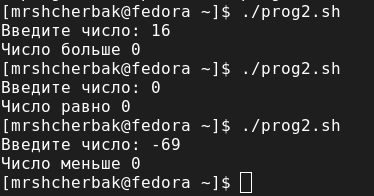{#fig:009 width=80%}

## Задание: 
3. Написать командный файл, создающий указанное число файлов, пронумерованных
последовательно от 1 до N (например 1.tmp, 2.tmp, 3.tmp,4.tmp и т.д.). Число файлов,
которые необходимо создать, передаётся в аргументы командной строки. Этот же командный файл должен уметь удалять все созданные им файлы (если они существуют).

## Создала файл prog3.sh, в котором писала третий скрипт, и открыла его в редакторе emacs (C-x C-s). Предоставила право доступа на выполнение файлу prog3.sh. (Рис. [-@fig:0010]).  
Написала командный файл, создающий указанное число файлов, пронумерованных
последовательно от 1 до N (1.tmp, 2.tmp, 3.tmp,4.tmp и т.д.).  Этот же командный файл удаляет все созданные им файлы (Рис. [-@fig:0011]).  

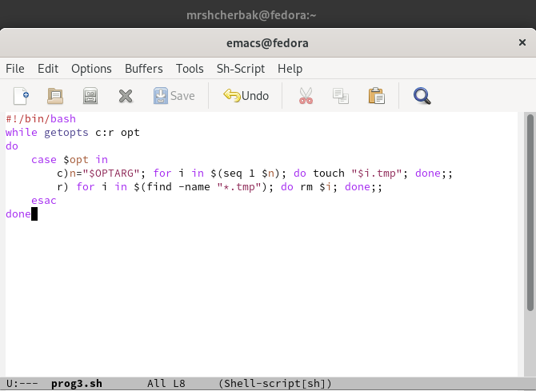{#fig:0011 width=50%}

## Скрипт работает корректно.

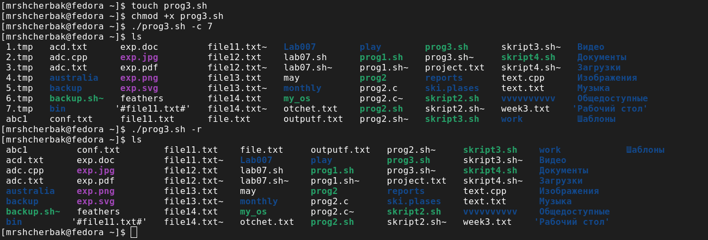{#fig:0010 width=90%}

## Задание:
4.  Написать командный файл, который с помощью команды tar запаковывает в архив
все файлы в указанной директории. Модифицировать его так, чтобы запаковывались
только те файлы, которые были изменены менее недели тому назад (использовать
команду find).

## Создала файл prog4.sh, в котором писала четвёртый скрипт, и открыла его в редакторе emacs (C-x C-s). Предоставила право доступа на выполнение файлу prog4.sh. (Рис. [-@fig:0012]).  
Написала командный файл, который с помощью команды tar запаковывает в архив
все файлы в указанной директории. Запаковываются те файлы, которые были изменены менее недели тому назад. (Рис. [-@fig:0013]).  

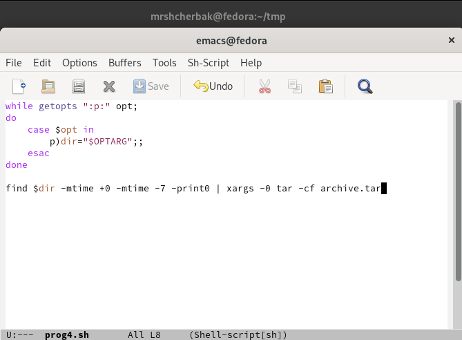{#fig:0013 width=50%}

## В папке tmp, созданной в домашнем каталоге, находятся файлы, изменённые менее недели тому назад.

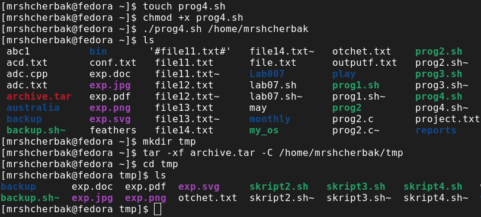{#fig:0012 width=90%}

## **Вывод:** 

Таким образом, в ходе ЛР№11 я изучила основы программирования в оболочке ОС UNIX. Научилась писать более
сложные командные файлы с использованием логических управляющих конструкций
и циклов.

