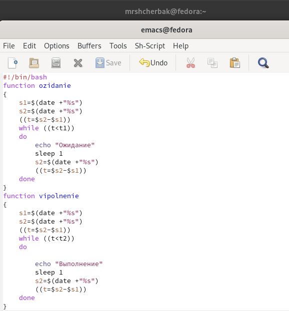
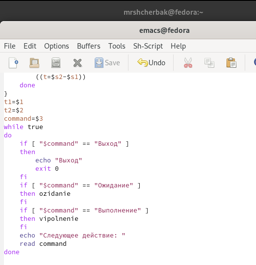
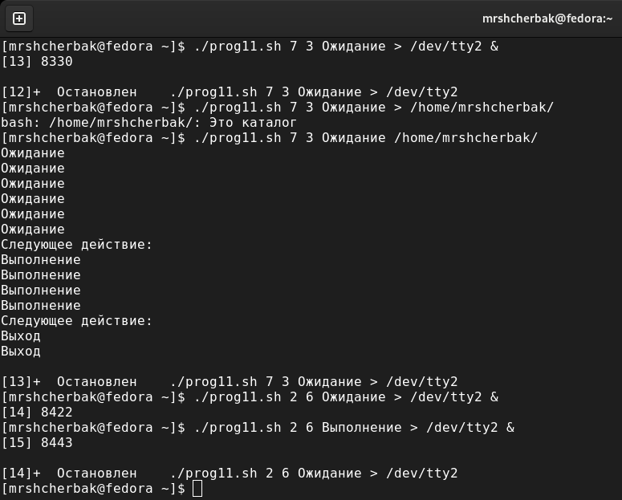
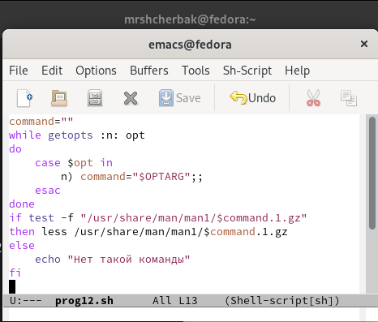
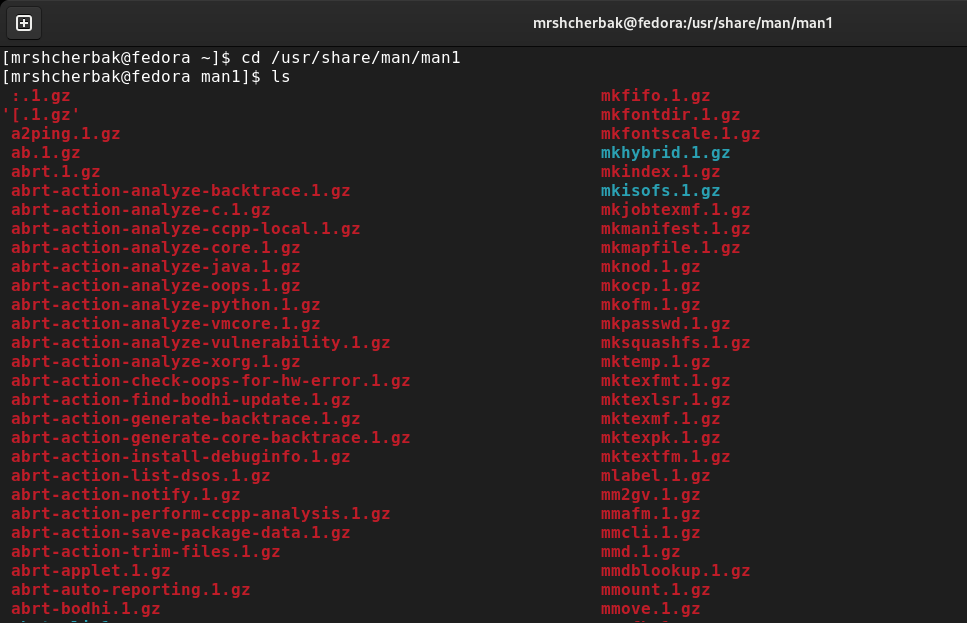
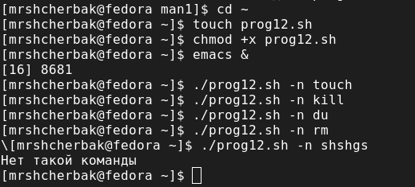
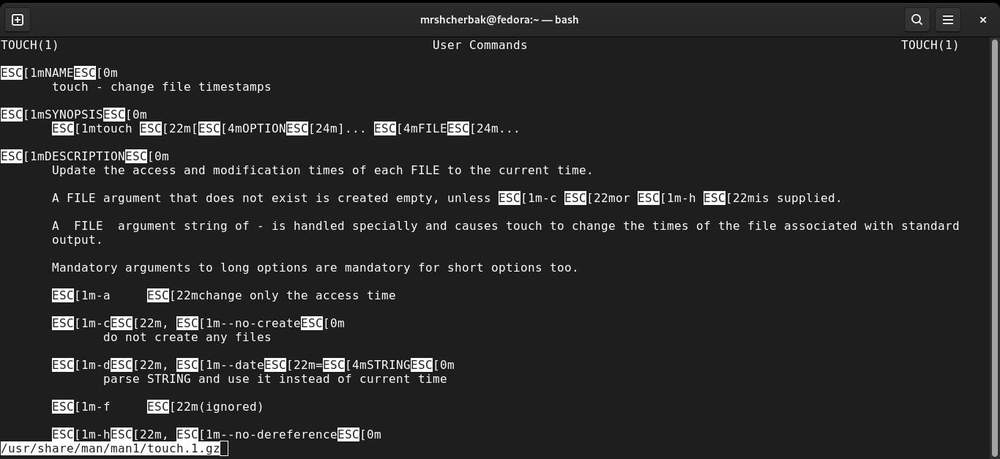
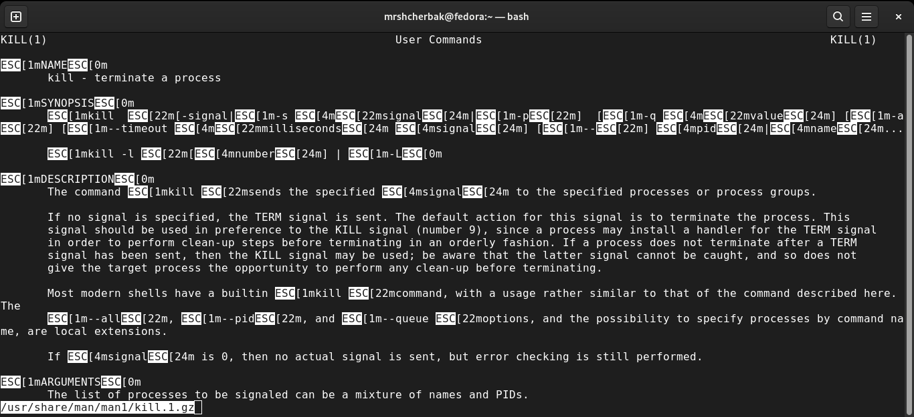
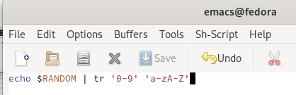
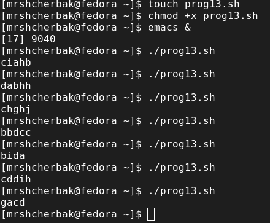

---
## Front matter
lang: ru-RU
title: "Программирование в командном
процессоре ОС UNIX. Расширенное программирование"
author: |
        Щербак Маргарита Романовна

institute: |
           RUDN
date: 2022

## Formatting
toc: false
slide_level: 2
theme: metropolis
header-includes: 
 - \metroset{progressbar=frametitle,sectionpage=progressbar,numbering=fraction}
 - '\makeatletter'
 - '\beamer@ignorenonframefalse'
 - '\makeatother'
aspectratio: 43
section-titles: true
---

## **Цель работы**
Изучить основы программирования в оболочке ОС UNIX. Научиться писать более
сложные командные файлы с использованием логических управляющих конструкций
и циклов.

## Задание: 
1.  Написать командный файл, реализующий упрощённый механизм семафоров. Командный файл должен в течение некоторого времени t1 дожидаться освобождения
ресурса, выдавая об этом сообщение, а дождавшись его освобождения, использовать
его в течение некоторого времени t2<>t1, также выдавая информацию о том, что
ресурс используется соответствующим командным файлом (процессом). Запустить
командный файл в одном виртуальном терминале в фоновом режиме, перенаправив
его вывод в другой (> /dev/tty#, где # — номер терминала куда перенаправляется
вывод), в котором также запущен этот файл, но не фоновом, а в привилегированном
режиме. Доработать программу так, чтобы имелась возможность взаимодействия трёх
и более процессов.

## **Ход работы:** Написала командный файл, реализующий упрощённый механизм семафоров. (Рис. [-@fig:001] - Рис. [-@fig:003]).
Я создала файл prog11.sh, в котором писала скрипт, открыла текстовой редактор emacs. Также дала созданному файлу право доступа на выполнение (+х).  
 
{#fig:001 width=40%}

## Скрипт

{#fig:002 width=50%}

## Делаем вывод, что скрипт работает корректно.

{#fig:003 width=80%}

## Задание:
2. Реализовать команду man с помощью командного файла. Изучите содержимое каталога /usr/share/man/man1. В нем находятся архивы текстовых файлов, содержащих
справку по большинству установленных в системе программ и команд. Каждый архив
можно открыть командой less сразу же просмотрев содержимое справки. Командный
файл должен получать в виде аргумента командной строки название команды и в виде
результата выдавать справку об этой команде или сообщение об отсутствии справки,
если соответствующего файла нет в каталоге man1.

## Командный файл получает в виде аргумента командной строки название команды и в виде результата выдаёт справку об этой команде/сообщение об отсутствии справки, если соответствующего файла нет в каталоге man1. (Рис. [-@fig:004] - Рис. [-@fig:008]).  
Создала файл prog12.sh, в котором писала второй скрипт, и открыла его в редакторе emacs.   
Предоставила право доступа на выполнение файлу prog12.sh.  

{#fig:004 width=40%}

## Изучила содержимое каталога /usr/share/man/man1.

{#fig:005 width=80%}

## Проверка работы скрипта

{#fig:006 width=60%}

{#fig:007 width=60%}

## Таким образом, мы видим, что задание выполнено успешно.

{#fig:008 width=90%}

## Задание: 
3. Используя встроенную переменную $RANDOM, напишите командный файл, генерирующий случайную последовательность букв латинского алфавита. Учтите, что $RANDOM
выдаёт псевдослучайные числа в диапазоне от 0 до 32767.

## Используя встроенную переменную $RANDOM, написала командный файл, генерирующий случайную последовательность букв латинского алфавита. (Рис. [-@fig:009] - Рис. [-@fig:0010]). 
Создала файл prog13.sh, в котором писала третий скрипт, и открыла его в редакторе emacs. Предоставила право доступа на выполнение файлу prog13.sh.  

{#fig:009 width=80%}

## Скрипт работает корректно.

{#fig:0010 width=70%}

## **Вывод:** 

Таким образом, в ходе ЛР№12 я изучила основы программирования в оболочке ОС UNIX. Научилась писать более
сложные командные файлы с использованием логических управляющих конструкций
и циклов.
