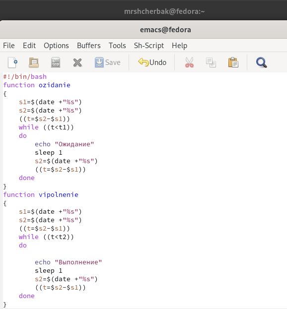
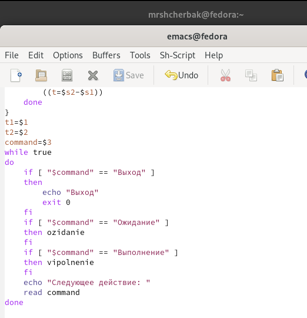
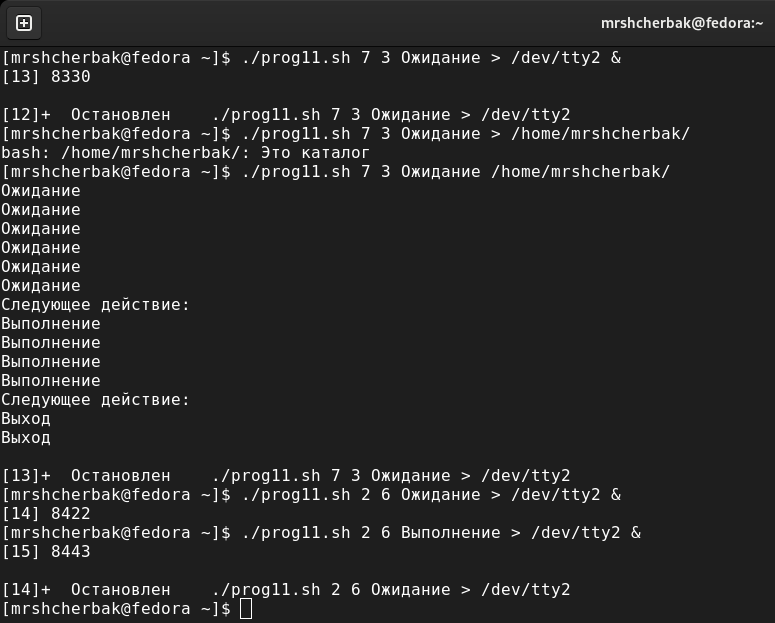
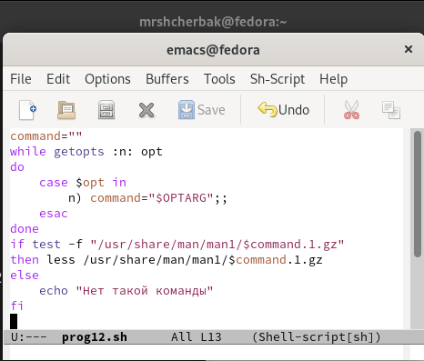
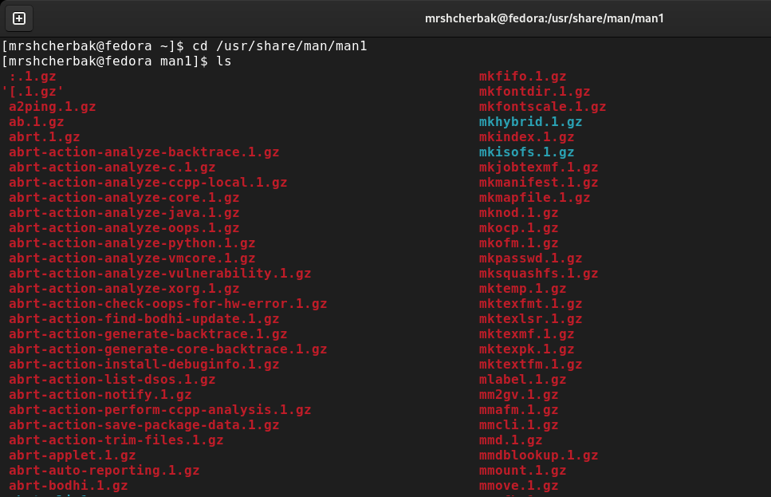
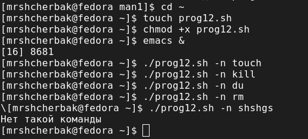
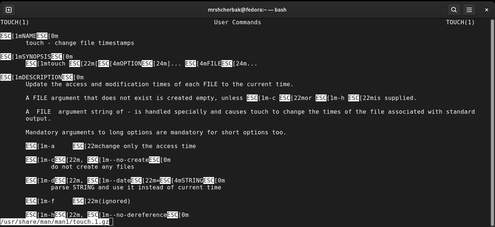
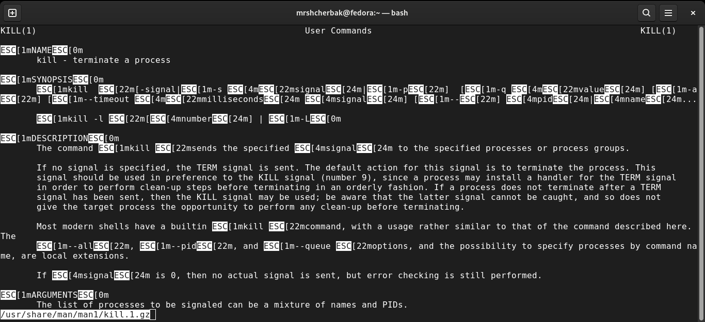
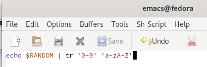
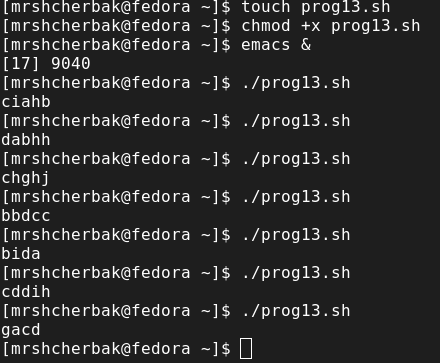

---
## Front matter

title: "Отчёт по лабораторной работе №12"
subtitle: "Программирование в командном
процессоре ОС UNIX. Расширенное программирование"
author: "Щербак Маргарита Романовна"
date: "2022"
## Generic otions
lang: ru-RU

## Bibliography
bibliography: bib/cite.bib
csl: pandoc/csl/gost-r-7-0-5-2008-numeric.csl

## Pdf output format
toc-depth: 2
fontsize: 12pt
linestretch: 1.5
papersize: a4
documentclass: scrreprt
## I18n polyglossia
polyglossia-lang:
  name: russian
  options:
	- spelling=modern
	- babelshorthands=true
polyglossia-otherlangs:
  name: english
## I18n babel
babel-lang: russian
babel-otherlangs: english
## Fonts
mainfont: PT Serif
romanfont: PT Serif
sansfont: PT Sans
monofont: PT Mono
mainfontoptions: Ligatures=TeX
romanfontoptions: Ligatures=TeX
sansfontoptions: Ligatures=TeX,Scale=MatchLowercase
monofontoptions: Scale=MatchLowercase,Scale=0.9
## Biblatex
biblatex: true
biblio-style: "gost-numeric"
biblatexoptions:
  - parentracker=true
  - backend=biber
  - hyperref=auto
  - language=auto
  - autolang=other*
  - citestyle=gost-numeric
## Pandoc-crossref LaTeX customization
figureTitle: "Рис."

listingTitle: "Листинг"
lofTitle: "Список иллюстраций"

lolTitle: "Листинги"
## Misc options
indent: true
header-includes:
  - \usepackage{indentfirst}
  - \usepackage{float} # keep figures where there are in the text
  - \floatplacement{figure}{H} # keep figures where there are in the text
---

# Цель работы:
Изучить основы программирования в оболочке ОС UNIX. Научиться писать более
сложные командные файлы с использованием логических управляющих конструкций
и циклов.

## Задание: 
1. Написать командный файл, реализующий упрощённый механизм семафоров. Командный файл должен в течение некоторого времени t1 дожидаться освобождения
ресурса, выдавая об этом сообщение, а дождавшись его освобождения, использовать
его в течение некоторого времени t2<>t1, также выдавая информацию о том, что
ресурс используется соответствующим командным файлом (процессом). Запустить
командный файл в одном виртуальном терминале в фоновом режиме, перенаправив
его вывод в другой (> /dev/tty#, где # — номер терминала куда перенаправляется
вывод), в котором также запущен этот файл, но не фоновом, а в привилегированном
режиме. Доработать программу так, чтобы имелась возможность взаимодействия трёх
и более процессов.
2. Реализовать команду man с помощью командного файла. Изучите содержимое каталога /usr/share/man/man1. В нем находятся архивы текстовых файлов, содержащих
справку по большинству установленных в системе программ и команд. Каждый архив
можно открыть командой less сразу же просмотрев содержимое справки. Командный
файл должен получать в виде аргумента командной строки название команды и в виде
результата выдавать справку об этой команде или сообщение об отсутствии справки,
если соответствующего файла нет в каталоге man1.
3. Используя встроенную переменную $RANDOM, напишите командный файл, генерирующий случайную последовательность букв латинского алфавита. Учтите, что $RANDOM
выдаёт псевдослучайные числа в диапазоне от 0 до 32767.

# Теоретическое введение: 
Выполнение условного оператора if сводится к тому, что сначала выполняется последовательность команд (операторов), которую задаёт список-команд в
строке, содержащей служебное слово if. Затем, если последняя выполненная команда из этой последовательности команд возвращает нулевой код завершения
(истина), то будет выполнена последовательность команд (операторов), которую
задаёт список-команд в строке, содержащей служебное слово then. Фраза elif
проверяется в том случае, когда предыдущая проверка была ложной. Строка, содержащая служебное слово else, является необязательной. Если она присутствует,
то последовательность команд (операторов), которую задаёт список-команд в
строке, содержащей служебное слово else, будет выполнена только при условии,
что последняя выполненная команда из последовательности команд (операторов), которую задаёт список-команд в строке, содержащей служебное слово if
или elif, возвращает ненулевой код завершения (ложь).

# Выполнение лабораторной работы:
1. **Первое задание.**  Для выполнения первого задания я создала файл prog11.sh, в котором писала скрипт, открыла текстовой редактор emacs. Также дала созданному файлу право доступа на выполнение (+х).  
Написала командный файл, реализующий упрощённый механизм семафоров. (Рис. [-@fig:001] - Рис. [-@fig:003]). 

{#fig:001 width=70%}

{#fig:002 width=70%}

{#fig:003 width=80%}

Делаем вывод, что скрипт работает корректно.

2. **Второе задание.** Создала файл prog12.sh, в котором писала второй скрипт, и открыла его в редакторе emacs.   
Предоставила право доступа на выполнение файлу prog12.sh.  
Командный
файл получает в виде аргумента командной строки название команды и в виде
результата выдаёт справку об этой команде/сообщение об отсутствии справки,
если соответствующего файла нет в каталоге man1.
(Рис. [-@fig:004] - Рис. [-@fig:008]).  

{#fig:004 width=70%}

{#fig:005 width=80%}

{#fig:006 width=70%}

{#fig:007 width=80%}

{#fig:008 width=80%}

Таким образом, мы видим, что задание выполнено успешно.

3. **Третье задание.** Создала файл prog13.sh, в котором писала третий скрипт, и открыла его в редакторе emacs. Предоставила право доступа на выполнение файлу prog13.sh.  
Используя встроенную переменную $RANDOM, написала командный файл, генерирующий случайную последовательность букв латинского алфавита. (Рис. [-@fig:009] - Рис. [-@fig:0010]).  

{#fig:009 width=90%}

{#fig:0010 width=70%}

Скрипт работает корректно.

# *Контрольные вопросы:*  

1). while [$1 != "exit"]

В данной строчке допущены следующие ошибки:

не хватает пробелов после первой скобки [и перед второй скобкой ]

выражение $1 необходимо взять в “”, потому что эта переменная может содержать пробелы.

Таким образом, правильный вариант должен выглядеть так: while [“$1”!= "exit"]

2). Чтобы объединить несколько строк в одну, можно воспользоваться несколькими способами:

Первый: VAR1="Hello,

"VAR2=" World"

VAR3="$VAR1$VAR2"

echo "$VAR3"

Результат: Hello, World

Второй: VAR1="Hello, "

VAR1+=" World"

echo "$VAR1"

Результат: Hello, World

3). Команда seq в Linux используется для генерации чисел от ПЕРВОГО до ПОСЛЕДНЕГО шага INCREMENT.

Параметры:

seq LAST: если задан только один аргумент, он создает числа от 1 до LAST с шагом шага, равным 1. Если LAST меньше 1, значение is не выдает.

seq FIRST LAST: когда заданы два аргумента, он генерирует числа от FIRST до LAST с шагом 1, равным 1. Если LAST меньше FIRST, он не выдает никаких выходных данных.

seq FIRST INCREMENT LAST: когда заданы три аргумента, он генерирует числа от FIRST до LAST на шаге INCREMENT . Если LAST меньше, чем FIRST, он не производит вывод.

seq -f «FORMAT» FIRST INCREMENT LAST: эта команда используется для генерации последовательности в форматированном виде. FIRST и INCREMENT являются необязательными.

seq -s «STRING» ПЕРВЫЙ ВКЛЮЧЕНО: Эта команда используется для STRING для разделения чисел. По умолчанию это значение равно /n. FIRST и INCREMENT являются необязательными.

seq -w FIRST INCREMENT LAST:эта команда используется для выравнивания ширины путем заполнения начальными нулями. FIRST и INCREMENT являются необязательными.

4). Результатом данного выражения $((10/3))будет 3, потому что это целочисленное деление без остатка.

5). Отличия командной оболочки zshот bash:

В zsh более быстрое автодополнение для cdс помощью Тab

В zsh существует калькулятор zcalc, способный выполнять вычисления внутри терминала

В zsh поддерживаются числа с плавающей запятой

В zsh поддерживаются структуры данных «хэш»

В zsh поддерживается раскрытие полного пути на основе неполных данных

В zsh поддерживаетсязаменачастипути

В zsh есть возможность отображать разделенный экран, такой же как разделенный экран vim

6). for((a=1; a<= LIMIT; a++)) синтаксис данной конструкции верен, потому что, используя двойные круглые скобки, можно не писать $ перед переменными ().

7). Преимущества скриптового языка bash:

Один из самых распространенных и ставится по умолчаниюв большинстве дистрибутивах Linux, MacOS

Удобное перенаправление ввода/вывода

Большое количество команд для работы с файловыми системами Linux

Можно писать собственные скрипты, упрощающие работу в Linux

Недостатки скриптового языка bash:

Дополнительные библиотеки других языков позволяют выполнить больше действий

Bash не является языков общего назначения

Утилиты, при выполнении скрипта, запускают свои процессы, которые, в свою очередь, отражаются на быстроте выполнения этого скрипта

Скрипты, написанные на bash, нельзя запустить на других операционных системах без дополнительных действий.

# Выводы
Таким образом, в ходе ЛР№12 я изучила основы программирования в оболочке ОС UNIX. Научилась писать более
сложные командные файлы с использованием логических управляющих конструкций
и циклов.

