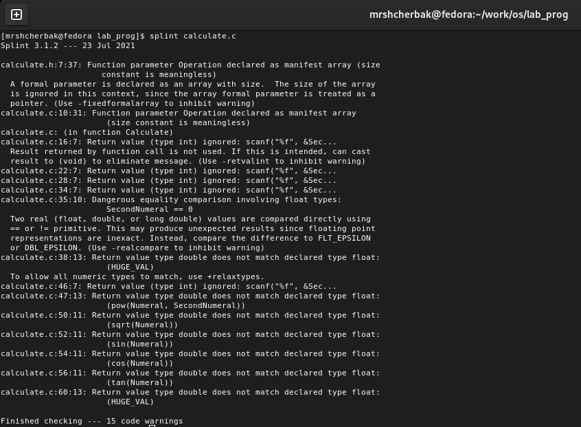

---
## Front matter
lang: ru-RU
title: "Средства, применяемые при
разработке программного обеспечения в ОС типа UNIX/Linux"
author: |
        Щербак Маргарита Романовна

institute: |
           RUDN
date: 2022

## Formatting
toc: false
slide_level: 2
theme: metropolis
header-includes: 
 - \metroset{progressbar=frametitle,sectionpage=progressbar,numbering=fraction}
 - '\makeatletter'
 - '\beamer@ignorenonframefalse'
 - '\makeatother'
aspectratio: 43
section-titles: true
---

## **Цель работы**
Приобрести простейшие навыки разработки, анализа, тестирования и отладки приложений в ОС типа UNIX/Linux на примере создания на языке программирования
С калькулятора с простейшими функциями.

## **Ход работы:**  В домашнем каталоге создала подкаталог ~/work/os/lab_prog.(Рис. [-@fig:001]). 

{#fig:001 width=80%}

## Создала в нём файлы: calculate.h, calculate.c, main.c. (Рис. [-@fig:002]).  

{#fig:002 width=80%}

## Открыла редактор emacs  и записала реализацию функций калькулятора в файле calculate.с (Содержимое данного файла в полном объёме представлено в методичке к этой лабораторной работе): (Рис. [-@fig:003]).  

{#fig:003 width=60%}

## В этом же редакторе открыла интерфейсный файл calculate.h, описывающий формат вызова функции калькулятора: (Рис. [-@fig:004]).  

{#fig:004 width=70%}

## Аналогично открыла и написала основной файл main.c, реализующий интерфейс пользователя к калькулятору: (Рис. [-@fig:005]).  

{#fig:005 width=70%}

## Выполнила компиляцию программы посредством gcc: (Рис.[-@fig:006]).  

{#fig:006 width=80%}

## Создала Makefile со следующим содержанием: (Рис.[-@fig:007] - Рис.[-@fig:008]).  

{#fig:007 width=70%}

## Makefile

{#fig:008 width=70%}

## Перед использованием gdb исправила Makefile: в переменную CFLAGS добавила опцию -g, необходимую для компиляции объектных файлов и их использования в программе отладчика GDB. (Рис.[-@fig:009]).  

{#fig:009 width=60%}

## С помощью gdb выполнила отладку программы calcul (Рис.[-@fig:0010]).
- запустила отладчик GDB, загрузив в него программу для отладки 
-  Для запуска программы внутри отладчика ввела команду run:

{#fig:0010 width=50%}

## Использовала команду list: (Рис.[-@fig:0011]).
- Для постраничного просмотра исходного кода использовала команду list. 
- Для просмотра строк с 12 по 15 основного файла использовала list с параметрами: list 12,15. 
- Для просмотра определённых строк не основного файла использовала list с параметрами: list calculate.c:20,29 

## Выполнение

{#fig:0011 width=90%}

## Выполнение нижеперечисленных действий: (Рис.[-@fig:0012]).
- установила точку останова в файле calculate.c на строке номер 21:  
 list calculate.c:20,27  
 break 21
- вывела информацию об имеющихся в проекте точках останова: info breakpoints
- запустила программу внутри отладчика и убедилась, что программа остановится
в момент прохождения точки останова:  
 run  
 5  
 "-" (просто минус)  
 backtrace 
- отладчик выдал следующую информацию:  
 #0 Calculate (Numeral=5, Operation=0x7fffffffdec4 "-") at calculate.c:21  
 #1 0x0000000000400b2b in main () at main.c:16

## Просмотр

{#fig:0012 width=90%}

## выполнение нижеперечисленных действий (Рис.[-@fig:0013]).  
Посмотрела, чему равно на этом этапе значение переменной Numeral, введя: print Numeral  
На экран должно быть выведено число 5.  
Сравнила с результатом вывода на экран после использования команды: display Numeral  
Убрала точки останова:  
 info breakpoints  
 delete 1  

## Просмотр

{#fig:0013 width=90%}

## С помощью утилиты splint попробовала проанализировать коды файлов calculate.c и main.c. (Рис.[-@fig:0014] - Рис.[-@fig:0015]).  

{#fig:0014 width=70%}

## Splint 

{#fig:0015 width=70%}

## **Вывод:** 

Таким образом, в ходе ЛР№13 я приобрела простейшие навыки разработки, анализа, тестирования и отладки приложений в ОС типа UNIX/Linux на примере создания на языке программирования
С калькулятора с простейшими функциями.
