---
## Front matter

title: "Отчёт по лабораторной работе №13"
subtitle: "Средства, применяемые при
разработке программного обеспечения в ОС типа UNIX/Linux"
author: "Щербак Маргарита Романовна"
date: "2022"
## Generic otions
lang: ru-RU

## Bibliography
bibliography: bib/cite.bib
csl: pandoc/csl/gost-r-7-0-5-2008-numeric.csl

## Pdf output format
toc-depth: 2
fontsize: 12pt
linestretch: 1.5
papersize: a4
documentclass: scrreprt
## I18n polyglossia
polyglossia-lang:
  name: russian
  options:
	- spelling=modern
	- babelshorthands=true
polyglossia-otherlangs:
  name: english
## I18n babel
babel-lang: russian
babel-otherlangs: english
## Fonts
mainfont: PT Serif
romanfont: PT Serif
sansfont: PT Sans
monofont: PT Mono
mainfontoptions: Ligatures=TeX
romanfontoptions: Ligatures=TeX
sansfontoptions: Ligatures=TeX,Scale=MatchLowercase
monofontoptions: Scale=MatchLowercase,Scale=0.9
## Biblatex
biblatex: true
biblio-style: "gost-numeric"
biblatexoptions:
  - parentracker=true
  - backend=biber
  - hyperref=auto
  - language=auto
  - autolang=other*
  - citestyle=gost-numeric
## Pandoc-crossref LaTeX customization
figureTitle: "Рис."

listingTitle: "Листинг"
lofTitle: "Список иллюстраций"

lolTitle: "Листинги"
## Misc options
indent: true
header-includes:
  - \usepackage{indentfirst}
  - \usepackage{float} # keep figures where there are in the text
  - \floatplacement{figure}{H} # keep figures where there are in the text
---

# Цель работы:
Приобрести простейшие навыки разработки, анализа, тестирования и отладки приложений в ОС типа UNIX/Linux на примере создания на языке программирования
С калькулятора с простейшими функциями.

# Теоретическое введение: 
Стандартным средством для компиляции программ в ОС типа UNIX является GCC (GNU
Compiler Collection). Это набор компиляторов для разного рода языков программирования (С, C++, Java, Фортран и др.). Работа с GCC производится при помощи одноимённой
управляющей программы gcc, которая интерпретирует аргументы командной строки,
определяет и осуществляет запуск нужного компилятора для входного файла.
Файлы с расширением (суффиксом) .c воспринимаются gcc как программы на языке
С, файлы с расширением .cc или .C — как файлы на языке C++, а файлы c расширением
.o считаются объектными.  
Для сборки разрабатываемого приложения и собственно компиляции полезно воспользоваться утилитой make. Она позволяет автоматизировать процесс преобразования
файлов программы из одной формы в другую, отслеживает взаимосвязи между файлами.
Для работы с утилитой make необходимо в корне рабочего каталога с Вашим проектом
создать файл с названием makefile или Makefile, в котором будут описаны правила
обработки файлов Вашего программного комплекса.  
В качестве цели в Makefile может выступать имя файла или название какого-то действия. Зависимость задаёт исходные параметры (условия) для достижения указанной
цели. Зависимость также может быть названием какого-то действия. Команды — собственно действия, которые необходимо выполнить для достижения цели.  
Во время работы над кодом программы программист неизбежно сталкивается с появлением ошибок в ней. Использование отладчика для поиска и устранения ошибок
в программе существенно облегчает жизнь программиста. В комплект программ GNU
для ОС типа UNIX входит отладчик GDB (GNU Debugger).
Для использования GDB необходимо скомпилировать анализируемый код программы
таким образом, чтобы отладочная информация содержалась в результирующем бинарном
файле.  
Ещё одним средством проверки исходных кодов программ, написанных на языке C,
является утилита splint. Эта утилита анализирует программный код, проверяет корректность задания аргументов использованных в программе функций и типов возвращаемых
значений, обнаруживает синтаксические и семантические ошибки.
В отличие от компилятора C анализатор splint генерирует комментарии с описанием
разбора кода программы и осуществляет общий контроль, обнаруживая такие ошибки,
как одинаковые объекты, определённые в разных файлах, или объекты, чьи значения не
используются в работе программы, переменные с некорректно заданными значениями
и типами и многое другое.

# Выполнение лабораторной работы:
1. В домашнем каталоге создала подкаталог ~/work/os/lab_prog.(Рис. [-@fig:001]). 

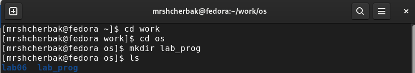{#fig:001 width=80%}

2. Создала в нём файлы: calculate.h, calculate.c, main.c.
(Рис. [-@fig:002]).  

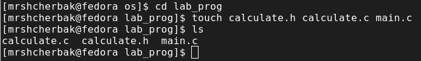{#fig:002 width=80%}

Это будет примитивнейший калькулятор, способный складывать, вычитать, умножать
и делить, возводить число в степень, брать квадратный корень, вычислять sin, cos, tan.
При запуске он будет запрашивать первое число, операцию, второе число. После этого
программа выведет результат и остановится.

3. Открыла редактор emacs  и записала реализацию функций калькулятора в файле calculate.с (Содержимое данного файла в полном объёме представлено в методичке к этой лабораторной работе): (Рис. [-@fig:003]).  

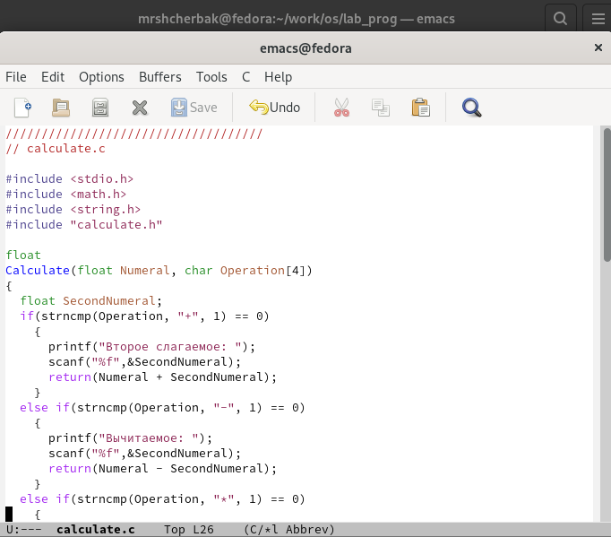{#fig:003 width=90%}

4. В этом же редакторе открыла интерфейсный файл calculate.h, описывающий формат вызова функции калькулятора: (Рис. [-@fig:004]).  

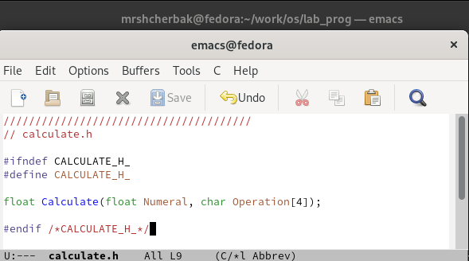{#fig:004 width=70%}

5. Аналогично открыла и написала основной файл main.c, реализующий интерфейс пользователя к калькулятору: (Рис. [-@fig:005]).  

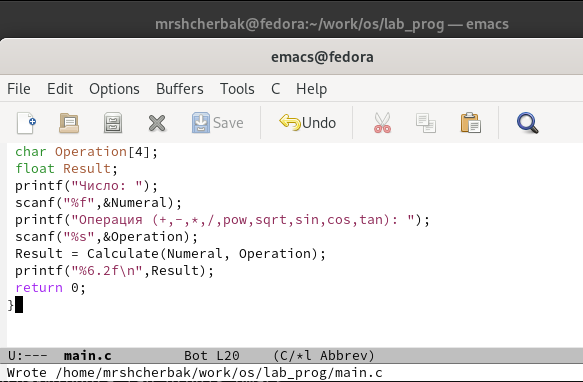{#fig:005 width=70%}

6. Выполнила компиляцию программы посредством gcc: (Рис.[-@fig:006]).  

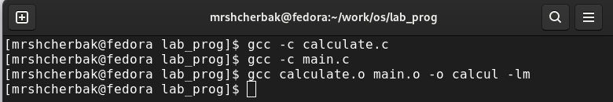{#fig:006 width=80%}

7. Создала Makefile со следующим содержанием: (Рис.[-@fig:007] - Рис.[-@fig:008]).  

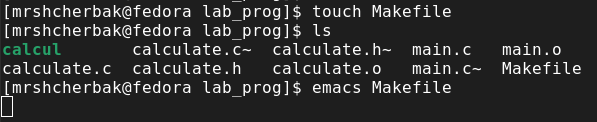{#fig:007 width=70%}

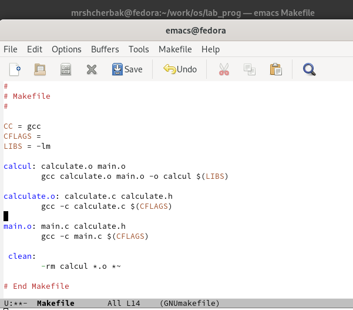{#fig:008 width=70%}

Данный файл необходим для автоматической компиляции файлов calculate.c
(цель calculate.o), main.c (цель main.o), а также их объединения в один исполняемый файл calcul (цель calcul). Цель clean нужна для автоматического удаления файлов. Переменная CC отвечает за утилиту для компиляции. Переменная
CFLAGS отвечает за опции в данной утилите. Переменная LIBS отвечает за опции
для объединения объектных файлов в один исполняемый файл.

8. Перед использованием gdb исправила Makefile: в переменную CFLAGS добавила опцию -g, необходимую для компиляции
объектных файлов и их использования в программе отладчика GDB. 
(Рис.[-@fig:009]).  

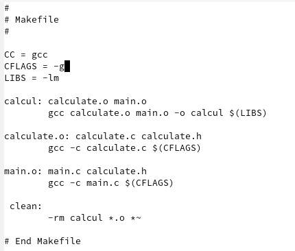{#fig:009 width=70%}

9. С помощью gdb выполнила отладку программы calcul (Рис.[-@fig:0010]).
- запустила отладчик GDB, загрузив в него программу для отладки 
-  Для запуска программы внутри отладчика ввела команду run:

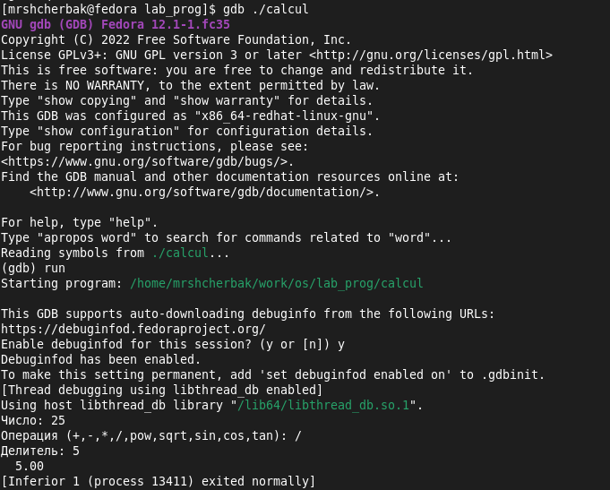{#fig:0010 width=70%}

10. Использовала команду list: (Рис.[-@fig:0011]).
- Для постраничного просмотра исходного кода использовала команду list. 
- Для просмотра строк с 12 по 15 основного файла использовала list с параметрами: list 12,15. 
- Для просмотра определённых строк не основного файла использовала list с параметрами: list calculate.c:20,29 

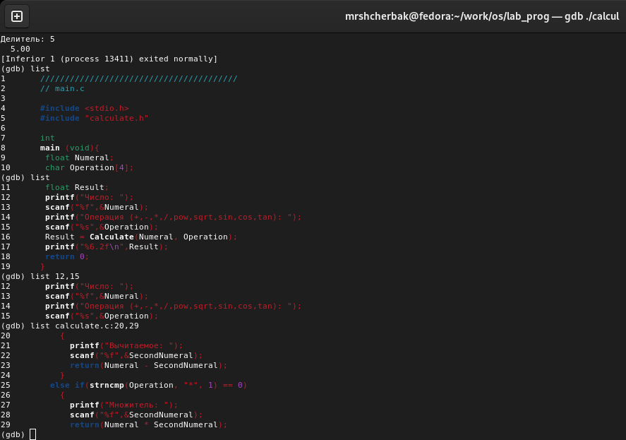{#fig:0011 width=90%}

11. Выполнение нижеперечисленных действий: (Рис.[-@fig:0012]).
- установила точку останова в файле calculate.c на строке номер 21:  
 list calculate.c:20,27  
 break 21
- вывела информацию об имеющихся в проекте точках останова: info breakpoints
- запустила программу внутри отладчика и убедилась, что программа остановится
в момент прохождения точки останова:  
 run  
 5  
 "-" (просто минус)  
 backtrace 
- отладчик выдал следующую информацию:  
 #0 Calculate (Numeral=5, Operation=0x7fffffffdec4 "-") at calculate.c:21  
 #1 0x0000000000400b2b in main () at main.c:16

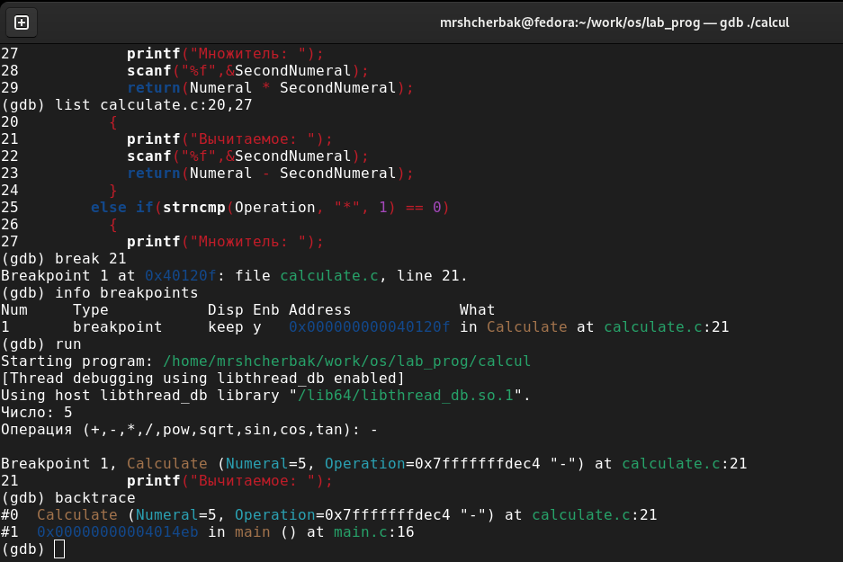{#fig:0012 width=90%}

12. выполнение нижеперечисленных действий (Рис.[-@fig:0013]).  
Посмотрела, чему равно на этом этапе значение переменной Numeral, введя: print Numeral  
На экран должно быть выведено число 5.  
Сравнила с результатом вывода на экран после использования команды: display Numeral  
Убрала точки останова:  
 info breakpoints  
 delete 1  

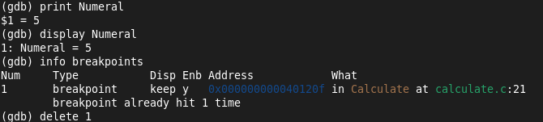{#fig:0013 width=90%}

13. С помощью утилиты splint попробовала проанализировать коды файлов calculate.c
и main.c. (Рис.[-@fig:0014] - Рис.[-@fig:0015]).  

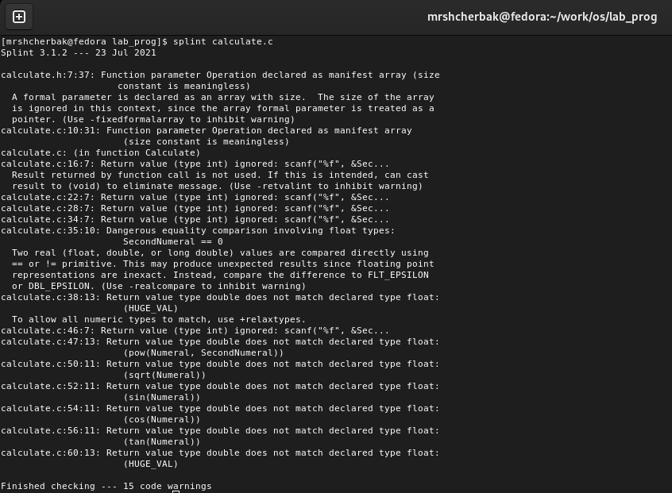{#fig:0014 width=70%}

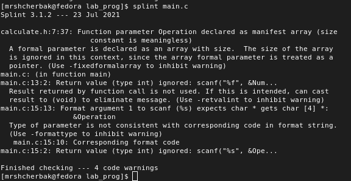{#fig:0015 width=70%}

C помощью утилиты splint
выяснилось, что в файлах calculate.c и main.c присутствует функция чтения scanf,
возвращающая целое число (тип int), но эти числа не используются и нигде не
сохраняются. Утилита вывела предупреждение о том, что в файле calculate.c происходит сравнение вещественного числа с нулем. Также возвращаемые значения
(тип double) в функциях pow, sqrt, sin, cos и tan записываются в переменную типа
float, что свидетельствует о потери данных.

# *Контрольные вопросы:*  

1). Чтобы получить информацию о возможностях программ gcc, make, gdbи др.нужно воспользоваться командой manили опцией -help(-h)для каждой команды.

2). Процесс разработки программного обеспечения обычно разделяется на следующие этапы:

планирование, включающее сбор и анализ требований к функционалу и другим характеристикам разрабатываемого приложения;
проектирование, включающее в себя разработку базовых алгоритмов и спецификаций, определение языка программирования;
непосредственная разработка приложения: oкодирование −по сути создание исходного текста программы (возможно в нескольких вариантах); –анализ разработанного кода; oсборка, компиляция и разработка исполняемого модуля; oтестирование и отладка, сохранение произведённых изменений;
документирование. Для создания исходного текста программы разработчик может воспользоваться любым удобным для него редактором текста: vi, vim, mceditor, emacs, geanyи др. После завершения написания исходного кода программы (возможно состоящей из нескольких файлов), необходимо её скомпилировать и получить исполняемый модуль.

3). Для имени входного файла суффикс определяет какая компиляция требуется. Суффиксы указывают на тип объекта. Файлы с расширением (суффиксом) .cвоспринимаются gccкак программы на языке С, файлы с расширением .ccили .C−как файлы на языке C++, а файлы cрасширением .oсчитаются объектными.Например, в команде «gcc-cmain.c»:gccпо расширению (суффиксу) .cраспознает тип файла для компиляции и формирует объектный модуль −файл с расширением .o. Если требуется получить исполняемый файл с определённым именем (например, hello), то требуется воспользоваться опцией -oи в качестве параметра задать имя создаваемого файла: «gcc-ohellomaiВ ходе выполнения данной лабораторной работы я приобрелапростейшие навыки разработки, анализа, тестирования и отладки приложений в ОС типа UNIX/Linuxна примере создания на языке программирования С калькулятора с простейшими функциями.n.c».

4). Основное назначение компилятора языка Си в UNIX заключается в компиляции всей программы и получении исполняемого файла/модуля.

5). Для сборки разрабатываемого приложения и собственно компиляции полезно воспользоваться утилитой make. Она позволяет автоматизировать процесс преобразования файлов программы из одной формы в другую, отслеживает взаимосвязи между файлами.

6). Для работы с утилитой makeнеобходимо в корне рабочего каталога с Вашим проектом создать файл с названием makefileили Makefile, в котором будут описаны правила обработки файлов Вашего программного комплекса. В самом простом случае Makefile имеет следующий синтаксис: <цель_1> <цель_2> ... : <зависимость_1> <зависимость_2> ...<команда 1>...<команда n>Сначала задаётся список целей, разделённых пробелами, за которым идёт двоеточие и список зависимостей. Затем в следующих строках указываются команды. Строки с командами обязательно должны начинаться с табуляции. В качестве цели в Makefileможет выступать имя файла или название какого-то действия. Зависимость задаёт исходные параметры (условия) для достижения указанной цели. Зависимость также может быть названием какого-то действия. Команды − собственно действия, которые необходимо выполнить для достижения цели.Общий синтаксис Makefileимеет вид: target1 [target2...]:[:] [dependment1...][(tab)commands] [#commentary][(tab)commands] [#commentary]. Здесь знак # определяет начало комментария (содержимое от знака # и до конца строки не будет обрабатываться. Одинарное двоеточие указывает на то, что последовательность команд должна содержаться в одной строке. Для переноса можно в длинной строке команд можно использовать обратный слэш (). Двойное двоеточие указывает на то, что последовательность команд может содержаться в нескольких последовательных строках.Пример более сложного синтаксиса Makefile:## Makefile for abcd.c#CC = gccCFLAGS =# Compile abcd.c normalyabcd: abcd.c(CFLAGS) abcd.cclean:-rm abcd *.o *~# EndMakefileforabcd.c. В этом примере в начале файла заданы три переменные: CC и CFLAGS. Затем указаны цели, их зависимости и соответствующие команды. В командах происходит обращение к значениям переменных. Цель с именем cleanпроизводит очистку каталога от файлов, полученных в результате компиляции. Для её описания использованы регулярные выражения.

7). Во время работы над кодом программы программист неизбежно сталкивается с появлением ошибок в ней. Использование отладчика для поиска и устранения ошибок в программе существенно облегчает жизнь программиста. В комплект программ GNUдля ОС типа UNIXвходит отладчик GDB(GNUDebugger). Для использования GDB необходимо скомпилировать анализируемый код программы таким образом, чтобы отладочная информация содержалась в результирующем бинарном файле. Для этого следует воспользоваться опцией -gкомпилятора gcc: gcc-cfile.c-g. После этого для начала работы с gdbнеобходимо в командной строке ввести одноимённую команду, указав в качестве аргумента анализируемый бинарный файл: gdbfile.o

8). Основные команды отладчика gdb:

backtrace − вывод на экран пути к текущей точке останова (по сутивывод − названий всех функций);  
break − установить точку останова (в качестве параметра можетбыть указан номер строки или название функции);  
clear − удалить все точки останова в функции;  
continue − продолжить выполнение программы;  
delete − удалить точку останова;  
display − добавить выражение в список выражений, значения которых отображаются при достижении точки останова программы;  
finish − выполнить программу до момента выхода из функции;  
info breakpoints −вывести на экран список используемых точек останова;  
info watchpoints −вывести на экран список используемых контрольных выражений;  
list − вывести на экран исходный код (в ходе выполнения данной лабораторной работы я приобрелапростейшие навыки разработки, анализа, тестирования и отладки приложений в ОС типа UNIX/Linuxна примере создания на языке программирования С калькулятора с простейшими функциями. качестве параметра может быть указано название файла и через двоеточие номера начальнойи конечной строк);  
next − выполнить программу пошагово, но без выполнения вызываемых в программе функций;  
print − вывести значение указываемого в качестве параметра выражения;  
run − запуск программы на выполнение;  
set − установить новое значение переменной;  
step − пошаговое выполнение программы;  
watch − установить контрольное выражение, при изменении значения которого программа будет остановлена. Для выхода из gdbможно воспользоваться командой quit (или её сокращённым вариантом q) или комбинацией клавиш Ctrl-d. Более подробную информацию по работе с gdb можно получить с помощью команд gdb-hи mangdb.

9). Cхема отладки программы показана в 6 пункте лабораторной работы.

10). При первом запуске компилятор не выдал никаких ошибок, но в коде программы main.c допущена ошибка, которую компилятор мог пропустить (возможно, из-за версии 8.3.0-19): в строке scanf(“%s”, &Operation); нужно убрать знак &, потому что имя массивасимволов уже является указателемна первый элементэтого массива.

11). Система разработки приложений UNIX предоставляет различные средства, повышающие понимание исходного кода. К ним относятся:cscope −исследование функций, содержащихся в программе,lint −критическая проверка программ, написанных на языке Си.

12). Утилита splint анализирует программный код, проверяет корректность задания аргументов использованных в программе функций и типов возвращаемых значений, обнаруживает синтаксические и семантические ошибки. В отличие от компилятора Cанализатор splintгенерирует комментарии с описанием разбора кода программы и осуществляет общий контроль, обнаруживая такие ошибки, как одинаковые объекты, определённые в разных файлах, или объекты, чьи значения не используются в работt программы, переменные с некорректно заданными значениямии типами и многое другое.

# Выводы
Таким образом, в ходе ЛР№13 я приобрела простейшие навыки разработки, анализа, тестирования и отладки приложений в ОС типа UNIX/Linux на примере создания на языке программирования
С калькулятора с простейшими функциями.

