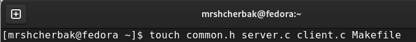
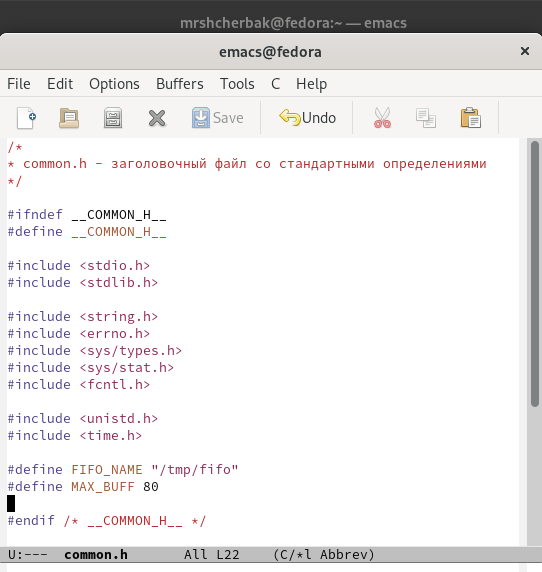
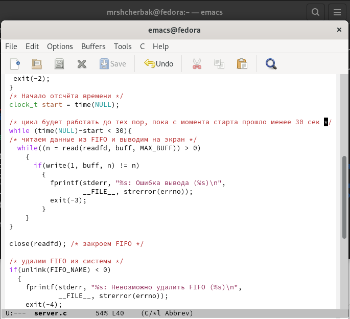
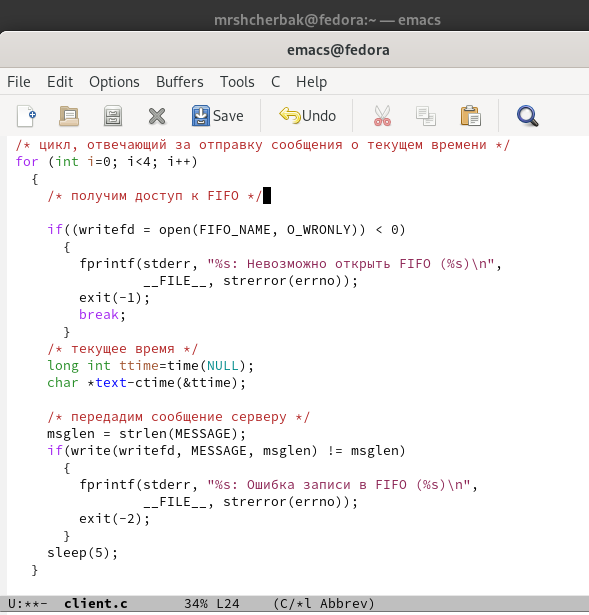
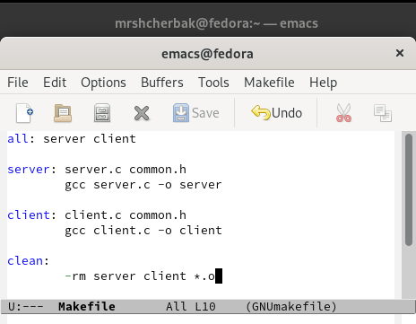
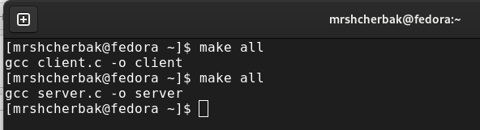
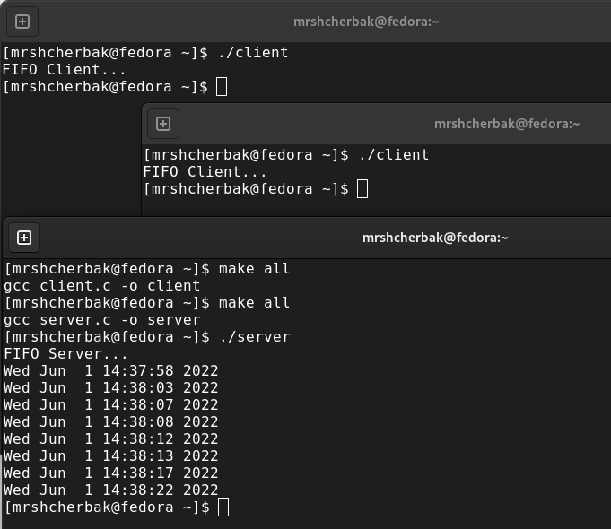

---
## Front matter
lang: ru-RU
title: "Лабораторная работа №14. Именованные каналы"
author: |
        Щербак Маргарита Романовна

institute: |
           RUDN
date: 2022

## Formatting
toc: false
slide_level: 2
theme: metropolis
header-includes: 
 - \metroset{progressbar=frametitle,sectionpage=progressbar,numbering=fraction}
 - '\makeatletter'
 - '\beamer@ignorenonframefalse'
 - '\makeatother'
aspectratio: 43
section-titles: true
---

## **Цель работы**
Приобрести практические навыки работы с именованными каналами.

## **Ход работы:** Я создала необходимые файлы с помощью команды touch и открыла текстовой редактор emacs для редактирования этих файлов.(Рис. [-@fig:001]). 

{#fig:001 width=80%}

## Изменила содержимое файлов в редакторе. (Рис. [-@fig:002] - Рис. [-@fig:005]).  
В файл common.h добавила заголовочные файлы unisd.h и time.h. 

{#fig:002 width=50%}

## В файле server.c добавила цикл while для контроля за временем работы сервера.

{#fig:003 width=60%}

## В файл client.c добавила цикл, отвечающий за кол-во сообщений о текущем времени (4 смс), и команду sleep(5) для приостановки работы клиента на 5 сек. 

{#fig:004 width=50%}

## Makefile оставила неизменённым. 

{#fig:005 width=70%}

## Скомпилировала файлы (Рис. [-@fig:006]).  

{#fig:006 width=70%}

## Проверка работы файлов. Открыла 3 терминала и запустила: ./server в одном и ./client в двух других. (Рис. [-@fig:007]).  
В результате каждый терминал client выдал по 4 сообщения. Спустя менее 30 сек работа сервера прекратилась.  
Работа выполнена корректно.

{#fig:007 width=50%}

## **Вывод:** 

Таким образом, в ходе ЛР№14 я приобрела практические навыки работы с именованными каналами.