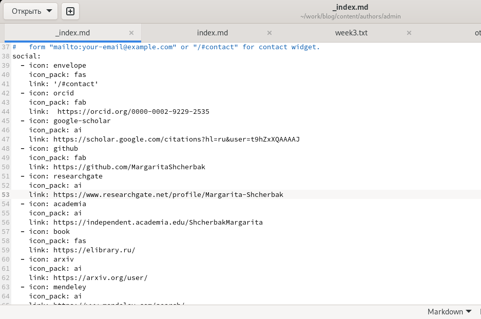
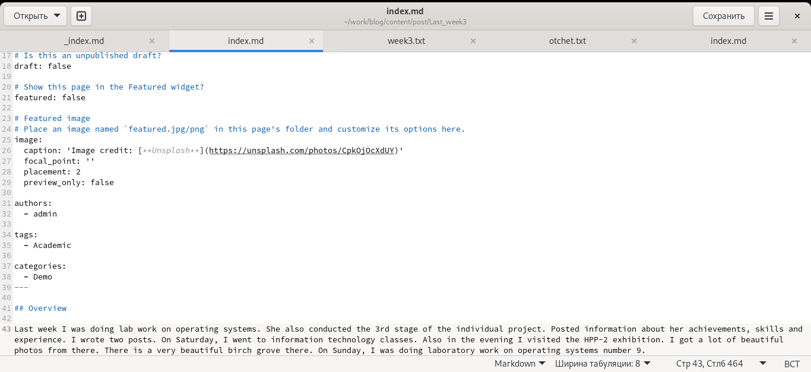
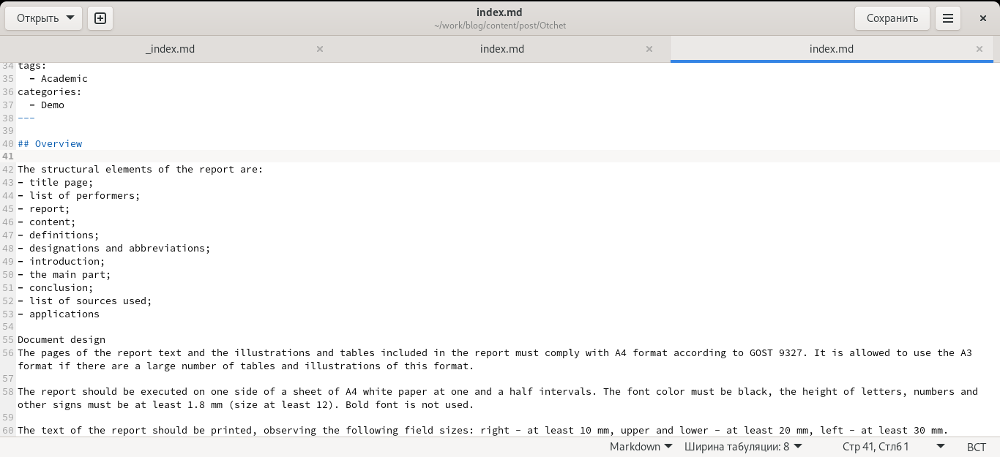
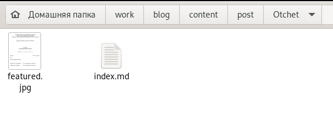
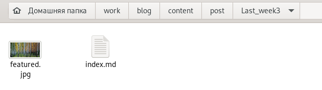
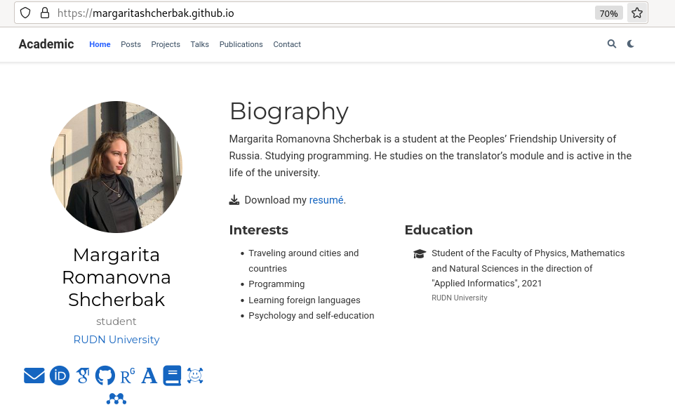
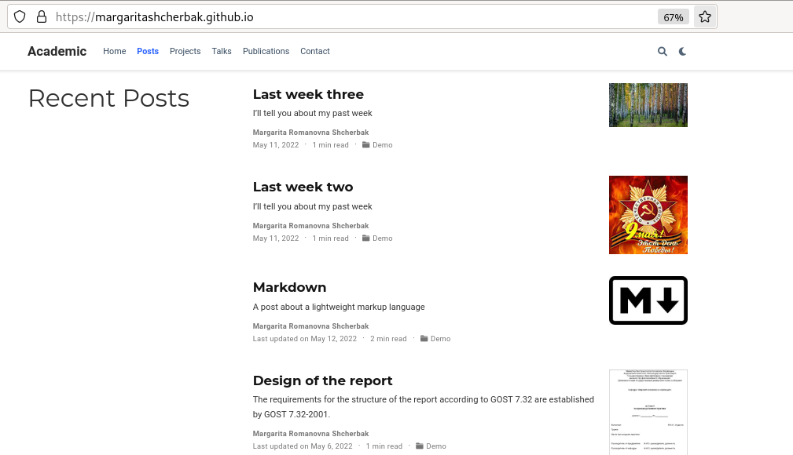

---
## Front matter
lang: ru-RU
title: "Добавить к сайту ссылки на научные и библиометрические ресурсы"
author: |
        Щербак Маргарита Романовна

institute: |
           RUDN
date: 2022

## Formatting
toc: false
slide_level: 2
theme: metropolis
header-includes: 
 - \metroset{progressbar=frametitle,sectionpage=progressbar,numbering=fraction}
 - '\makeatletter'
 - '\beamer@ignorenonframefalse'
 - '\makeatother'
aspectratio: 43
section-titles: true
---

## **Цель работы**
Добавить к сайту ссылки на научные и библиометрические ресурсы и написать два поста: о прошедшей неделе и на тему "Оформление отчёта". 

## **Теоретическое введение**
Для реализации сайта используется генератор статических сайтов Hugo.  
Исходя из действий в предыдущих этапах, мы также будем продолжать писать посты и обновлять наш сайт новой информацией. Добавим ссылки на ресурсы. Обновим иконки. Это необходимо для того, чтобы человек, который будет просматривать нашу страницу, смог найти меня на других ресурсах, посмотреть мои работы и публикации.

## **Ход работы:** Перешли в ~/work/blog/content/authors/admin и открыли файл _index.md. Внесли изменения: переименовали иконки, паки иконок и добавили ссылки на свои научные ресурсы. По заданию требовалось зарегистрироваться на 8 ресурсах и добавить на них ссылки. Сделано. (Рис. [-@fig:001])

{#fig:001 width=70%}

## Переходим в ~/work/blog/content/post и создаём там две папки, соответствующие названиям постов: Last_week3 и Otchet. (Рис. [-@fig:002])

{#fig:002 width=70%} 

## Копируем файл из папки getting-started и изменяем информацию в файле аналогично как во втором этапе проекта. (Рис. [-@fig:003] - Рис. [-@fig:004])

{#fig:003 width=70%} 

## Выполнение

{#fig:004 width=70%}

## Добавляем картиночки к постам. (Рис. [-@fig:005] - Рис. [-@fig:006])

{#fig:005 width=60%} 

{#fig:006 width=60%}

## Запускаем терминал, вводим следующие команды:  
- hugo (~/work/blog)
- cd public
- git add .
- git commit -am "Comment"
- git push origin main (Рис .[-@fig:007]) 

{#fig:007 width=60%}

## Проверяем страницу. (Рис .[-@fig:008] - Рис .[-@fig:009]) 

{#fig:008 width=90%}

## посты
{#fig:009 width=90%}
 
## **Вывод:** 

Таким образом, я добавила к сайту ссылки на научные и библиометрические ресурсы и написала два поста: о прошедшей неделе и на тему "Оформление отчёта".
