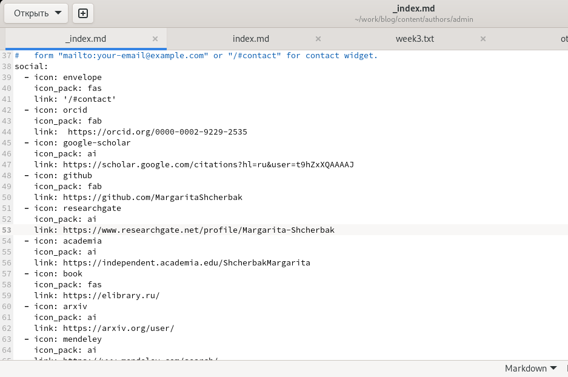
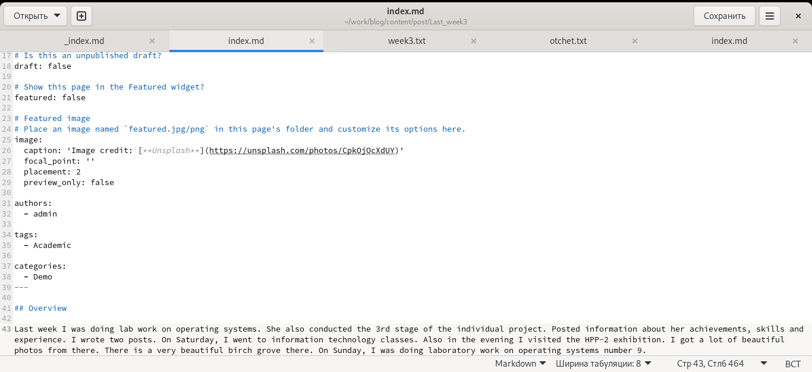
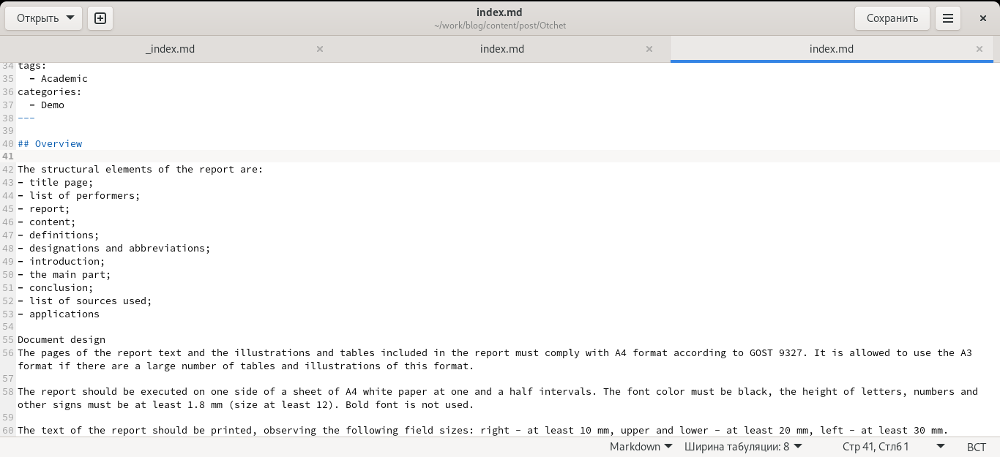
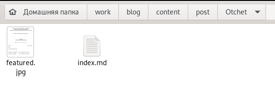
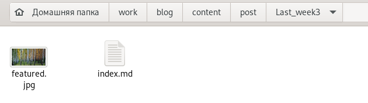
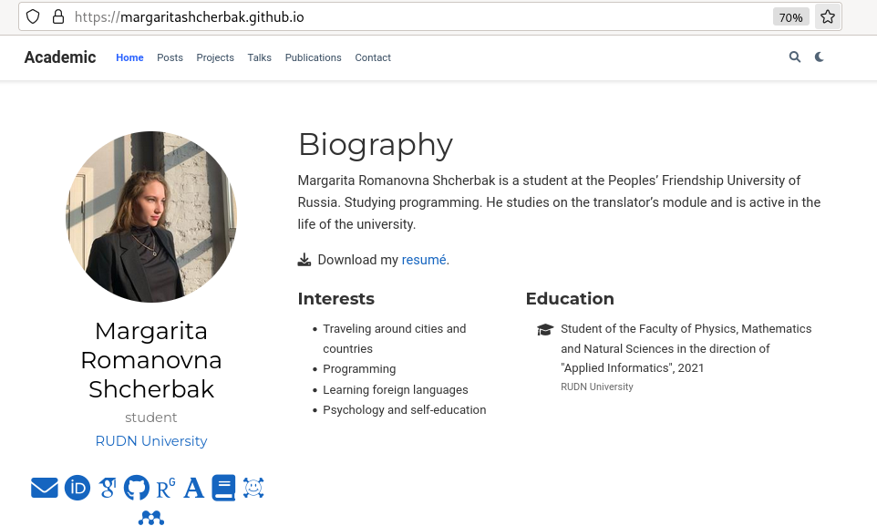
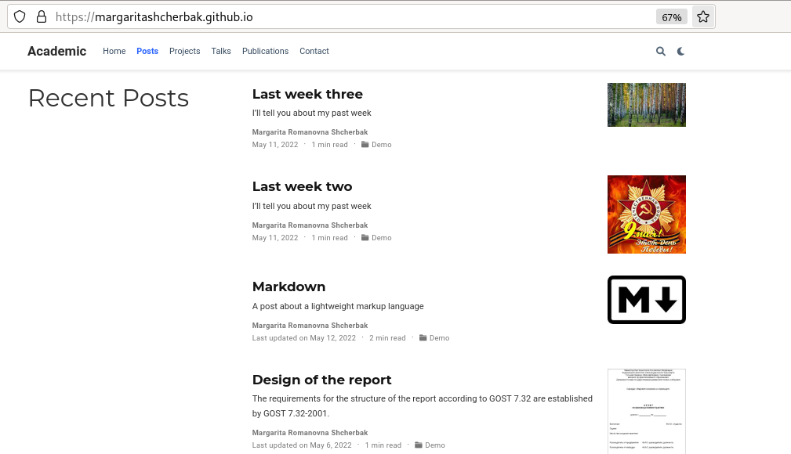

---
## Front matter
title: "Отчёт по четвёртому этапу реализации проекта"
subtitle: "Персональный сайт научного работника"
author: "Щербак Маргарита Романовна"

## Generic otions
lang: ru-RU

## Bibliography
bibliography: bib/cite.bib
csl: pandoc/csl/gost-r-7-0-5-2008-numeric.csl

## Pdf output format
toc: true # Table of contents
toc-depth: 2
fontsize: 12pt
linestretch: 1.5
papersize: a4
documentclass: scrreprt
## I18n polyglossia
polyglossia-lang:
  name: russian
  options:
	- spelling=modern
	- babelshorthands=true
polyglossia-otherlangs:
  name: english
## I18n babel
babel-lang: russian
babel-otherlangs: english
## Fonts
mainfont: PT Serif
romanfont: PT Serif
sansfont: PT Sans
monofont: PT Mono
mainfontoptions: Ligatures=TeX
romanfontoptions: Ligatures=TeX
sansfontoptions: Ligatures=TeX,Scale=MatchLowercase
monofontoptions: Scale=MatchLowercase,Scale=0.9
## Biblatex
biblatex: true
biblio-style: "gost-numeric"
biblatexoptions:
  - parentracker=true
  - backend=biber
  - hyperref=auto
  - language=auto
  - autolang=other*
  - citestyle=gost-numeric
## Pandoc-crossref LaTeX customization
figureTitle: "Рис."
tableTitle: "Таблица"
listingTitle: "Листинг"
lofTitle: "Список иллюстраций"
lotTitle: "Список таблиц"
lolTitle: "Листинги"
## Misc options
indent: true
header-includes:
  - \usepackage{indentfirst}
  - \usepackage{float} # keep figures where there are in the text
  - \floatplacement{figure}{H} # keep figures where there are in the text
---

# **Добавить к сайту ссылки на научные и библиометрические ресурсы.** 

## **Цель работы**
Добавить к сайту ссылки на научные и библиометрические ресурсы и написать два поста: о прошедшей неделе и на тему "Оформление отчёта". 

## **Задание**
Зарегистрироваться на соответствующих ресурсах и разместить на них ссылки на сайте:  
eLibrary : https://elibrary.ru/;  
Google Scholar : https://scholar.google.com/;  
ORCID : https://orcid.org/;  
Mendeley : https://www.mendeley.com/;  
ResearchGate : https://www.researchgate.net/;  
Academia.edu : https://www.academia.edu/;  
arXiv : https://arxiv.org/;  
github : https://github.com/  
Сделать пост по прошедшей неделе.  
Добавить пост на тему по выбору  

## **Теоретическое введение**
Для реализации сайта используется генератор статических сайтов Hugo.  
Исходя из действий в предыдущих этапах, мы также будем продолжать писать посты и обновлять наш сайт новой информацией. Добавим ссылки на ресурсы. Обновим иконки. Это необходимо для того, чтобы человек, который будет просматривать нашу страницу, смог найти меня на других ресурсах, посмотреть мои работы и публикации.

## **Ход работы**

1. Перешли в ~/work/blog/content/authors/admin и открыли файл _index.md. Внесли изменения: переименовали иконки, паки иконок и добавили ссылки на свои научные ресурсы. По заданию требовалось зарегистрироваться на 8 ресурсах и добавить на них ссылки. Сделано. 
(Рис. [-@fig:001])

{#fig:001 width=70%}

2. Переходим в ~/work/blog/content/post и создаём там две папки, соответствующие названиям постов: Last_week3 и Otchet. (Рис. [-@fig:002])

{#fig:002 width=70%} 

3. Копируем файл из папки getting-started и изменяем информацию в файле аналогично как во втором этапе проекта. (Рис. [-@fig:003] - Рис. [-@fig:004])

{#fig:003 width=70%} 

{#fig:004 width=70%}
 
4. Добавляем картиночки к постам. (Рис. [-@fig:005] - Рис. [-@fig:006])

{#fig:005 width=70%} 

{#fig:006 width=70%}

5. Запускаем терминал, вводим следующие команды:
- hugo (~/work/blog)
- cd public
- git add .
- git commit -am "Comment"
- git push origin main (Рис .[-@fig:007]) 

{#fig:007 width=70%}

6. Проверяем страницу. (Рис .[-@fig:008] - Рис .[-@fig:009]) 

{#fig:008 width=90%}

{#fig:009 width=90%}

7. Читаем посты. (Рис .[-@fig:0010] - Рис .[-@fig:0011]) 

{#fig:0010 width=70%}

{#fig:0011 width=70%}

## **Вывод:** 

Таким образом, я добавила к сайту ссылки на научные и библиометрические ресурсы и написала два поста: о прошедшей неделе и на тему "Оформление отчёта".
