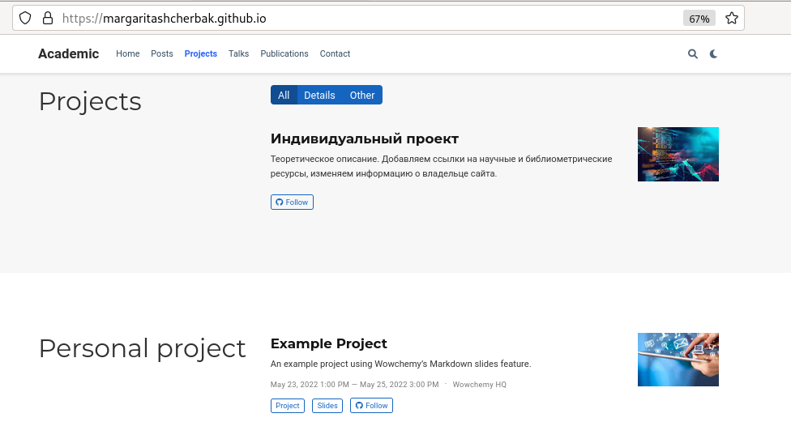

---
## Front matter
lang: ru-RU
title: "Пятый этап индивидуального проекта. Добавить к сайту все остальные элементы"
author: |
        Щербак Маргарита Романовна

institute: |
           RUDN
date: 2022

## Formatting
toc: false
slide_level: 2
theme: metropolis
header-includes: 
 - \metroset{progressbar=frametitle,sectionpage=progressbar,numbering=fraction}
 - '\makeatletter'
 - '\beamer@ignorenonframefalse'
 - '\makeatother'
aspectratio: 43
section-titles: true
---

## **Цель работы**
Добавить к сайту все остальные элементы.  
Сделать записи для персональных проектов.  
Написать два поста: по прошедшей неделе и про языки научного программирования.

## **Теоретическое введение**
Для реализации сайта используется генератор статических сайтов Hugo.  
Исходя из действий в предыдущих этапах, мы также будем продолжать писать посты и обновлять наш сайт новой информацией.  
Добавляем научный проект (пост), меняем изображения, иконки, контакты, даты и тд.

## **Ход работы:** Перешли в ~/work/blog/content/post и создали там две папки, соответствующие названиям постов: Last_week4 и language_speak. (Рис. [-@fig:001])

{#fig:001 width=90%} 

## Добавляем картиночки к постам. (Рис. [-@fig:002])

{#fig:002 width=90%} 

## Скопировали файл из папки getting-started и изменили информацию в файле аналогично как в предыдущих этапах проекта. (Рис. [-@fig:003] - Рис. [-@fig:004])
 
{#fig:003 width=80%} 

## Пишем пост

{#fig:004 width=90%} 

## Добавляем записи к персональному проекту.  
Перешли в ~/work/blog/content/project/example и сменили картинку. Я в качестве научного проекта использовала отчёт по выполнению 1го этапа индивидуального проекта, поэтому скопировала в данную папку каталог с картинки из отчёта. Далее редактировала файл index.md  
(Рис. [-@fig:005] - Рис. [-@fig:006])

{#fig:005 width=90%} 

## Редактируем файл

{#fig:006 width=90%} 

## Также перешла в ~/work/blog/content/publication/example , сменила там картинку и внесла в файл index.md необходимые изменения, аналогично предыдущему шагу. (Рис. [-@fig:007])
Затем я в ~/work/blog/content заходила в разные папки и вносила некоторые изменения в файлах, соответствующие названиям, датам, заголовкам, иконкам, ссылкам. 

{#fig:007 width=90%} 

## Запускаем терминал, вводим следующие команды: 
- hugo (~/work/blog)
- cd public
- git add .
- git commit -am "Comment"
- git push origin main (Рис .[-@fig:008]) 

{#fig:008 width=60%}

## Смотрим посты. (Рис .[-@fig:009]) 

{#fig:009 width=90%}

## Проверяем обновления на сайте, связанные с записями проекта. (Рис. [-@fig:0010] - Рис. [-@fig:0012])  
Убеждаемся в изменениях: обновились картинки, названия, подзаголовки, иконки, даты, "кнопки".

{#fig:0010 width=90%}

## Проверка

{#fig:0011 width=90%}

## Смотрим

{#fig:0012 width=90%}
 
## **Вывод:** 

Таким образом, я сделала записи для персональных проектов.  
Написала два поста: по прошедшей неделе и про языки научного программирования.  
Обновила информацию на сайте, внесла изменения.
