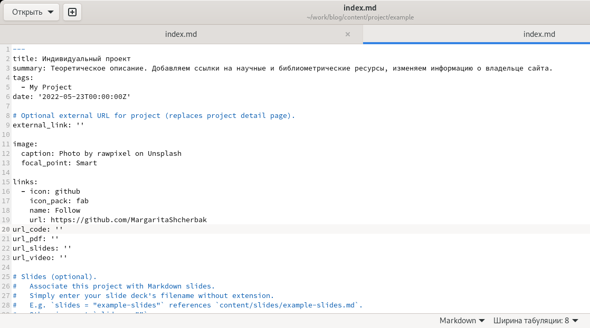

---
## Front matter
title: "Отчёт по пятому этапу реализации проекта"
subtitle: "Персональный сайт научного работника"
author: "Щербак Маргарита Романовна"

## Generic otions
lang: ru-RU

## Bibliography
bibliography: bib/cite.bib
csl: pandoc/csl/gost-r-7-0-5-2008-numeric.csl

## Pdf output format
toc: true # Table of contents
toc-depth: 2
fontsize: 12pt
linestretch: 1.5
papersize: a4
documentclass: scrreprt
## I18n polyglossia
polyglossia-lang:
  name: russian
  options:
	- spelling=modern
	- babelshorthands=true
polyglossia-otherlangs:
  name: english
## I18n babel
babel-lang: russian
babel-otherlangs: english
## Fonts
mainfont: PT Serif
romanfont: PT Serif
sansfont: PT Sans
monofont: PT Mono
mainfontoptions: Ligatures=TeX
romanfontoptions: Ligatures=TeX
sansfontoptions: Ligatures=TeX,Scale=MatchLowercase
monofontoptions: Scale=MatchLowercase,Scale=0.9
## Biblatex
biblatex: true
biblio-style: "gost-numeric"
biblatexoptions:
  - parentracker=true
  - backend=biber
  - hyperref=auto
  - language=auto
  - autolang=other*
  - citestyle=gost-numeric
## Pandoc-crossref LaTeX customization
figureTitle: "Рис."
tableTitle: "Таблица"
listingTitle: "Листинг"
lofTitle: "Список иллюстраций"
lotTitle: "Список таблиц"
lolTitle: "Листинги"
## Misc options
indent: true
header-includes:
  - \usepackage{indentfirst}
  - \usepackage{float} # keep figures where there are in the text
  - \floatplacement{figure}{H} # keep figures where there are in the text
---

# **Добавить к сайту все остальные элементы** 

## **Цель работы**
Добавить к сайту все остальные элементы.  
Сделать записи для персональных проектов.  
Написать два поста: по прошедшей неделе и про языки научного программирования.

## **Теоретическое введение**
Для реализации сайта используется генератор статических сайтов Hugo.  
Исходя из действий в предыдущих этапах, мы также будем продолжать писать посты и обновлять наш сайт новой информацией.  
Добавляем научный проект (пост), меняем изображения, иконки, контакты, даты и тд.

## **Ход работы**

1. Перешли в ~/work/blog/content/post и создали там две папки, соответствующие названиям постов: Last_week4 и language_speak. (Рис. [-@fig:001])

{#fig:001 width=90%} 

2. Добавляем картиночки к постам. (Рис. [-@fig:002])

{#fig:002 width=90%} 

3. Скопировали файл из папки getting-started и изменили информацию в файле аналогично как в предыдущих этапах проекта. (Рис. [-@fig:003] - Рис. [-@fig:004])
 
{#fig:003 width=90%} 

{#fig:004 width=90%} 

4. Добавляем записи к персональному проекту.  
Перешли в ~/work/blog/content/project/example и сменили картинку. Я в качестве научного проекта использовала отчёт по выполнению 1го этапа индивидуального проекта, поэтому скопировала в данную папку каталог с картинки из отчёта. Далее редактировала файл index.md. (Рис. [-@fig:005] - Рис. [-@fig:006])

{#fig:005 width=90%} 

{#fig:006 width=90%} 

5. Также перешла в ~/work/blog/content/publication/example , сменила там картинку и внесла в файл index.md необходимые изменения, аналогично предыдущему шагу. (Рис. [-@fig:007])

{#fig:007 width=90%} 

6. Затем я в ~/work/blog/content заходила в разные папки и вносила некоторые изменения в файлах, соответствующие названиям, датам, заголовкам, иконкам, ссылкам. 
7. Запускаем терминал, вводим следующие команды: 
- hugo (~/work/blog)
- cd public
- git add .
- git commit -am "Comment"
- git push origin main (Рис .[-@fig:008]) 

{#fig:008 width=80%}

8. Смотрим посты. (Рис .[-@fig:009]) 

{#fig:009 width=90%}

9. Проверяем обновления на сайте, связанные с записями проекта. (Рис. [-@fig:0010] - Рис. [-@fig:0012])  
Убеждаемся в изменениях: обновились картинки, названия, подзаголовки, иконки, даты, "кнопки".

{#fig:0010 width=90%}

{#fig:0011 width=90%}

{#fig:0012 width=90%}

## **Вывод:** 

Таким образом, я сделала записи для персональных проектов.  
Написала два поста: по прошедшей неделе и про языки научного программирования.  
Обновила информацию на сайте, внесла изменения.
