---
## Front matter
lang: ru-RU
title: "Шестой этап индивидуального проекта. Размещение двуязычного сайта на Github"
author: |
        Щербак Маргарита Романовна

institute: |
           RUDN
date: 2022

## Formatting
toc: false
slide_level: 2
theme: metropolis
header-includes: 
 - \metroset{progressbar=frametitle,sectionpage=progressbar,numbering=fraction}
 - '\makeatletter'
 - '\beamer@ignorenonframefalse'
 - '\makeatother'
aspectratio: 43
section-titles: true
---

## **Цель работы**
Сделать поддержку английского и русского языков.  
Разместить элементы сайта на обоих языках.  
Разместить контент на обоих языках.  
Сделать пост по прошедшей неделе.  
Добавить пост на тему по выбору (на двух языках). 

## **Теоретическое введение**
Для реализации сайта используется генератор статических сайтов Hugo.  
Исходя из действий в предыдущих этапах, мы также будем продолжать писать посты. В этот раз вся информация на сайте будет представлена на двух языках. Мы сделаем поддержку английского и русского языков.

## **Ход работы:** Перешли в ~/work/blog/content и создали там две папки: en и ru. (Рис. [-@fig:001])  
В каждую из этих папок мы скопировали содержимое папки content.  
В папке "en" находятся все файлы с информацией на англиском языке.  
В папке "ru" находятся все файлы с информацией на русском языке.  
Таким образом, мы сделали первый шаг к поддержке двух языков.

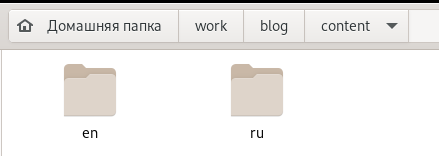{#fig:001 width=50%} 

## Перешли в ~/work/blog/config/_default и открыли файл languages.yaml  (Рис. [-@fig:002])  
Внесли необходимые изменения, опираясь на информацию из файла "menus.yaml" в этом же каталоге.  
Таким образом, мы перевели на русский язык наше меню вверху сайта.

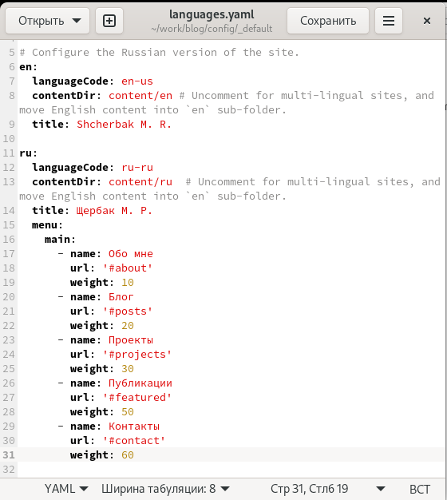{#fig:002 width=35%} 

## Далее мы переходим в подкаталог ~/work/blog/content/ru и там, заходя в каждую папку, вносим изменения на русском языке в файлы. (Рис. [-@fig:003])  
В подкаталоге ~/work/blog/content/ru/authors/admin в файле _index.md мы перевели первую страницу сайта, на которой представлена информация о владельце.

{#fig:003 width=40%} 
 

## Затем в подкаталоге ~/work/blog/content/ru/home мы изменяем нужную информацию в файлах на русский язык. (Рис. [-@fig:004] - Рис. [-@fig:007])  

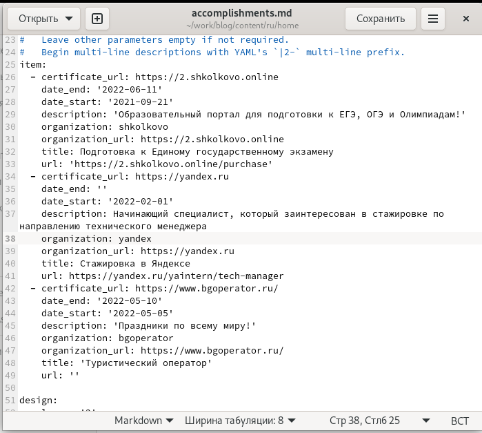{#fig:004 width=60%} 

## Внесли изменения и перевели на русский язык информацию в разделе "Контакты"

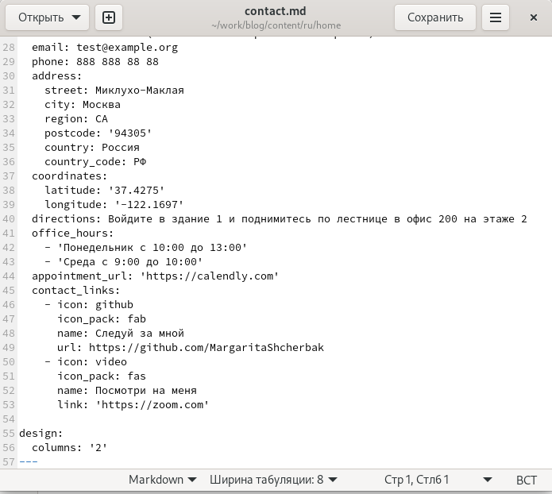{#fig:005 width=60%} 

## Перевели информацию на русск.яз в разделе "Опыт"

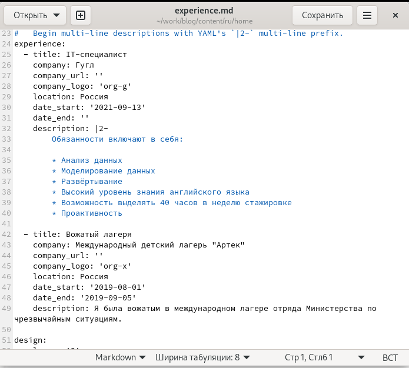{#fig:006 width=60%} 

## Переводим раздел "Навыки"

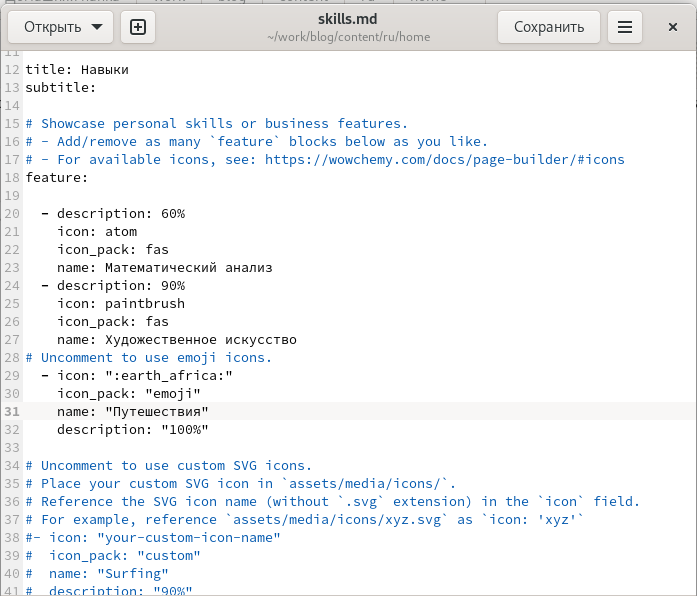{#fig:007 width=70%} 

## Также перешла в ~/work/blog/content/ru/post создала две папки под названиями, соответствующими названиям постов. Написала пост о прошедшей неделе и пост на тему "Путешествие" (Рис. [-@fig:008] - Рис. [-@fig:009])

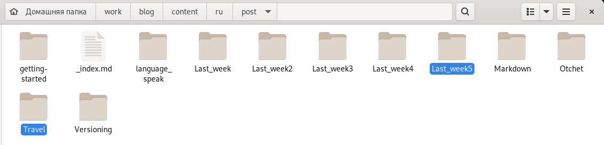{#fig:008 width=45%} 

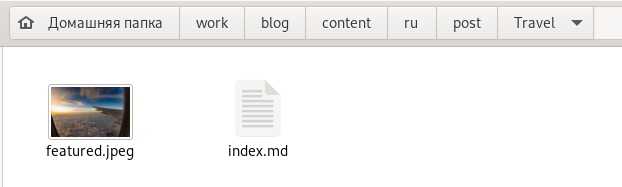{#fig:009 width=45%} 

## После того, как мы внесли изменения в папке ru в необходимые файлы на русском языке (также переписали все англоязычные посты на русский язык), загружаем всё на гитхаб: (Рис .[-@fig:0011])

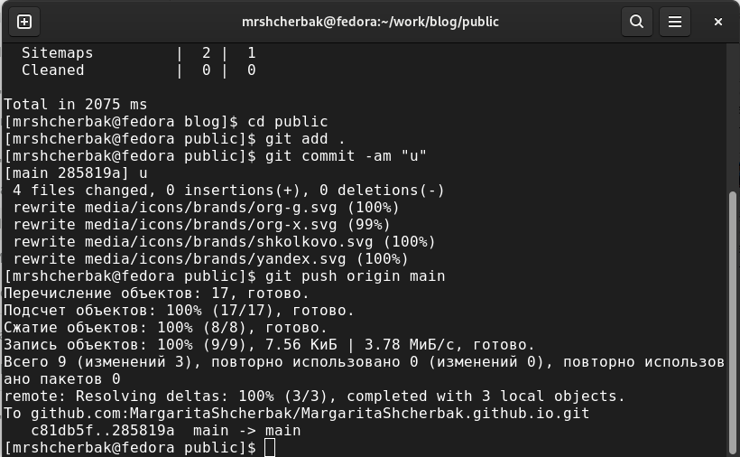{#fig:0011 width=80%}

## Видим, что появилась возможность просматривать сайт на двух языках (Рис .[-@fig:0012]) 

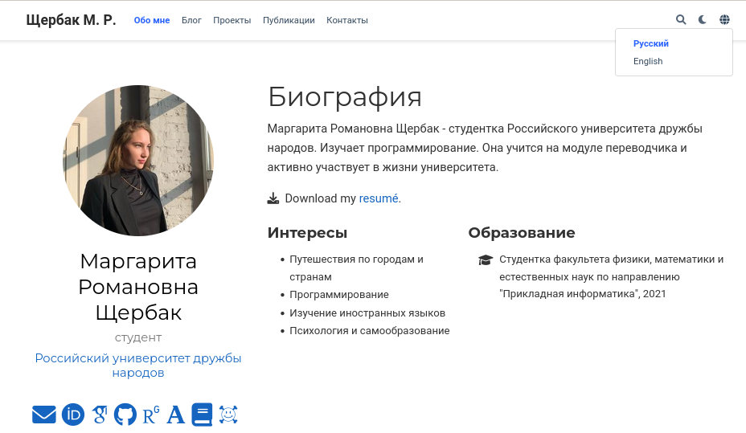{#fig:0012 width=90%}

## Проверяем остальные разделы сайта. Убеждаемся, что всё переведено. (Рис. [-@fig:0013] - Рис. [-@fig:0018])  

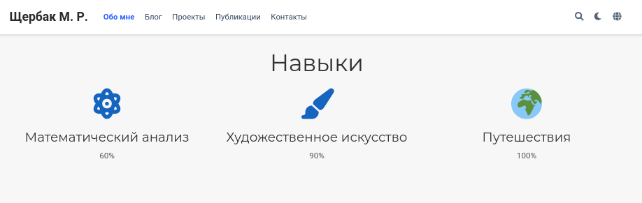{#fig:0013 width=80%}

## Перевод на русский язык раздела "Опыт"

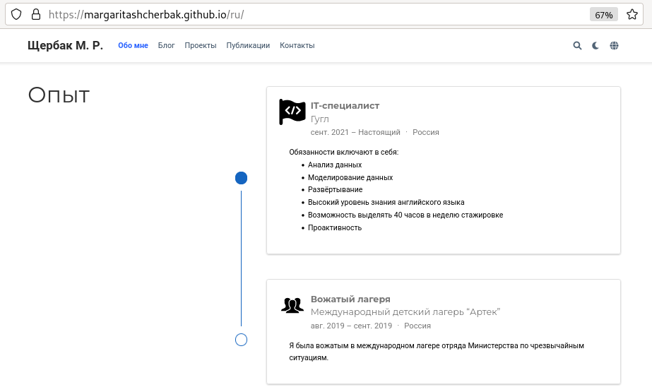{#fig:0014 width=75%}

## Перевод на русский язык всех постов

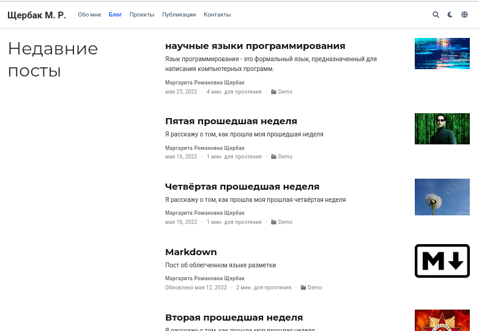{#fig:0015 width=90%}

## Русская раскладка

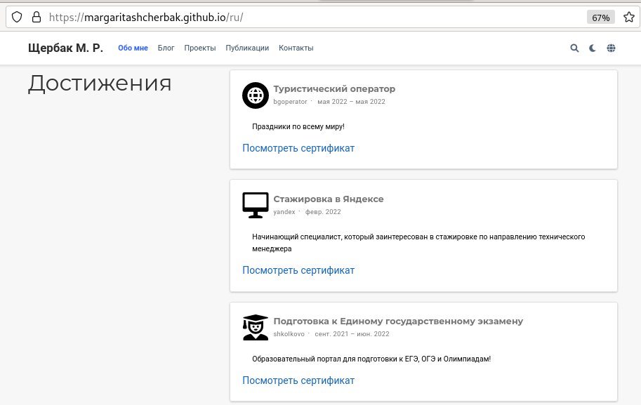{#fig:0016 width=90%}

## Перевод на русский язык раздела "Проекты"

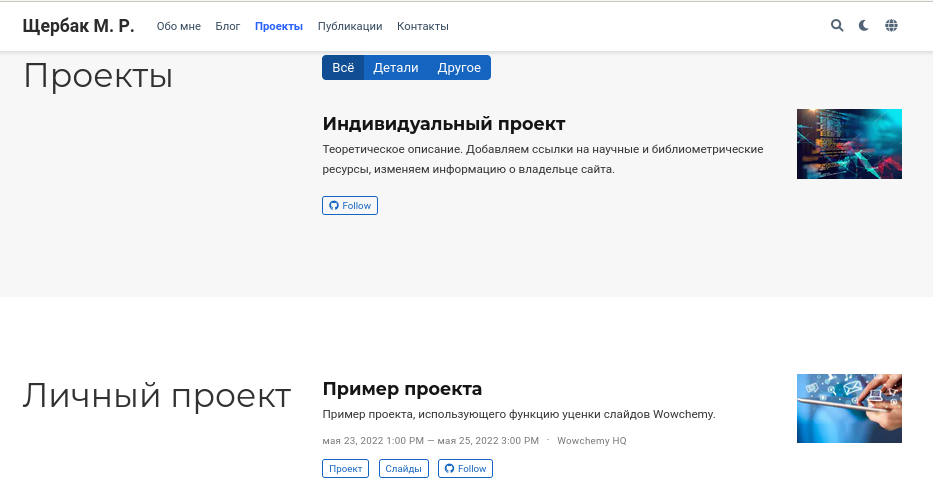{#fig:0017 width=90%}

## Перевод на русский язык раздела "Публикации"

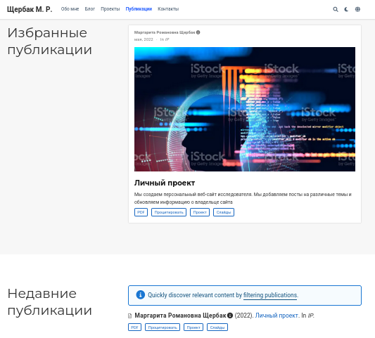{#fig:0018 width=70%}

 
## **Вывод:** 

Таким образом, я сделала поддержку английского и русского языков.  
Разместила элементы сайта на обоих языках, контент на обоих языках.  
Сделала пост по прошедшей неделе.  
Добавила пост на тему "Путешествие".
