---
## Front matter
title: "Отчёт по шестому этапу реализации проекта"
subtitle: "Персональный сайт научного работника"
author: "Щербак Маргарита Романовна"

## Generic otions
lang: ru-RU

## Bibliography
bibliography: bib/cite.bib
csl: pandoc/csl/gost-r-7-0-5-2008-numeric.csl

## Pdf output format
toc: true # Table of contents
toc-depth: 2
fontsize: 12pt
linestretch: 1.5
papersize: a4
documentclass: scrreprt
## I18n polyglossia
polyglossia-lang:
  name: russian
  options:
	- spelling=modern
	- babelshorthands=true
polyglossia-otherlangs:
  name: english
## I18n babel
babel-lang: russian
babel-otherlangs: english
## Fonts
mainfont: PT Serif
romanfont: PT Serif
sansfont: PT Sans
monofont: PT Mono
mainfontoptions: Ligatures=TeX
romanfontoptions: Ligatures=TeX
sansfontoptions: Ligatures=TeX,Scale=MatchLowercase
monofontoptions: Scale=MatchLowercase,Scale=0.9
## Biblatex
biblatex: true
biblio-style: "gost-numeric"
biblatexoptions:
  - parentracker=true
  - backend=biber
  - hyperref=auto
  - language=auto
  - autolang=other*
  - citestyle=gost-numeric
## Pandoc-crossref LaTeX customization
figureTitle: "Рис."
tableTitle: "Таблица"
listingTitle: "Листинг"
lofTitle: "Список иллюстраций"
lotTitle: "Список таблиц"
lolTitle: "Листинги"
## Misc options
indent: true
header-includes:
  - \usepackage{indentfirst}
  - \usepackage{float} # keep figures where there are in the text
  - \floatplacement{figure}{H} # keep figures where there are in the text
---

# **Размещение двуязычного сайта на Github** 

## **Цель работы**
Сделать поддержку английского и русского языков.  
Разместить элементы сайта на обоих языках.  
Разместить контент на обоих языках.  
Сделать пост по прошедшей неделе.  
Добавить пост на тему по выбору (на двух языках). 

## **Теоретическое введение**
Для реализации сайта используется генератор статических сайтов Hugo.  
Исходя из действий в предыдущих этапах, мы также будем продолжать писать посты. В этот раз вся информация на сайте будет представлена на двух языках. Мы сделаем поддержку английского и русского языков.

## **Ход работы**

1. Перешли в ~/work/blog/content и создали там две папки: en и ru. (Рис. [-@fig:001])  
В каждую из этих папок мы скопировали содержимое папки content.  
В папке "en" находятся все файлы с информацией на англиском языке.  
В папке "ru" находятся все файлы с информацией на русском языке.  
Таким образом, мы сделали первый шаг к поддержке двух языков.

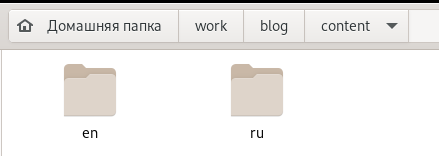{#fig:001 width=70%} 

2. Перешли в ~/work/blog/config/_default и открыли файл languages.yaml  
(Рис. [-@fig:002])  
Внесли необходимые изменения, опираясь на информацию из файла "menus.yaml" в этом же каталоге.  
Таким образом, мы перевели на русский язык наше меню вверху сайта.

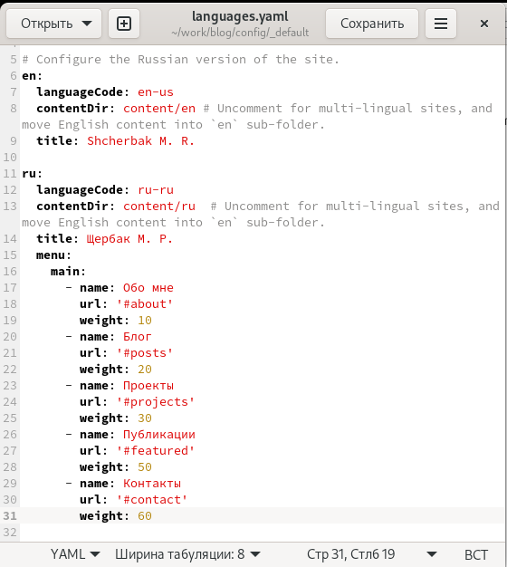{#fig:002 width=70%} 

3. Далее мы переходим в подкаталог ~/work/blog/content/ru и там, заходя в каждую папку, вносим изменения на русском языке в файлы. (Рис. [-@fig:003])  
В подкаталоге ~/work/blog/content/ru/authors/admin в файле _index.md мы переписали всю информацию о владельце сайта с английского на русский язык: биографию, интересы, образование, образовательное учреждение и тд.  
Так, мы перевели первую страницу сайта, на которой представлена информация о владельце.

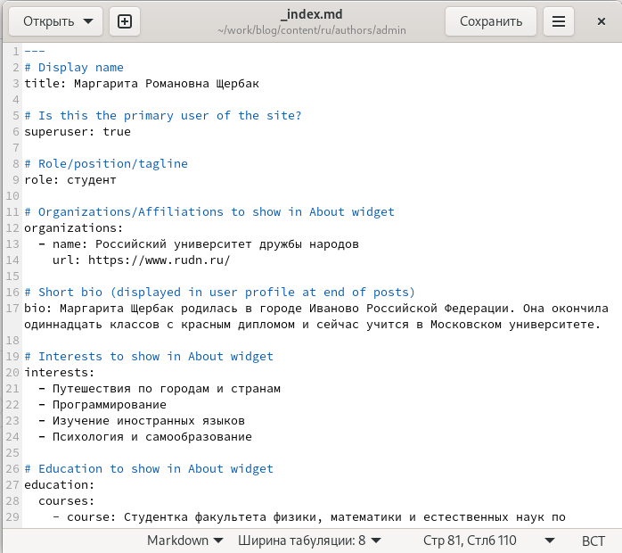{#fig:003 width=80%} 

4. Затем в подкаталоге ~/work/blog/content/ru/home мы изменяем нужную информацию в файлах на русский язык. (Рис. [-@fig:004] - Рис. [-@fig:007])  

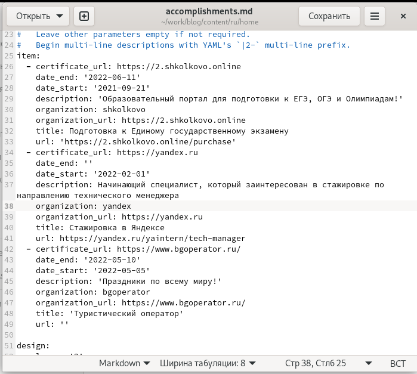{#fig:004 width=80%} 

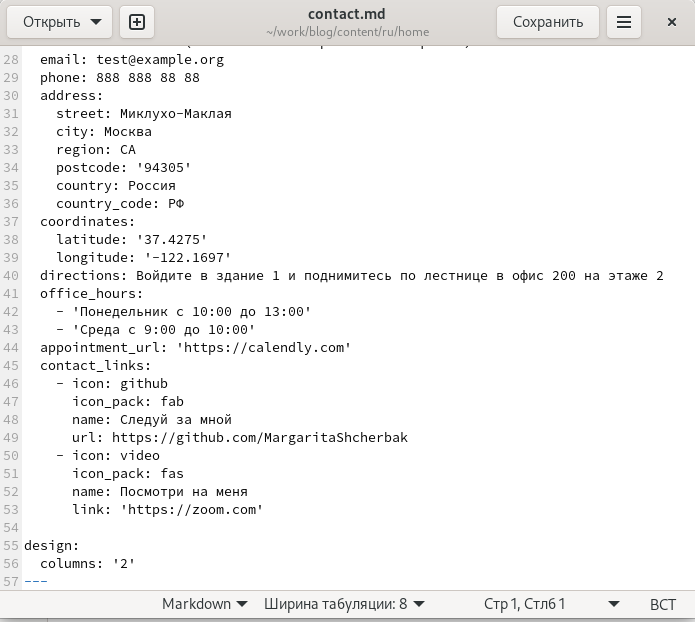{#fig:005 width=80%} 

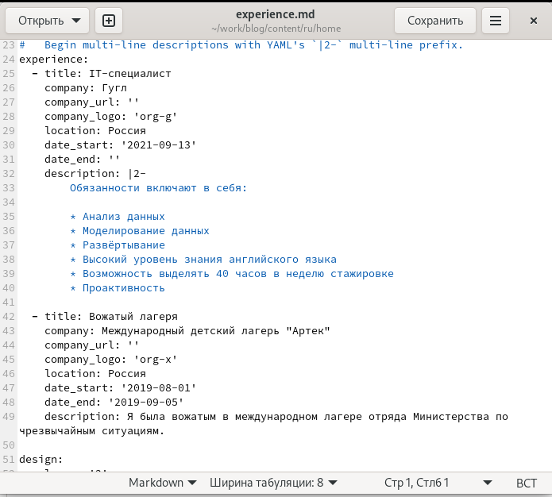{#fig:006 width=80%} 

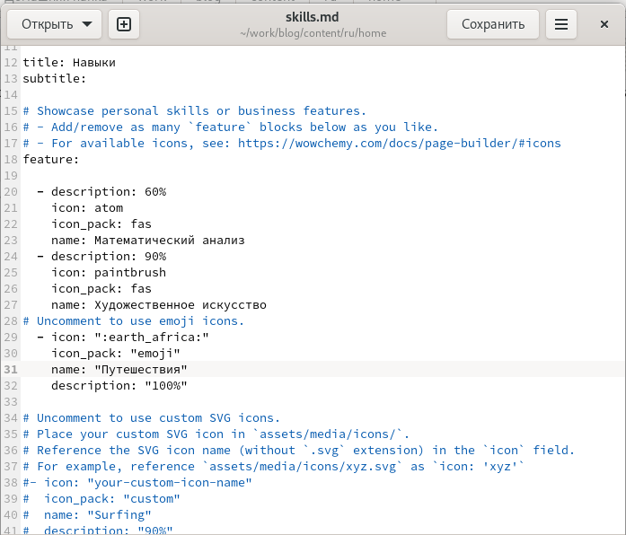{#fig:007 width=80%} 

5. Также перешла в ~/work/blog/content/ru/post создала две папки под названиями, соответствующими названиям постов. Написала пост о прошедшей неделе и пост на тему "Путешествие" (Рис. [-@fig:008] - Рис. [-@fig:0010])  
Изменяла информацию в файлах аналогично действиям из предыдущих этапов проекта.

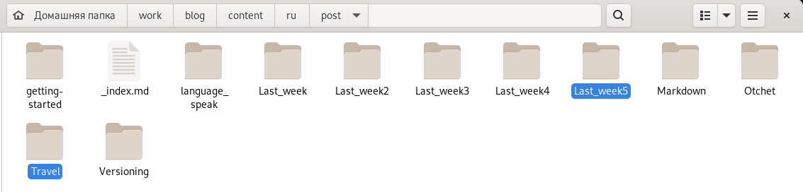{#fig:008 width=90%} 

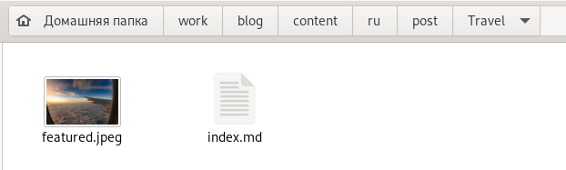{#fig:009 width=90%} 

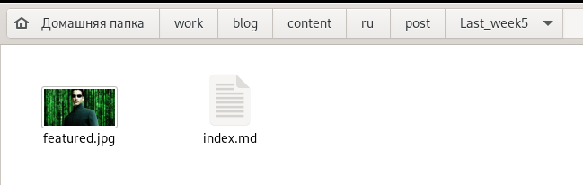{#fig:0010 width=90%} 

6. После того, как мы внесли изменения в папке ru в необходимые файлы на русском языке (также переписали все англоязычные посты на русский язык), запускаем терминал, вводим следующие команды: 
(Рис .[-@fig:0011])
- hugo (~/work/blog)
- cd public
- git add .
- git commit -am "u"
- git push origin main 

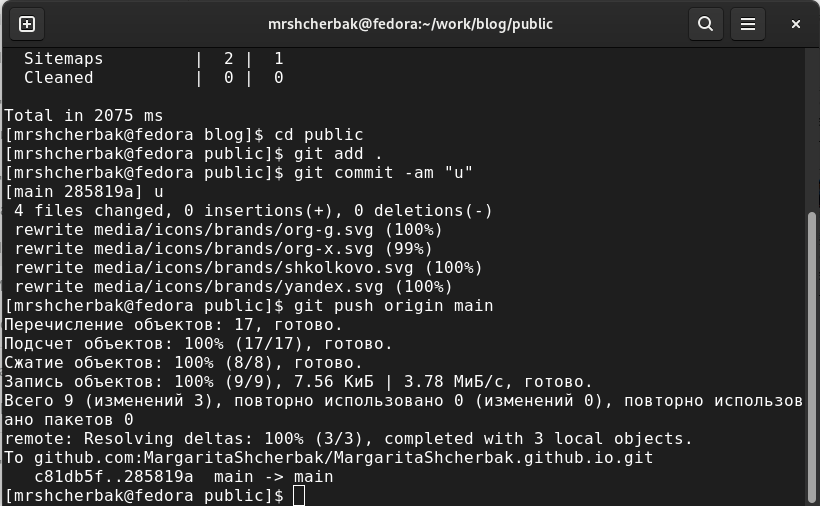{#fig:0011 width=80%}

8. Убеждаемся в правильности выполненных действий. Видим, что появилась возможность просматривать сайт на двух языках. Также при русской раскладке первая страница сайта и меню сверху отображаются на русском языке, что нам и нужно. (Рис .[-@fig:0012]) 

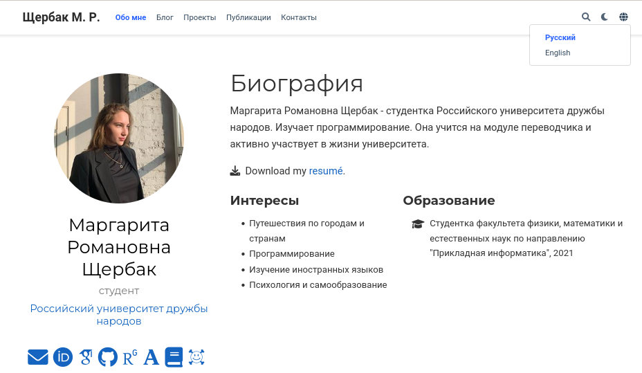{#fig:0012 width=90%}

9. Проверяем остальные разделы сайта. Убеждаемся, что всё переведено. (Рис. [-@fig:0013] - Рис. [-@fig:0018])  

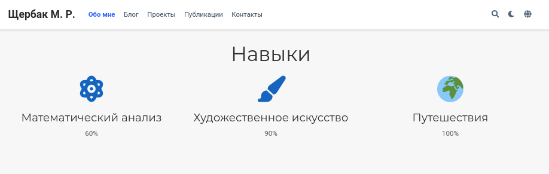{#fig:0013 width=90%}

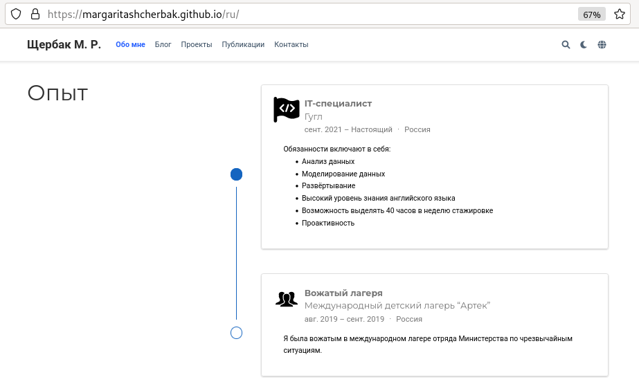{#fig:0014 width=90%}

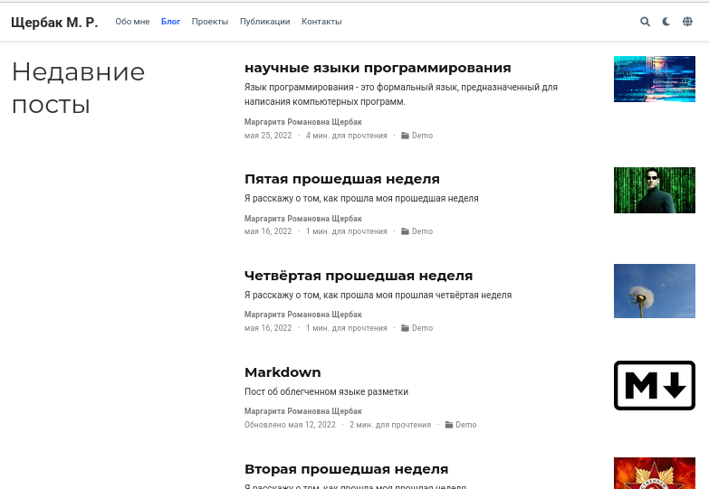{#fig:0015 width=90%}

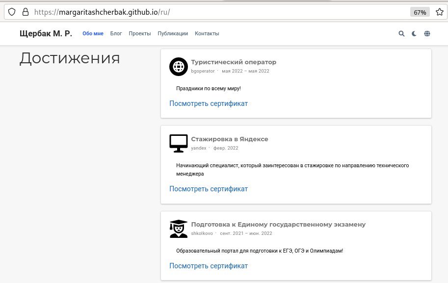{#fig:0016 width=90%}

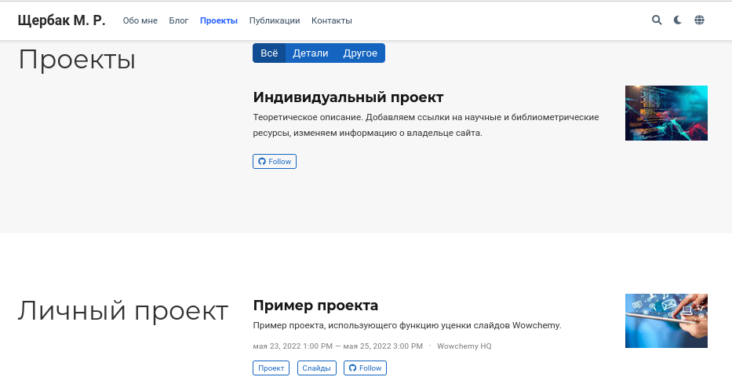{#fig:0017 width=90%}

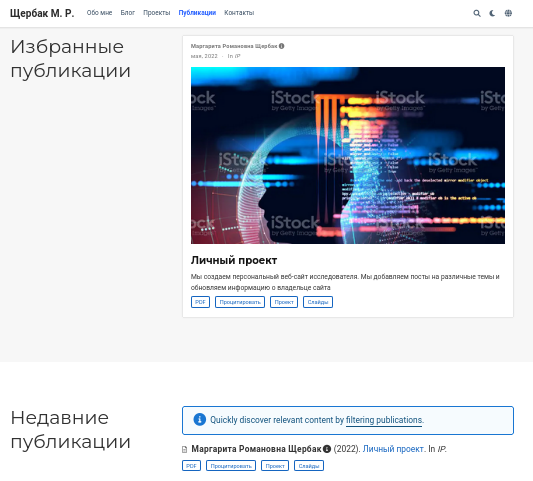{#fig:0018 width=90%}

## **Вывод:** 

Таким образом, я сделала поддержку английского и русского языков.  
Разместила элементы сайта на обоих языках, контент на обоих языках.  
Сделала пост по прошедшей неделе.  
Добавила пост на тему "Путешествие".
